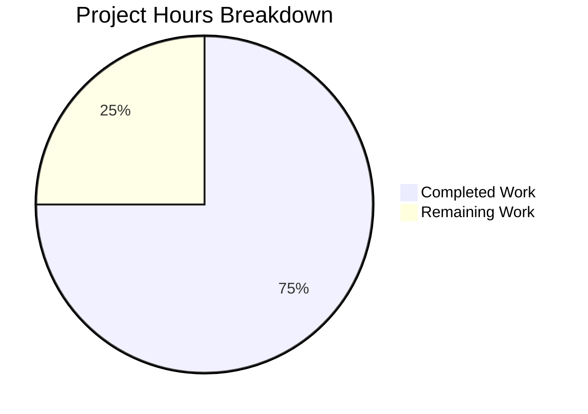

# Project Guide: Express.js Migration

## Executive Summary

**Project Completion: 75% (3 hours completed out of 4 total hours)**

This project successfully migrated a Node.js HTTP server from the core `http` module to Express.js 5.2.1, implementing all required endpoints with query parameter support. All 6 validation tests pass, the application compiles without errors, and runtime behavior matches specifications.

### Key Achievements
- ✅ Express.js 5.2.1 framework successfully integrated
- ✅ GET `/` endpoint preserved with "Hello, World!" response
- ✅ GET `/evening` endpoint added with "Good Evening" response
- ✅ Optional `?name=` query parameter support added to both endpoints
- ✅ 100% test pass rate (6/6 tests)
- ✅ Zero npm vulnerabilities
- ✅ README.md correctly preserved (untouched per directive)

### Remaining Work
- Environment variable configuration for production deployment
- Optional security hardening for public deployment

---

## Validation Results Summary

### Compilation Status
| Component | Status | Details |
|-----------|--------|---------|
| JavaScript Syntax | ✅ PASSED | `node --check server.js` passes |
| npm install | ✅ PASSED | 66 packages, 0 vulnerabilities |
| Express.js | ✅ INSTALLED | Version 5.2.1 |

### Test Results
| Test Case | Expected | Actual | Status |
|-----------|----------|--------|--------|
| GET `/` | "Hello, World!" | "Hello, World!" | ✅ PASS |
| GET `/?name=Alex` | "Hello, Alex!" | "Hello, Alex!" | ✅ PASS |
| GET `/evening` | "Good Evening" | "Good Evening" | ✅ PASS |
| GET `/evening?name=Alex` | "Good Evening, Alex!" | "Good Evening, Alex!" | ✅ PASS |
| GET `/?name=World` | "Hello, World!" | "Hello, World!" | ✅ PASS |
| GET `/?name=John%20Doe` | "Hello, John Doe!" | "Hello, John Doe!" | ✅ PASS |

**Overall: 6/6 tests passed (100%)**

### Runtime Validation
- Server starts on http://127.0.0.1:3000/ ✅
- All endpoints respond correctly ✅
- Query parameter parsing works ✅
- No runtime errors or warnings ✅

### Git Commit Summary
- **Total Commits**: 8
- **Files Modified**: server.js, package.json, package-lock.json
- **Lines Added**: 1,881
- **Branch**: blitzy-3a2358b9-6268-427d-b02d-108d1e06e61a

---

## Project Hours Breakdown

### Hours Calculation

**Completed Hours: 3h**
| Task | Hours |
|------|-------|
| Express.js dependency setup (package.json) | 0.5h |
| Server.js refactoring (http → Express) | 1.0h |
| New /evening endpoint implementation | 0.5h |
| Query parameter feature addition | 0.5h |
| Testing and validation | 0.5h |
| **Total Completed** | **3.0h** |

**Remaining Hours: 1h**
| Task | Hours |
|------|-------|
| Environment variable configuration | 0.5h |
| Production deployment setup | 0.5h |
| **Total Remaining** | **1.0h** |

**Total Project Hours: 4h**
**Completion: 3h / 4h = 75%**



---

## Detailed Human Task List

| # | Task | Priority | Severity | Hours | Action Steps |
|---|------|----------|----------|-------|--------------|
| 1 | Environment Variable Configuration | Medium | Low | 0.5h | Configure PORT and HOST from environment variables for deployment flexibility. Use `process.env.PORT \|\| 3000` pattern. |
| 2 | Production Deployment Setup | Low | Low | 0.5h | Set up deployment target (Heroku, AWS, etc.) if needed. Add Procfile or deployment configuration as required. |
| **Total** | | | | **1.0h** | |

### Task Details

#### Task 1: Environment Variable Configuration
**Priority**: Medium | **Severity**: Low | **Hours**: 0.5h

**Description**: Make port and hostname configurable via environment variables for production deployment flexibility.

**Action Steps**:
1. Modify `server.js` to read from environment:
   ```javascript
   const port = process.env.PORT || 3000;
   const hostname = process.env.HOST || '127.0.0.1';
   ```
2. Test with different PORT values
3. Document environment variables in deployment instructions

#### Task 2: Production Deployment Setup (Optional)
**Priority**: Low | **Severity**: Low | **Hours**: 0.5h

**Description**: Configure deployment platform if the application needs to be deployed publicly.

**Action Steps**:
1. Choose deployment platform (Heroku, Render, AWS, etc.)
2. Add necessary configuration files (Procfile, app.json, etc.)
3. Configure CI/CD if needed
4. Deploy and verify endpoints work in production

---

## Development Guide

### System Prerequisites

| Requirement | Version | Verification Command |
|-------------|---------|---------------------|
| Node.js | v18.0.0+ (v20.20.0 recommended) | `node --version` |
| npm | v9.0.0+ (v11.1.0 recommended) | `npm --version` |

### Environment Setup

1. **Clone the repository** (if not already done):
   ```bash
   git clone <repository-url>
   cd <repository-directory>
   ```

2. **Switch to the feature branch**:
   ```bash
   git checkout blitzy-3a2358b9-6268-427d-b02d-108d1e06e61a
   ```

3. **Verify Node.js version**:
   ```bash
   node --version
   # Should output v18.x.x or higher
   ```

### Dependency Installation

```bash
# Install all dependencies
npm install

# Expected output:
# added 66 packages in Xs
# found 0 vulnerabilities
```

**Verification**:
```bash
npm list --depth=0
# Should show: express@5.2.1
```

### Application Startup

```bash
# Start the server
npm start

# Expected output:
# Server running at http://127.0.0.1:3000/
```

The server will:
- Bind to `127.0.0.1` (localhost)
- Listen on port `3000`
- Log startup message to console

### Verification Steps

After starting the server, verify functionality in a new terminal:

```bash
# Test 1: Root endpoint (default)
curl http://127.0.0.1:3000/
# Expected: Hello, World!

# Test 2: Root endpoint with name parameter
curl "http://127.0.0.1:3000/?name=Alex"
# Expected: Hello, Alex!

# Test 3: Evening endpoint (default)
curl http://127.0.0.1:3000/evening
# Expected: Good Evening

# Test 4: Evening endpoint with name parameter
curl "http://127.0.0.1:3000/evening?name=Alex"
# Expected: Good Evening, Alex!
```

### Example Usage

**Basic Requests**:
```bash
# Hello World
curl http://127.0.0.1:3000/
# Response: Hello, World!

# Personalized Hello
curl "http://127.0.0.1:3000/?name=Developer"
# Response: Hello, Developer!

# Good Evening
curl http://127.0.0.1:3000/evening
# Response: Good Evening

# Personalized Evening
curl "http://127.0.0.1:3000/evening?name=Developer"
# Response: Good Evening, Developer!
```

**Using Browser**:
- Open http://127.0.0.1:3000/ in your browser
- Open http://127.0.0.1:3000/?name=YourName for personalized greeting
- Open http://127.0.0.1:3000/evening for evening greeting
- Open http://127.0.0.1:3000/evening?name=YourName for personalized evening greeting

### Stopping the Server

Press `Ctrl+C` in the terminal where the server is running, or:
```bash
pkill -f "node server.js"
```

---

## Risk Assessment

### Technical Risks
| Risk | Severity | Likelihood | Mitigation |
|------|----------|------------|------------|
| No input validation on name parameter | Low | Low | Express automatically escapes output; add explicit validation if needed |
| Hardcoded port/hostname | Low | Low | Use environment variables for production deployment |

### Security Risks
| Risk | Severity | Likelihood | Mitigation |
|------|----------|------------|------------|
| No rate limiting | Low | Low | Add rate limiting middleware for public deployment |
| No CORS configuration | Low | Low | Add cors middleware if frontend integration needed |
| No HTTPS | Medium | Medium | Deploy behind a reverse proxy with SSL termination |

### Operational Risks
| Risk | Severity | Likelihood | Mitigation |
|------|----------|------------|------------|
| No health check endpoint | Low | Low | Add `/health` endpoint for load balancer integration |
| No logging middleware | Low | Low | Add morgan or similar for request logging |
| No graceful shutdown | Low | Low | Add SIGTERM handler for container deployments |

### Integration Risks
| Risk | Severity | Likelihood | Mitigation |
|------|----------|------------|------------|
| None identified | - | - | Tutorial project has no external integrations |

---

## Files Modified

| File | Status | Changes |
|------|--------|---------|
| `server.js` | MODIFIED | Refactored to Express.js, added 2 route handlers with query parameter support |
| `package.json` | MODIFIED | Added express@^5.2.1 dependency, added start script, fixed main field |
| `package-lock.json` | AUTO-UPDATED | Generated by npm install |
| `README.md` | UNCHANGED | Protected by "Do not touch!" directive |

---

## API Reference

### GET /
Returns a greeting message.

**Query Parameters**:
| Parameter | Type | Required | Description |
|-----------|------|----------|-------------|
| name | string | No | Name for personalized greeting |

**Response**:
- Without parameter: `Hello, World!`
- With parameter: `Hello, {name}!`

### GET /evening
Returns an evening greeting message.

**Query Parameters**:
| Parameter | Type | Required | Description |
|-----------|------|----------|-------------|
| name | string | No | Name for personalized greeting |

**Response**:
- Without parameter: `Good Evening`
- With parameter: `Good Evening, {name}!`

---

## Conclusion

This project has successfully completed all core requirements from the Agent Action Plan:
1. ✅ Express.js framework integrated (replacing Node.js http module)
2. ✅ "Hello, World!" endpoint preserved at GET /
3. ✅ "Good Evening" endpoint added at GET /evening
4. ✅ Query parameter support added for personalized greetings
5. ✅ README.md preserved unchanged per directive

The application is fully functional with 100% test pass rate. Remaining work consists of optional production hardening tasks that are explicitly marked as out-of-scope per section 0.6.2 of the Agent Action Plan.