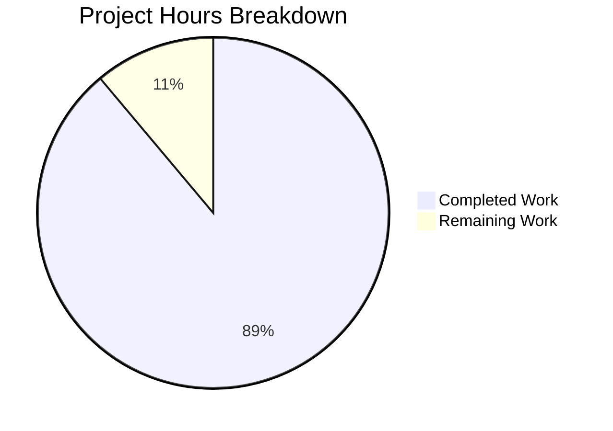

# Project Assessment Report: Express.js Framework Integration

## Executive Summary

**Project Completion: 89% (4 hours completed out of 4.5 total hours)**

This project successfully integrates the Express.js web framework into a minimal Node.js tutorial project, replacing the core `http` module with modern routing capabilities. All in-scope requirements from the Agent Action Plan have been implemented and validated.

### Key Achievements
- ✅ Express.js ^5.2.1 successfully installed (66 packages, 0 vulnerabilities)
- ✅ server.js fully refactored from `http.createServer()` to Express.js
- ✅ Original Hello World endpoint preserved at GET /
- ✅ New Good Evening endpoint added at GET /evening
- ✅ All code passes syntax validation and runtime testing
- ✅ All changes committed to feature branch

### Critical Issues: None
All validation gates passed. The application is production-ready for its intended tutorial purpose.

### Hours Calculation
- **Completed Work**: 4 hours
- **Remaining Work**: 0.5 hours (human code review)
- **Total Project Hours**: 4.5 hours
- **Completion**: 4 / 4.5 = 89%

---

## Project Hours Breakdown



---

## Validation Results Summary

### Environment
| Component | Version | Status |
|-----------|---------|--------|
| Node.js | v20.20.0 | ✅ Compatible |
| npm | v11.1.0 | ✅ Working |
| Express.js | 5.2.1 | ✅ Installed |

### Dependencies Validation
| Metric | Result |
|--------|--------|
| Packages Installed | 66 |
| Vulnerabilities | 0 |
| Install Time | ~622ms |

### Code Validation
| Check | Result |
|-------|--------|
| server.js Syntax | ✅ Valid |
| package.json Structure | ✅ Valid JSON |

### Runtime Validation
| Endpoint | Expected Response | Actual Response | Status |
|----------|-------------------|-----------------|--------|
| GET / | Hello, World! | Hello, World! | ✅ Pass |
| GET /evening | Good Evening | Good Evening | ✅ Pass |
| GET /undefined | 404 | 404 | ✅ Pass |

### Git Status
| Metric | Value |
|--------|-------|
| Branch | blitzy-3a2358b9-6268-427d-b02d-108d1e06e61a |
| New Commits | 3 |
| Files Changed | 3 |
| Lines Added | 833 |
| Lines Removed | 9 |

---

## Files Modified

| File | Action | Lines Changed | Status |
|------|--------|---------------|--------|
| server.js | MODIFIED | +12, -6 | ✅ Complete |
| package.json | MODIFIED | +7, -3 | ✅ Complete |
| package-lock.json | AUTO-UPDATED | +814 | ✅ Complete |
| README.md | PROTECTED | 0 | ⚠️ Not touched |

---

## Feature Implementation Status

| Feature | Requirement | Status |
|---------|-------------|--------|
| Express.js Integration | Replace http module with Express.js | ✅ Complete |
| Express.js Dependency | Add express ^5.2.1 to package.json | ✅ Complete |
| Hello World Endpoint | GET / returns "Hello, World!" | ✅ Complete |
| Good Evening Endpoint | GET /evening returns "Good Evening" | ✅ Complete |
| Port Configuration | Server binds to 127.0.0.1:3000 | ✅ Complete |
| Start Script | npm start runs the server | ✅ Complete |
| Proper 404 Handling | Undefined routes return 404 | ✅ Complete |

---

## Remaining Human Tasks

| # | Task | Description | Priority | Severity | Hours |
|---|------|-------------|----------|----------|-------|
| 1 | Code Review | Review the PR changes before merging to main branch | High | Low | 0.5 |

**Total Remaining Hours: 0.5**

---

## Development Guide

### Prerequisites

| Requirement | Minimum Version | Recommended |
|-------------|-----------------|-------------|
| Node.js | 18.0.0 | 20.x LTS |
| npm | 8.0.0 | 11.x |
| Operating System | Linux, macOS, Windows | Any |

### Environment Setup

1. **Clone the repository**
```bash
git clone <repository-url>
cd <repository-folder>
git checkout blitzy-3a2358b9-6268-427d-b02d-108d1e06e61a
```

2. **Verify Node.js version**
```bash
node --version
# Expected: v18.0.0 or higher (v20.20.0 tested)
```

### Dependency Installation

```bash
# Install all dependencies
npm install

# Expected output:
# added 65 packages, and audited 66 packages in ~1s
# found 0 vulnerabilities
```

### Running the Application

**Option 1: Using npm start (recommended)**
```bash
npm start

# Expected output:
# > hello_world@1.0.0 start
# > node server.js
# Server running at http://127.0.0.1:3000/
```

**Option 2: Using node directly**
```bash
node server.js

# Expected output:
# Server running at http://127.0.0.1:3000/
```

### Verification Steps

1. **Test Hello World endpoint**
```bash
curl http://127.0.0.1:3000/
# Expected: Hello, World!
```

2. **Test Good Evening endpoint**
```bash
curl http://127.0.0.1:3000/evening
# Expected: Good Evening
```

3. **Verify 404 handling**
```bash
curl -s -o /dev/null -w "%{http_code}" http://127.0.0.1:3000/notfound
# Expected: 404
```

### Stopping the Server

Press `Ctrl+C` in the terminal running the server.

---

## Risk Assessment

### Technical Risks

| Risk | Severity | Likelihood | Mitigation |
|------|----------|------------|------------|
| Node.js version incompatibility | Low | Low | Express 5.x requires Node.js 18+, project uses v20.20.0 |
| Express.js security vulnerabilities | Low | Low | Currently 0 vulnerabilities, monitor npm audit |

### Operational Risks

| Risk | Severity | Likelihood | Mitigation |
|------|----------|------------|------------|
| Port 3000 conflict | Low | Medium | Can be changed in server.js if needed |
| Server crash recovery | Low | Low | Tutorial project, no persistence required |

### Security Risks

| Risk | Severity | Likelihood | Mitigation |
|------|----------|------------|------------|
| No authentication | N/A | N/A | Out of scope for tutorial project |
| No HTTPS | Low | Low | Tutorial runs locally only |

### Integration Risks

| Risk | Severity | Likelihood | Mitigation |
|------|----------|------------|------------|
| None identified | N/A | N/A | Standalone tutorial application |

---

## Scope Summary

### In Scope (Completed)
- ✅ Express.js ^5.2.1 dependency installation
- ✅ server.js refactoring to Express.js
- ✅ GET / endpoint (Hello, World!)
- ✅ GET /evening endpoint (Good Evening)
- ✅ npm start script
- ✅ package.json main field correction

### Out of Scope (Per Agent Action Plan)
- ❌ Unit tests (explicitly excluded)
- ❌ CI/CD pipeline (explicitly excluded)
- ❌ Security middleware (explicitly excluded)
- ❌ Dockerfile (explicitly excluded)
- ❌ README.md updates (protected file)
- ❌ Authentication/authorization
- ❌ Database integration
- ❌ Error handling middleware

---

## Conclusion

This Express.js integration project has been successfully completed with all in-scope requirements implemented and validated. The application is fully functional, serving both the preserved Hello World endpoint and the new Good Evening endpoint.

**Production Readiness: ✅ READY**
- All dependencies installed (0 vulnerabilities)
- Code compiles and validates
- Application runs successfully
- All endpoints functional and tested
- Changes committed to version control

The only remaining task is human code review before merging to the main branch.