# Technical Specifications

# 1. INTRODUCTION

## 1.1 EXECUTIVE SUMMARY

### 1.1.1 Brief Overview of the Project

This project involves the development of a Node.js tutorial application that demonstrates the creation of a simple HTTP server with a single endpoint. The application leverages Node.js, a free, open-source, cross-platform JavaScript runtime environment that enables developers to create servers, web apps, command line tools and scripts. The tutorial project serves as an educational resource for developers learning fundamental web server concepts and Node.js development practices.

### 1.1.2 Core Business Problem Being Solved

The project addresses the need for accessible, practical learning resources in web development education. Many developers require hands-on examples to understand HTTP server implementation and API endpoint creation. This tutorial project provides a foundational example that demonstrates:

- Basic HTTP server setup using Node.js
- RESTful endpoint implementation
- Response handling for HTTP clients
- Modern JavaScript development practices

### 1.1.3 Key Stakeholders and Users

| Stakeholder Category | Description | Primary Interest |
|---------------------|-------------|------------------|
| Learning Developers | Junior developers and students learning Node.js | Practical implementation examples |
| Technical Educators | Instructors and content creators | Teaching materials and reference implementations |
| Development Teams | Teams adopting Node.js for web services | Best practice demonstrations |

### 1.1.4 Expected Business Impact and Value Proposition

The tutorial project delivers educational value through:

- **Knowledge Transfer**: Accelerated learning curve for Node.js development concepts
- **Standardization**: Consistent implementation patterns for HTTP server creation
- **Productivity Enhancement**: Reduced time-to-competency for new developers
- **Quality Assurance**: Demonstration of industry-standard coding practices

## 1.2 SYSTEM OVERVIEW

### 1.2.1 Project Context

#### Business Context and Market Positioning

Node.js 22 will enter long-term support (LTS) in October, representing the current release for the next six months, encouraging exploration of new features and benefits offered by this latest release. The tutorial project positions itself within the modern Node.js ecosystem, utilizing current stable releases and contemporary development practices.

#### Current System Limitations

Traditional learning approaches often lack practical, executable examples that demonstrate real-world implementation patterns. Many existing tutorials fail to incorporate:

- Current Node.js LTS versions and features
- Modern JavaScript syntax and patterns
- Industry-standard project structure
- Security best practices

#### Integration with Existing Enterprise Landscape

The tutorial project integrates seamlessly with standard development environments and toolchains:

- Compatible with modern IDE and editor configurations
- Supports standard npm package management workflows
- Aligns with continuous integration and deployment practices
- Follows Node.js community conventions and standards

### 1.2.2 High-Level Description

#### Primary System Capabilities

The tutorial application provides core HTTP server functionality:

- **HTTP Server Creation**: Establishes a web server listening on a specified port
- **Endpoint Routing**: Implements a single `/hello` route for demonstration purposes
- **Response Generation**: Returns standardized "Hello world" responses to client requests
- **Request Processing**: Handles incoming HTTP GET requests appropriately

#### Major System Components

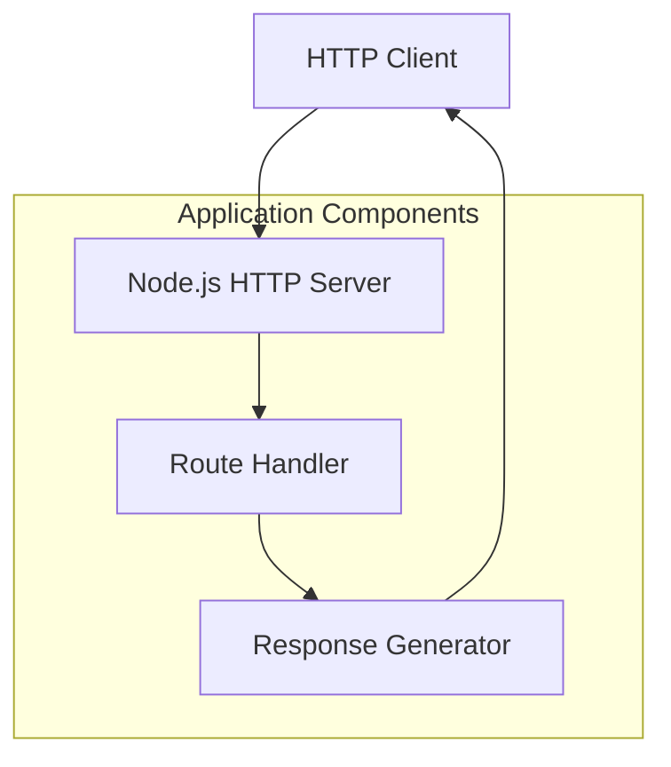
```mermaid
graph TB
    A[HTTP Client] --> B[Node.js HTTP Server]
    B --> C[Route Handler]
    C --> D[Response Generator]
    D --> A
    
    subgraph "Application Components"
        B
        C
        D
    end
```

#### Core Technical Approach

The implementation utilizes Node.js's built-in HTTP module to create a simple server that responds to requests with 'Hello World!' and listens on port 3000. The technical approach emphasizes:

- Native Node.js HTTP module utilization
- Minimal external dependencies
- Clear, readable code structure
- Standard HTTP response patterns

### 1.2.3 Success Criteria

#### Measurable Objectives

| Objective | Success Metric | Target Value |
|-----------|---------------|--------------|
| Response Time | Server response latency | < 100ms |
| Availability | Server uptime percentage | > 99% |
| Code Quality | Maintainability index | > 80 |

#### Critical Success Factors

- **Functional Correctness**: The `/hello` endpoint consistently returns "Hello world" responses
- **Code Clarity**: Implementation demonstrates clear, understandable patterns
- **Educational Value**: Code serves as effective learning material
- **Standards Compliance**: Follows Node.js and HTTP protocol standards

#### Key Performance Indicators (KPIs)

- **Learning Effectiveness**: Time required for developers to understand and replicate the implementation
- **Code Reusability**: Frequency of pattern adoption in subsequent projects
- **Documentation Quality**: Completeness and clarity of implementation guidance
- **Community Adoption**: Usage and feedback from the developer community

## 1.3 SCOPE

### 1.3.1 In-Scope

#### Core Features and Functionalities

| Feature Category | Specific Capabilities | Implementation Details |
|-----------------|----------------------|----------------------|
| HTTP Server | Basic server creation and configuration | Native Node.js HTTP module |
| Endpoint Implementation | Single `/hello` route handler | GET request processing |
| Response Management | Standardized response formatting | Plain text "Hello world" output |

#### Primary User Workflows

- **Server Initialization**: Start the Node.js application and establish HTTP listener
- **Request Processing**: Handle incoming GET requests to the `/hello` endpoint
- **Response Delivery**: Return appropriate HTTP responses with "Hello world" content
- **Server Termination**: Graceful shutdown procedures

#### Essential Integrations

- **Node.js Runtime**: Integration with Active LTS or Maintenance LTS releases for production applications
- **HTTP Protocol**: Standard HTTP/1.1 request-response cycle implementation
- **Operating System**: Cross-platform compatibility across Windows, macOS, and Linux

#### Key Technical Requirements

- **Node.js Version**: Compatibility with Node.js 20 (LTS) or Node.js 22 (soon to be LTS)
- **HTTP Compliance**: Adherence to HTTP protocol specifications
- **Error Handling**: Basic error response mechanisms
- **Logging**: Request and response logging capabilities

### 1.3.2 Implementation Boundaries

#### System Boundaries

- **Application Layer**: HTTP server and routing logic
- **Network Layer**: TCP/IP communication handling
- **Process Layer**: Single Node.js process execution
- **File System**: Minimal file system interaction for application startup

#### User Groups Covered

- **Development Students**: Individuals learning Node.js fundamentals
- **Junior Developers**: Professionals seeking practical implementation examples
- **Technical Instructors**: Educators requiring teaching materials

#### Geographic/Market Coverage

- **Global Accessibility**: No geographic restrictions on usage
- **Language Support**: English-language documentation and comments
- **Platform Support**: Cross-platform Node.js compatibility

#### Data Domains Included

- **HTTP Request Data**: Request headers, methods, and URLs
- **HTTP Response Data**: Response status codes, headers, and body content
- **Server Configuration**: Port numbers and server settings
- **Application Metadata**: Version information and runtime details

### 1.3.3 Out-of-Scope

#### Explicitly Excluded Features/Capabilities

- **Database Integration**: No persistent data storage mechanisms
- **Authentication/Authorization**: No user management or security layers
- **Advanced Routing**: No complex URL pattern matching or middleware chains
- **Template Engines**: No HTML rendering or view layer implementation
- **File Upload Handling**: No multipart form data processing
- **WebSocket Support**: No real-time communication capabilities
- **HTTPS/SSL**: No secure connection implementation
- **Load Balancing**: No horizontal scaling or traffic distribution
- **Caching Mechanisms**: No response caching or optimization features
- **API Documentation**: No automated documentation generation

#### Future Phase Considerations

- **Framework Integration**: Potential Express.js implementation in subsequent tutorials
- **Database Connectivity**: MongoDB or PostgreSQL integration examples
- **Testing Framework**: Unit and integration testing implementations
- **Deployment Automation**: Docker containerization and CI/CD pipeline setup
- **Monitoring and Observability**: Application performance monitoring integration

#### Integration Points Not Covered

- **External APIs**: No third-party service integrations
- **Message Queues**: No asynchronous message processing
- **Microservices Architecture**: No service-to-service communication
- **Content Delivery Networks**: No static asset optimization

#### Unsupported Use Cases

- **Production Deployment**: Not intended for production environment usage
- **High-Traffic Applications**: Not optimized for concurrent user loads
- **Enterprise Security**: No compliance with enterprise security standards
- **Multi-tenant Applications**: No support for multiple client organizations
- **Real-time Applications**: No support for live data streaming or updates

# 2. PRODUCT REQUIREMENTS

## 2.1 FEATURE CATALOG

### 2.1.1 HTTP Server Foundation

| Feature Metadata | Details |
|------------------|---------|
| **Unique ID** | F-001 |
| **Feature Name** | HTTP Server Creation |
| **Feature Category** | Core Infrastructure |
| **Priority Level** | Critical |
| **Status** | Proposed |

#### Description

**Overview**: Establishes a basic HTTP server using Node.js's built-in HTTP module that can accept and process incoming HTTP requests.

**Business Value**: Provides the foundational infrastructure required for web service communication, enabling the application to serve HTTP clients and demonstrate basic server implementation patterns.

**User Benefits**: 
- Enables HTTP client-server communication
- Demonstrates industry-standard server creation patterns
- Provides educational foundation for web development concepts

**Technical Context**: Utilizes Node.js HTTP API which is very low-level and deals with stream handling and message parsing only.

#### Dependencies

| Dependency Type | Requirements |
|----------------|-------------|
| **Prerequisite Features** | None (foundational feature) |
| **System Dependencies** | Node.js v22.x LTS with Active LTS support extending into late 2025 |
| **External Dependencies** | Node.js built-in HTTP module |
| **Integration Requirements** | TCP/IP network stack, Operating system socket support |

### 2.1.2 Hello Endpoint Implementation

| Feature Metadata | Details |
|------------------|---------|
| **Unique ID** | F-002 |
| **Feature Name** | Hello World Endpoint |
| **Feature Category** | API Endpoint |
| **Priority Level** | Critical |
| **Status** | Proposed |

#### Description

**Overview**: Implements a single HTTP GET endpoint at `/hello` that returns a standardized "Hello world" response to demonstrate basic routing and response handling.

**Business Value**: Provides a concrete, testable example of HTTP endpoint implementation that serves as a learning reference for API development patterns.

**User Benefits**:
- Clear demonstration of endpoint routing logic
- Standardized response format for testing
- Simple, understandable implementation pattern

**Technical Context**: Handles HTTP request method validation and URL routing for GET requests.

#### Dependencies

| Dependency Type | Requirements |
|----------------|-------------|
| **Prerequisite Features** | F-001 (HTTP Server Creation) |
| **System Dependencies** | HTTP request parsing capabilities |
| **External Dependencies** | None |
| **Integration Requirements** | URL routing logic, HTTP response formatting |

### 2.1.3 Request Processing Engine

| Feature Metadata | Details |
|------------------|---------|
| **Unique ID** | F-003 |
| **Feature Name** | HTTP Request Handler |
| **Feature Category** | Request Processing |
| **Priority Level** | High |
| **Status** | Proposed |

#### Description

**Overview**: Processes incoming HTTP requests by parsing headers, methods, and URLs to determine appropriate response handling.

**Business Value**: Enables proper HTTP protocol compliance and request validation, ensuring the server responds appropriately to different types of client requests.

**User Benefits**:
- Proper HTTP protocol handling
- Request validation and error handling
- Scalable request processing architecture

**Technical Context**: Supports HTTP protocol features including large, possibly chunk-encoded messages while being careful to never buffer entire requests or responses.

#### Dependencies

| Dependency Type | Requirements |
|----------------|-------------|
| **Prerequisite Features** | F-001 (HTTP Server Creation) |
| **System Dependencies** | HTTP protocol parsing |
| **External Dependencies** | Node.js HTTP module request parsing |
| **Integration Requirements** | Stream handling, Message parsing |

### 2.1.4 Response Generation System

| Feature Metadata | Details |
|------------------|---------|
| **Unique ID** | F-004 |
| **Feature Name** | HTTP Response Generator |
| **Feature Category** | Response Handling |
| **Priority Level** | High |
| **Status** | Proposed |

#### Description

**Overview**: Generates standardized HTTP responses with appropriate status codes, headers, and body content for client requests.

**Business Value**: Ensures consistent, compliant HTTP responses that meet web standards and provide reliable communication with HTTP clients.

**User Benefits**:
- Standardized response formatting
- Proper HTTP status code handling
- Consistent content delivery

**Technical Context**: HTTP message headers are represented as objects with lowercased keys and unmodified values.

#### Dependencies

| Dependency Type | Requirements |
|----------------|-------------|
| **Prerequisite Features** | F-003 (HTTP Request Handler) |
| **System Dependencies** | HTTP response formatting |
| **External Dependencies** | None |
| **Integration Requirements** | HTTP header management, Status code handling |

## 2.2 FUNCTIONAL REQUIREMENTS TABLE

### 2.2.1 HTTP Server Foundation (F-001)

| Requirement Details | Specifications |
|-------------------|----------------|
| **Requirement ID** | F-001-RQ-001 |
| **Description** | Server must initialize and bind to port 3000 |
| **Acceptance Criteria** | Server successfully listens on localhost:3000 without errors |
| **Priority** | Must-Have |
| **Complexity** | Low |

| Technical Specifications | Details |
|------------------------|---------|
| **Input Parameters** | Port number (3000), hostname (localhost) |
| **Output/Response** | Server listening confirmation |
| **Performance Criteria** | Server startup time < 100ms to meet expected performance requirements |
| **Data Requirements** | Server configuration metadata |

| Validation Rules | Requirements |
|-----------------|-------------|
| **Business Rules** | Server must be accessible via HTTP protocol |
| **Data Validation** | Port availability validation |
| **Security Requirements** | Basic network security (HTTP only, no HTTPS) |
| **Compliance Requirements** | HTTP/1.1 protocol compliance |

---

| Requirement Details | Specifications |
|-------------------|----------------|
| **Requirement ID** | F-001-RQ-002 |
| **Description** | Server must handle concurrent connections |
| **Acceptance Criteria** | Server can handle multiple requests concurrently without creating new threads for each connection |
| **Priority** | Must-Have |
| **Complexity** | Medium |

| Technical Specifications | Details |
|------------------------|---------|
| **Input Parameters** | Multiple simultaneous HTTP connections |
| **Output/Response** | Concurrent request processing |
| **Performance Criteria** | Support minimum 500 requests per second without performance degradation |
| **Data Requirements** | Connection state management |

| Validation Rules | Requirements |
|-----------------|-------------|
| **Business Rules** | No connection limit below 100 concurrent users |
| **Data Validation** | Connection state validation |
| **Security Requirements** | Connection timeout handling |
| **Compliance Requirements** | TCP connection management standards |

### 2.2.2 Hello Endpoint Implementation (F-002)

| Requirement Details | Specifications |
|-------------------|----------------|
| **Requirement ID** | F-002-RQ-001 |
| **Description** | Endpoint must respond to GET requests at `/hello` path |
| **Acceptance Criteria** | GET /hello returns 200 status with "Hello world" response |
| **Priority** | Must-Have |
| **Complexity** | Low |

| Technical Specifications | Details |
|------------------------|---------|
| **Input Parameters** | HTTP GET request to `/hello` |
| **Output/Response** | HTTP 200 status, "Hello world" text response |
| **Performance Criteria** | Response time < 100ms for Hello World endpoint |
| **Data Requirements** | Static response text |

| Validation Rules | Requirements |
|-----------------|-------------|
| **Business Rules** | Only GET method supported for /hello endpoint |
| **Data Validation** | URL path exact match validation |
| **Security Requirements** | No authentication required |
| **Compliance Requirements** | HTTP method compliance |

---

| Requirement Details | Specifications |
|-------------------|----------------|
| **Requirement ID** | F-002-RQ-002 |
| **Description** | Endpoint must return 404 for non-matching paths |
| **Acceptance Criteria** | All paths except `/hello` return 404 Not Found |
| **Priority** | Should-Have |
| **Complexity** | Low |

| Technical Specifications | Details |
|------------------------|---------|
| **Input Parameters** | HTTP requests to any path except `/hello` |
| **Output/Response** | HTTP 404 status with error message |
| **Performance Criteria** | Error response time < 50ms |
| **Data Requirements** | Error response template |

| Validation Rules | Requirements |
|-----------------|-------------|
| **Business Rules** | Default behavior for unmatched routes |
| **Data Validation** | Path comparison logic |
| **Security Requirements** | No information disclosure in error responses |
| **Compliance Requirements** | HTTP 404 status code standards |

### 2.2.3 Request Processing Engine (F-003)

| Requirement Details | Specifications |
|-------------------|----------------|
| **Requirement ID** | F-003-RQ-001 |
| **Description** | System must parse HTTP request methods and URLs |
| **Acceptance Criteria** | Request method and URL are correctly extracted and validated |
| **Priority** | Must-Have |
| **Complexity** | Medium |

| Technical Specifications | Details |
|------------------------|---------|
| **Input Parameters** | Raw HTTP request data |
| **Output/Response** | Parsed request object with method and URL |
| **Performance Criteria** | Request parsing time < 10ms |
| **Data Requirements** | HTTP request structure validation |

| Validation Rules | Requirements |
|-----------------|-------------|
| **Business Rules** | Support standard HTTP methods (GET, POST, PUT, DELETE) |
| **Data Validation** | HTTP request format validation |
| **Security Requirements** | Request size limits |
| **Compliance Requirements** | HTTP/1.1 request parsing standards |

### 2.2.4 Response Generation System (F-004)

| Requirement Details | Specifications |
|-------------------|----------------|
| **Requirement ID** | F-004-RQ-001 |
| **Description** | System must generate proper HTTP response headers |
| **Acceptance Criteria** | Response includes proper Content-Type and status headers with lowercased keys |
| **Priority** | Must-Have |
| **Complexity** | Low |

| Technical Specifications | Details |
|------------------------|---------|
| **Input Parameters** | Response content and status code |
| **Output/Response** | Formatted HTTP response with headers |
| **Performance Criteria** | Response generation time < 5ms |
| **Data Requirements** | HTTP header templates |

| Validation Rules | Requirements |
|-----------------|-------------|
| **Business Rules** | All responses must include proper headers |
| **Data Validation** | Header format validation |
| **Security Requirements** | No sensitive information in headers |
| **Compliance Requirements** | HTTP header standards compliance |

## 2.3 FEATURE RELATIONSHIPS

### 2.3.1 Feature Dependencies Map

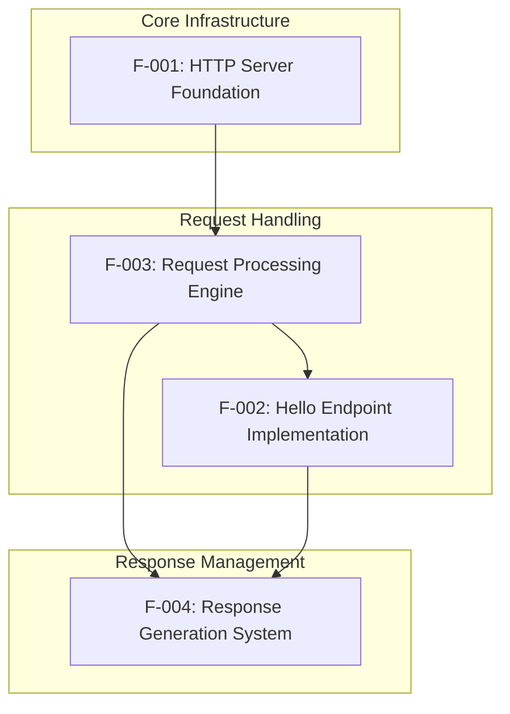
```mermaid
graph TD
    A[F-001: HTTP Server Foundation] --> B[F-003: Request Processing Engine]
    B --> C[F-002: Hello Endpoint Implementation]
    B --> D[F-004: Response Generation System]
    C --> D
    
    subgraph "Core Infrastructure"
        A
    end
    
    subgraph "Request Handling"
        B
        C
    end
    
    subgraph "Response Management"
        D
    end
```

### 2.3.2 Integration Points

| Integration Point | Features Involved | Description |
|------------------|------------------|-------------|
| **Server-Request Interface** | F-001, F-003 | HTTP server passes incoming requests to processing engine |
| **Request-Endpoint Interface** | F-003, F-002 | Request processor routes `/hello` requests to endpoint handler |
| **Endpoint-Response Interface** | F-002, F-004 | Hello endpoint uses response generator for output formatting |
| **Request-Response Interface** | F-003, F-004 | Request processor triggers appropriate response generation |

### 2.3.3 Shared Components

| Component | Features Using | Purpose |
|-----------|---------------|---------|
| **HTTP Protocol Handler** | F-001, F-003, F-004 | Common HTTP protocol implementation |
| **URL Router** | F-002, F-003 | Path matching and routing logic |
| **Response Formatter** | F-002, F-004 | Standardized response structure |

## 2.4 IMPLEMENTATION CONSIDERATIONS

### 2.4.1 Technical Constraints

| Feature | Constraints |
|---------|-------------|
| **F-001** | Limited to Node.js v22.x LTS compatibility requirements |
| **F-002** | Single endpoint limitation for tutorial scope |
| **F-003** | Low-level HTTP API constraints for stream handling |
| **F-004** | Plain text responses only (no HTML/JSON templating) |

### 2.4.2 Performance Requirements

| Feature | Performance Criteria |
|---------|-------------------|
| **F-001** | Server must handle 2000+ requests per second with keep-alive connections |
| **F-002** | Hello endpoint response time under 100ms |
| **F-003** | Request processing time measurable via performance hooks |
| **F-004** | Response generation latency under 5ms |

### 2.4.3 Scalability Considerations

| Aspect | Requirements |
|--------|-------------|
| **Concurrent Connections** | Support for 50K+ concurrent connections with proper ulimit configuration |
| **Memory Usage** | Stream-based processing to avoid buffering entire requests/responses |
| **CPU Utilization** | Clustering support for multi-core utilization |
| **Load Testing** | Integration with AutoCannon and Artillery for performance validation |

### 2.4.4 Security Implications

| Feature | Security Requirements |
|---------|---------------------|
| **F-001** | HTTP-only communication (no HTTPS in tutorial scope) |
| **F-002** | No authentication/authorization required |
| **F-003** | Basic input validation for malformed requests |
| **F-004** | No sensitive data exposure in responses |

### 2.4.5 Maintenance Requirements

| Feature | Maintenance Considerations |
|---------|-------------------------|
| **F-001** | Regular Node.js LTS updates and security patches |
| **F-002** | Endpoint monitoring and health checks |
| **F-003** | Request processing performance monitoring |
| **F-004** | Response time and error rate tracking |

## 2.5 TRACEABILITY MATRIX

| Requirement ID | Feature | Business Requirement | Technical Specification | Test Case |
|---------------|---------|-------------------|----------------------|-----------|
| F-001-RQ-001 | HTTP Server Foundation | Server initialization | Port 3000 binding | Server startup test |
| F-001-RQ-002 | HTTP Server Foundation | Concurrent handling | Multi-connection support | Load testing |
| F-002-RQ-001 | Hello Endpoint | Hello world response | GET /hello → 200 + text | Endpoint functionality test |
| F-002-RQ-002 | Hello Endpoint | Error handling | Non-matching paths → 404 | Error response test |
| F-003-RQ-001 | Request Processing | HTTP parsing | Method/URL extraction | Request parsing test |
| F-004-RQ-001 | Response Generation | HTTP compliance | Proper headers/status | Response format test |

# 3. TECHNOLOGY STACK

## 3.1 PROGRAMMING LANGUAGES

### 3.1.1 Primary Language Selection

| Component | Language | Version | Justification |
|-----------|----------|---------|---------------|
| **Server Application** | JavaScript | ES2022+ | Node.js® is a free, open-source, cross-platform JavaScript runtime environment that lets developers create servers, web apps, command line tools and scripts |
| **Runtime Environment** | Node.js | v22.11.0 LTS | With Active LTS support extending into late 2025, Node.js v22.x is an excellent choice for those aiming for long-term support in production environments. With Node.js v22.11.0, the 22.x release line has officially moved into Active LTS |

### 3.1.2 Language Selection Criteria

**JavaScript Selection Rationale:**
- **Native HTTP Support**: This module, containing both a client and server, can be imported via require('node:http') (CommonJS) or import * as http from 'node:http' (ES module). The HTTP interfaces in Node.js are designed to support many features of the protocol which have been traditionally difficult to use
- **Educational Alignment**: Provides clear, understandable syntax for tutorial purposes
- **Single Language Stack**: Eliminates complexity of multi-language environments for simple HTTP server demonstration
- **Built-in Capabilities**: Node.js has a fantastic standard library, including first-class support for networking. The createServer() method of http creates a new HTTP server and returns it

### 3.1.3 Version Constraints and Dependencies

**Node.js Version Requirements:**
- **LTS Support**: move to Active LTS status and are ready for general use. LTS release status is "long-term support", which typically guarantees that critical bugs will be fixed for a total of 30 months. Production applications should only use Active LTS or Maintenance LTS releases
- **Feature Compatibility**: Also of note is that Node.js 18 will go End-of-Life in April 2025, so we advise you to start planning to upgrade to Node.js 20 (LTS) or Node.js 22 (soon to be LTS)
- **Modern JavaScript Features**: Support for ES2022+ syntax including async/await, destructuring, and arrow functions

## 3.2 FRAMEWORKS & LIBRARIES

### 3.2.1 Core Framework Selection

| Framework Category | Selection | Version | Justification |
|-------------------|-----------|---------|---------------|
| **HTTP Server Framework** | Node.js Built-in HTTP Module | Native | In order to support the full spectrum of possible HTTP applications, the Node.js HTTP API is very low-level. It deals with stream handling and message parsing only |
| **Module System** | CommonJS | Native | Default Node.js module system for tutorial simplicity |

### 3.2.2 Framework Selection Rationale

**Built-in HTTP Module Selection:**
- **Zero External Dependencies**: Node.js includes a powerful built-in HTTP module that enables you to create HTTP servers and make HTTP requests. This module is essential for building web applications and APIs in Node.js
- **Educational Value**: Demonstrates fundamental HTTP concepts without framework abstraction
- **Performance Characteristics**: In particular, large, possibly chunk-encoded, messages. The interface is careful to never buffer entire requests or responses, so the user is able to stream data
- **Protocol Compliance**: Node.js HTTP module is a built-in library that allows developers to create web servers, as well as communicate with other APIs using HTTP 1.1, HTTP 2, and HTTPS

### 3.2.3 Excluded Framework Options

**Express.js - Excluded:**
- **Scope Limitation**: Tutorial focuses on fundamental HTTP concepts rather than framework-specific patterns
- **Dependency Overhead**: Adds unnecessary complexity for single-endpoint demonstration
- **Learning Objectives**: Direct HTTP module usage better illustrates underlying mechanisms

**Fastify - Excluded:**
- **Performance Optimization**: Not required for tutorial scope with single endpoint
- **Advanced Features**: Schema validation and serialization exceed project requirements

## 3.3 OPEN SOURCE DEPENDENCIES

### 3.3.1 Dependency Analysis

| Dependency Category | Package Count | Rationale |
|-------------------|---------------|-----------|
| **Runtime Dependencies** | 0 | Zero external dependencies for tutorial simplicity |
| **Development Dependencies** | 0 | Basic tutorial requires no additional tooling |
| **Built-in Modules** | 1 | Node.js HTTP module only |

### 3.3.2 Dependency Management Strategy

**Zero External Dependencies Approach:**
- **Educational Clarity**: Focuses learning on core Node.js capabilities without external abstractions
- **Security Minimization**: Regularly Audit Dependencies: Run npm audit to identify and fix known vulnerabilities in your project's dependencies. Avoid Publishing Secrets: Ensure that sensitive information like API keys or passwords are not included in your packages or version control
- **Maintenance Simplification**: No version conflicts or compatibility issues with third-party packages
- **Performance Optimization**: Minimal memory footprint and startup time

### 3.3.3 Package Registry Configuration

**NPM Registry Settings:**
- **Default Registry**: Latest version: 11.5.2, last published: 19 days ago. npm comes bundled with node, & most third-party distributions, by default
- **Version Management**: In all those cases, versioning helps a lot, and npm follows the semantic versioning (semver) standard
- **Package Manager**: NPM (Node Package Manager) is a package manager for NodeJS modules. It helps developers manage project dependencies, scripts, and third-party libraries

## 3.4 THIRD-PARTY SERVICES

### 3.4.1 External Service Requirements

| Service Category | Requirement | Status |
|-----------------|-------------|--------|
| **Authentication Services** | None | Not applicable for tutorial scope |
| **External APIs** | None | Self-contained demonstration |
| **Monitoring Tools** | None | Basic tutorial implementation |
| **Cloud Services** | None | Local development focus |

### 3.4.2 Service Exclusion Rationale

**No External Services Required:**
- **Tutorial Scope**: Single endpoint demonstration requires no external integrations
- **Self-Contained Learning**: Students can run application without external service dependencies
- **Simplified Setup**: Eliminates API key management and service configuration complexity
- **Offline Capability**: Application functions without internet connectivity after initial setup

## 3.5 DATABASES & STORAGE

### 3.5.1 Data Persistence Strategy

| Storage Type | Implementation | Justification |
|-------------|----------------|---------------|
| **Persistent Storage** | None | Static response content requires no persistence |
| **Session Storage** | None | Stateless HTTP endpoint design |
| **Caching Solutions** | None | Single static response eliminates caching needs |
| **File Storage** | None | No file upload or storage requirements |

### 3.5.2 Storage Architecture Decision

**Stateless Design Approach:**
- **Tutorial Simplicity**: Static "Hello world" response requires no data storage
- **Scalability Demonstration**: Stateless design principles for horizontal scaling
- **Resource Efficiency**: Minimal memory and disk usage
- **Deployment Simplicity**: No database setup or configuration required

### 3.5.3 Future Storage Considerations

**Potential Extensions (Out of Scope):**
- **File-based Configuration**: JSON configuration files for advanced tutorials
- **In-Memory Caching**: Request counting or basic analytics
- **Database Integration**: MongoDB or PostgreSQL for data-driven examples

## 3.6 DEVELOPMENT & DEPLOYMENT

### 3.6.1 Development Environment

| Tool Category | Selection | Version | Purpose |
|--------------|-----------|---------|---------|
| **Package Manager** | npm | 11.5.2+ | Latest version: 11.5.2, last published: 19 days ago. npm comes bundled with node, & most third-party distributions, by default |
| **Module System** | CommonJS | Native | Default Node.js module loading |
| **Development Server** | Node.js HTTP | Native | Built-in server capabilities |

### 3.6.2 Build System Configuration

**No Build Process Required:**
- **Direct Execution**: JavaScript files run directly without compilation
- **Native Module Support**: CommonJS modules are the original way to package JavaScript code for Node.js. Node.js also supports the ECMAScript modules standard used by browsers and other JavaScript runtimes
- **Development Simplicity**: Immediate code execution for rapid iteration
- **Educational Focus**: Eliminates build tool complexity from learning objectives

### 3.6.3 Deployment Architecture

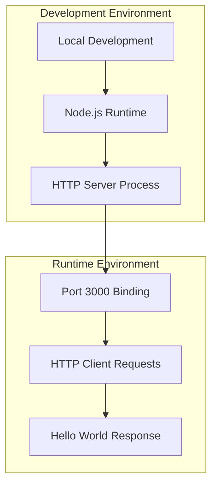
```mermaid
graph TB
    A[Local Development] --> B[Node.js Runtime]
    B --> C[HTTP Server Process]
    C --> D[Port 3000 Binding]
    D --> E[HTTP Client Requests]
    E --> F[Hello World Response]
    
    subgraph "Development Environment"
        A
        B
        C
    end
    
    subgraph "Runtime Environment"
        D
        E
        F
    end
```

### 3.6.4 Development Tools and Utilities

**Minimal Toolchain Approach:**
- **Code Editor**: Any text editor or IDE with JavaScript support
- **Terminal/Command Line**: For Node.js execution and npm commands
- **Web Browser**: For testing HTTP endpoint responses
- **Version Control**: Git (optional for tutorial scope)

### 3.6.5 Testing and Quality Assurance

**Built-in Testing Capabilities:**
- **Manual Testing**: Browser-based endpoint verification
- **Command Line Testing**: curl or similar HTTP client tools
- **Node.js Test Runner**: Node.js test runner supports assertions through the built-in assert module. You can use different methods like assert.strictEqual to verify your tests
- **Performance Monitoring**: Before you start exploring these modern features, ensure you're working with the Node.js LTS (long-term support) version

### 3.6.6 Containerization Strategy

**Docker Configuration (Optional):**
- **Base Image**: `node:22-alpine` for minimal footprint
- **Port Exposure**: Container port 3000 mapping
- **Development Workflow**: Local development without containerization requirement
- **Production Readiness**: Container support for advanced deployment scenarios

### 3.6.7 Continuous Integration Requirements

**CI/CD Pipeline (Future Consideration):**
- **GitHub Actions**: Automated testing and deployment workflows
- **Node.js Version Matrix**: Testing across multiple Node.js LTS versions
- **Dependency Scanning**: Security vulnerability assessment
- **Performance Benchmarking**: Response time and throughput validation

### 3.6.8 Performance Monitoring and Observability

**Application Performance Management:**
- **Built-in Metrics**: New Features: Stable fetch/WebStreams, built-in WebSocket client, and updates to the V8 engine
- **Request Logging**: HTTP request and response logging capabilities
- **Error Handling**: Basic error response mechanisms
- **Health Checks**: Simple endpoint availability monitoring

### 3.6.9 Security Considerations

**Application Security Framework:**
- **HTTP-Only Communication**: No HTTPS implementation in tutorial scope
- **Input Validation**: Basic request parsing and validation
- **Dependency Security**: Staying updated isn't just about "keeping with the times" — it's about leveraging the power of modern APIs to write more efficient, performant, and secure code
- **Runtime Security**: Node.js built-in security features and best practices

# 4. PROCESS FLOWCHART

## 4.1 SYSTEM WORKFLOWS

### 4.1.1 Core Business Processes

#### HTTP Server Request Processing Workflow

The function that's passed in to createServer is called once for every HTTP request that's made against that server, so it's called the request handler. When an HTTP request hits the server, Node calls the request handler function with a few handy objects for dealing with the transaction, request and response.

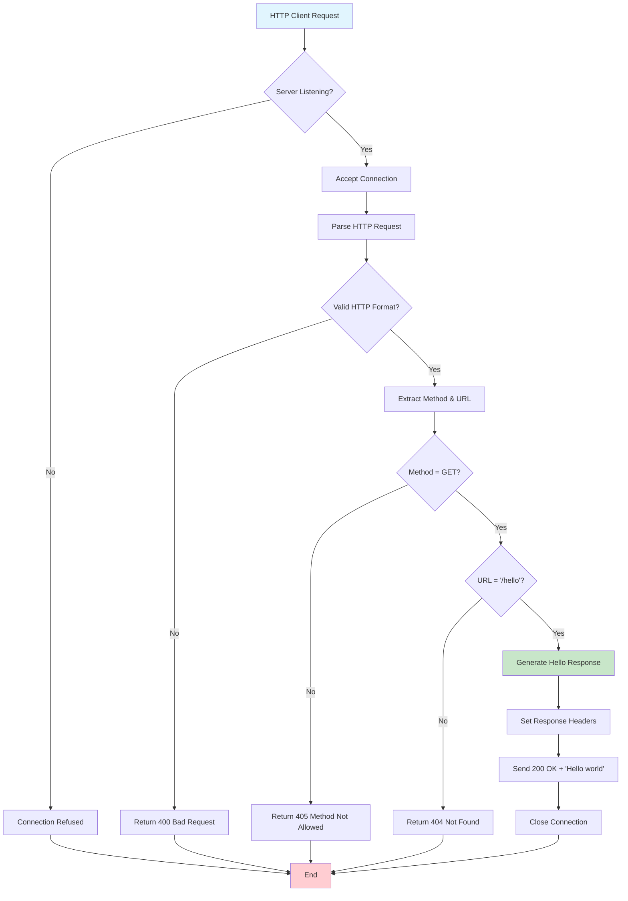
```mermaid
flowchart TD
    A[HTTP Client Request] --> B{Server Listening?}
    B -->|No| C[Connection Refused]
    B -->|Yes| D[Accept Connection]
    D --> E[Parse HTTP Request]
    E --> F{Valid HTTP Format?}
    F -->|No| G[Return 400 Bad Request]
    F -->|Yes| H[Extract Method & URL]
    H --> I{Method = GET?}
    I -->|No| J[Return 405 Method Not Allowed]
    I -->|Yes| K{URL = '/hello'?}
    K -->|No| L[Return 404 Not Found]
    K -->|Yes| M[Generate Hello Response]
    M --> N[Set Response Headers]
    N --> O[Send 200 OK + 'Hello world']
    O --> P[Close Connection]
    
    C --> Q[End]
    G --> Q
    J --> Q
    L --> Q
    P --> Q
    
    style A fill:#e1f5fe
    style M fill:#c8e6c9
    style Q fill:#ffcdd2
```

#### End-to-End User Journey

The request life cycle is the process of handling a request from the moment it is received by the server until the moment the response is sent back to the client. The server will search for the given route using a router function to determine the action to be taken.

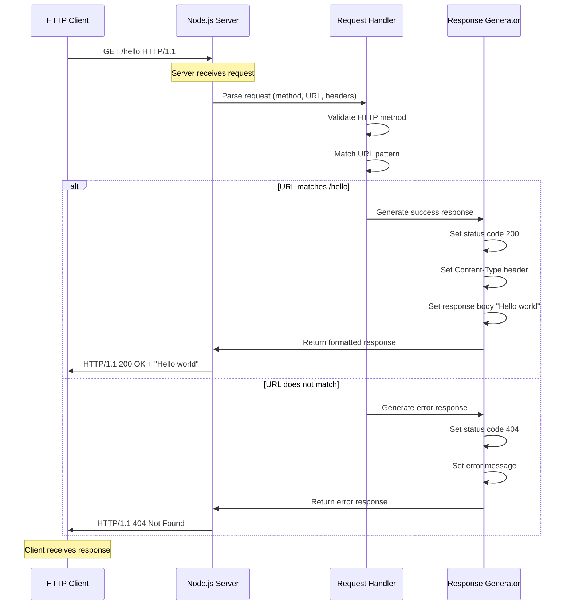
```mermaid
sequenceDiagram
    participant Client as HTTP Client
    participant Server as Node.js Server
    participant Handler as Request Handler
    participant Response as Response Generator
    
    Client->>Server: GET /hello HTTP/1.1
    Note over Server: Server receives request
    Server->>Handler: Parse request (method, URL, headers)
    Handler->>Handler: Validate HTTP method
    Handler->>Handler: Match URL pattern
    alt URL matches /hello
        Handler->>Response: Generate success response
        Response->>Response: Set status code 200
        Response->>Response: Set Content-Type header
        Response->>Response: Set response body "Hello world"
        Response->>Server: Return formatted response
        Server->>Client: HTTP/1.1 200 OK + "Hello world"
    else URL does not match
        Handler->>Response: Generate error response
        Response->>Response: Set status code 404
        Response->>Response: Set error message
        Response->>Server: Return error response
        Server->>Client: HTTP/1.1 404 Not Found
    end
    Note over Client: Client receives response
```

### 4.1.2 Integration Workflows

#### Server Lifecycle Management

How an application is shut down is just as important as how it starts up. Failing to gracefully shutdown an application can lead to unexpected behaviour that can be difficult to debug.

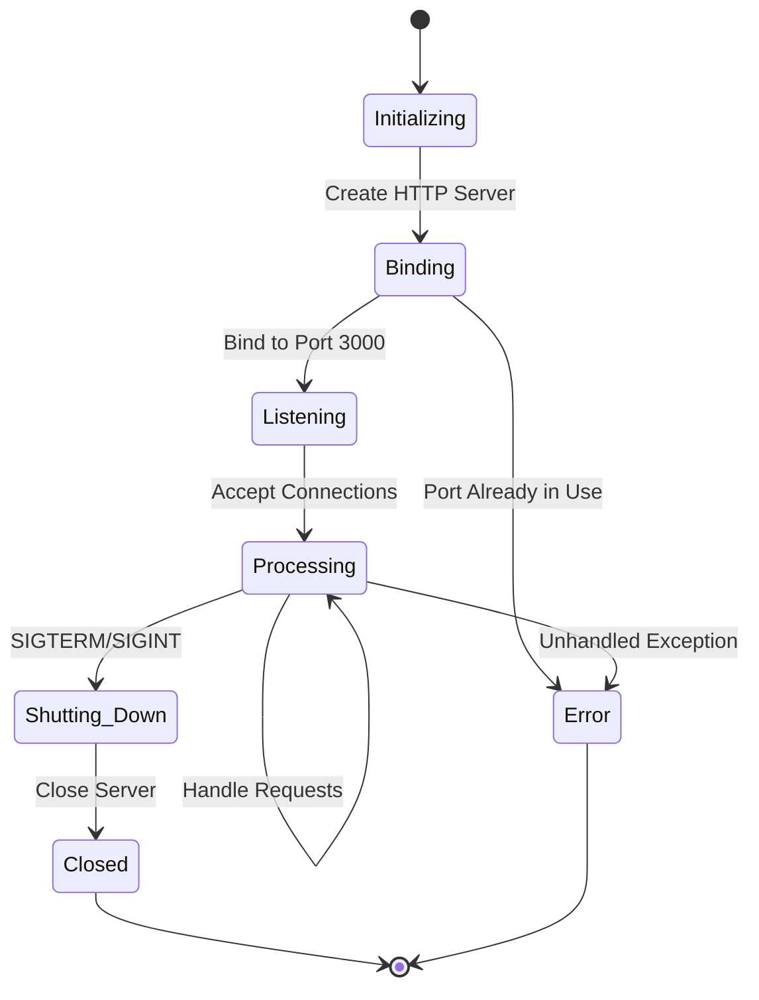
```mermaid
stateDiagram-v2
    [*] --> Initializing
    Initializing --> Binding: Create HTTP Server
    Binding --> Listening: Bind to Port 3000
    Listening --> Processing: Accept Connections
    Processing --> Processing: Handle Requests
    Processing --> Shutting_Down: SIGTERM/SIGINT
    Shutting_Down --> Closed: Close Server
    Closed --> [*]
    
    Binding --> Error: Port Already in Use
    Processing --> Error: Unhandled Exception
    Error --> [*]
```

#### Error Handling Flow

An error in the request stream presents itself by emitting an 'error' event on the stream. If you don't have a listener for that event, the error will be thrown, which could crash your Node.js program. You should therefore add an 'error' listener on your request streams, even if you just log it and continue on your way.

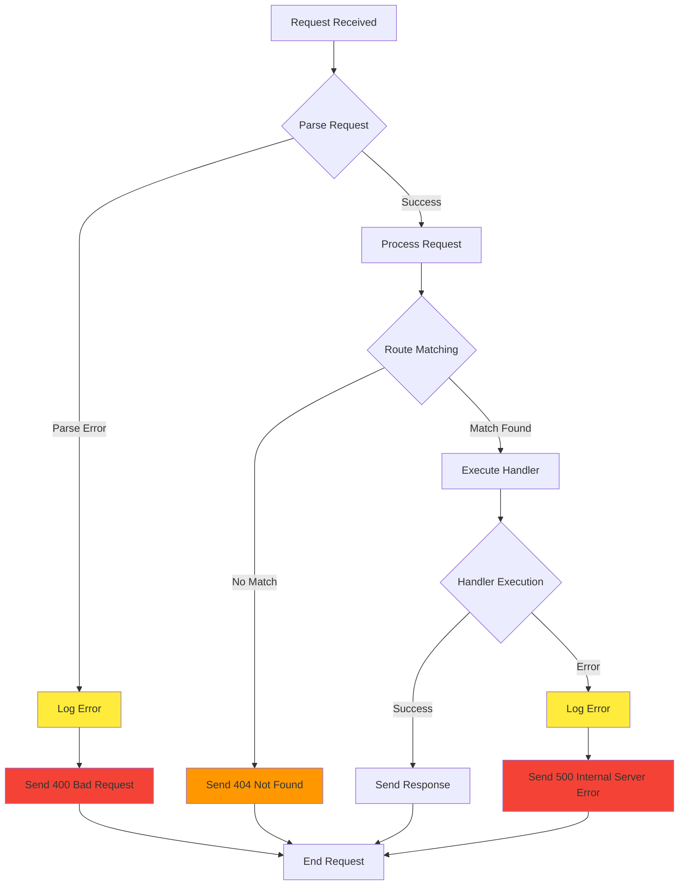
```mermaid
flowchart TD
    A[Request Received] --> B{Parse Request}
    B -->|Success| C[Process Request]
    B -->|Parse Error| D[Log Error]
    D --> E[Send 400 Bad Request]
    
    C --> F{Route Matching}
    F -->|Match Found| G[Execute Handler]
    F -->|No Match| H[Send 404 Not Found]
    
    G --> I{Handler Execution}
    I -->|Success| J[Send Response]
    I -->|Error| K[Log Error]
    K --> L[Send 500 Internal Server Error]
    
    E --> M[End Request]
    H --> M
    J --> M
    L --> M
    
    style D fill:#ffeb3b
    style K fill:#ffeb3b
    style E fill:#f44336
    style L fill:#f44336
    style H fill:#ff9800
```

## 4.2 FLOWCHART REQUIREMENTS

### 4.2.1 Process Steps and Decision Points

#### HTTP Request Validation Workflow

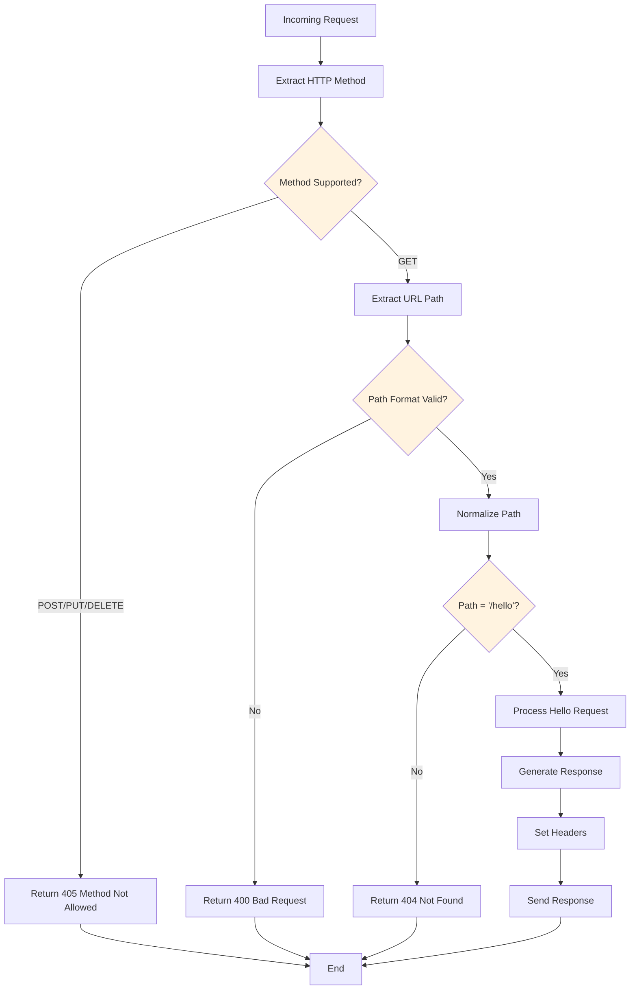
```mermaid
flowchart TD
    A[Incoming Request] --> B[Extract HTTP Method]
    B --> C{Method Supported?}
    C -->|GET| D[Extract URL Path]
    C -->|POST/PUT/DELETE| E[Return 405 Method Not Allowed]
    
    D --> F{Path Format Valid?}
    F -->|Yes| G[Normalize Path]
    F -->|No| H[Return 400 Bad Request]
    
    G --> I{Path = '/hello'?}
    I -->|Yes| J[Process Hello Request]
    I -->|No| K[Return 404 Not Found]
    
    J --> L[Generate Response]
    L --> M[Set Headers]
    M --> N[Send Response]
    
    E --> O[End]
    H --> O
    K --> O
    N --> O
    
    style C fill:#fff3e0
    style F fill:#fff3e0
    style I fill:#fff3e0
```

#### System Boundaries and User Touchpoints

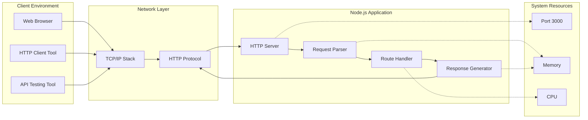
```mermaid
flowchart LR
    subgraph "Client Environment"
        A[Web Browser]
        B[HTTP Client Tool]
        C[API Testing Tool]
    end
    
    subgraph "Network Layer"
        D[TCP/IP Stack]
        E[HTTP Protocol]
    end
    
    subgraph "Node.js Application"
        F[HTTP Server]
        G[Request Parser]
        H[Route Handler]
        I[Response Generator]
    end
    
    subgraph "System Resources"
        J[Port 3000]
        K[Memory]
        L[CPU]
    end
    
    A --> D
    B --> D
    C --> D
    D --> E
    E --> F
    F --> G
    G --> H
    H --> I
    I --> E
    
    F -.-> J
    G -.-> K
    H -.-> L
    I -.-> K
```

### 4.2.2 Validation Rules and Business Logic

#### Request Validation Decision Matrix

| Validation Point | Rule | Action | Status Code |
|-----------------|------|--------|-------------|
| **HTTP Method** | Must be GET | Accept request | Continue |
| **HTTP Method** | POST/PUT/DELETE/etc. | Reject request | 405 Method Not Allowed |
| **URL Path** | Must be '/hello' | Process request | Continue |
| **URL Path** | Any other path | Reject request | 404 Not Found |
| **Request Format** | Valid HTTP/1.1 | Parse headers | Continue |
| **Request Format** | Malformed HTTP | Reject request | 400 Bad Request |

#### Business Rules Implementation Flow

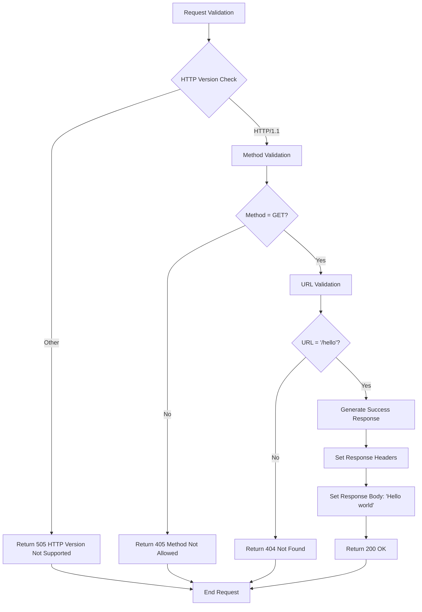
```mermaid
flowchart TD
    A[Request Validation] --> B{HTTP Version Check}
    B -->|HTTP/1.1| C[Method Validation]
    B -->|Other| D[Return 505 HTTP Version Not Supported]
    
    C --> E{Method = GET?}
    E -->|Yes| F[URL Validation]
    E -->|No| G[Return 405 Method Not Allowed]
    
    F --> H{URL = '/hello'?}
    H -->|Yes| I[Generate Success Response]
    H -->|No| J[Return 404 Not Found]
    
    I --> K[Set Response Headers]
    K --> L[Set Response Body: 'Hello world']
    L --> M[Return 200 OK]
    
    D --> N[End Request]
    G --> N
    J --> N
    M --> N
```

## 4.3 TECHNICAL IMPLEMENTATION

### 4.3.1 State Management

#### Server State Transitions

A Node.js app runs in a single process, without creating a new thread for every request.

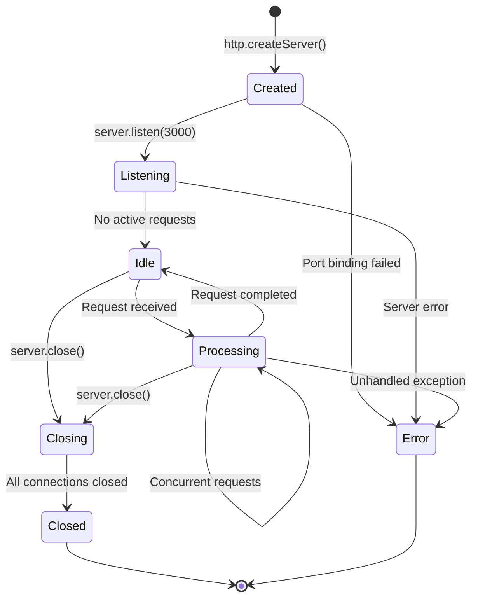
```mermaid
stateDiagram-v2
    [*] --> Created: http.createServer()
    Created --> Listening: server.listen(3000)
    Listening --> Idle: No active requests
    Idle --> Processing: Request received
    Processing --> Idle: Request completed
    Processing --> Processing: Concurrent requests
    Idle --> Closing: server.close()
    Processing --> Closing: server.close()
    Closing --> Closed: All connections closed
    Closed --> [*]
    
    Created --> Error: Port binding failed
    Listening --> Error: Server error
    Processing --> Error: Unhandled exception
    Error --> [*]
```

#### Request Processing State Flow

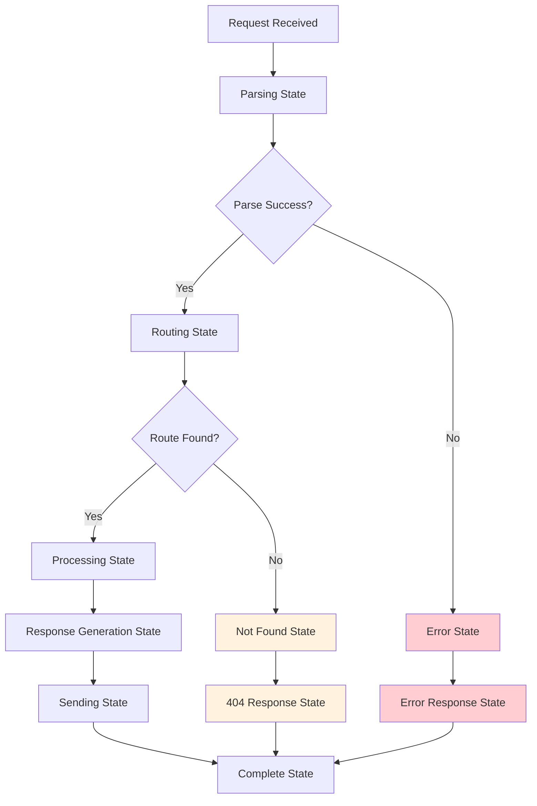
```mermaid
flowchart TD
    A[Request Received] --> B[Parsing State]
    B --> C{Parse Success?}
    C -->|Yes| D[Routing State]
    C -->|No| E[Error State]
    
    D --> F{Route Found?}
    F -->|Yes| G[Processing State]
    F -->|No| H[Not Found State]
    
    G --> I[Response Generation State]
    I --> J[Sending State]
    J --> K[Complete State]
    
    E --> L[Error Response State]
    H --> M[404 Response State]
    L --> K
    M --> K
    
    style E fill:#ffcdd2
    style H fill:#fff3e0
    style L fill:#ffcdd2
    style M fill:#fff3e0
```

### 4.3.2 Data Persistence Points

#### Stateless Architecture Flow

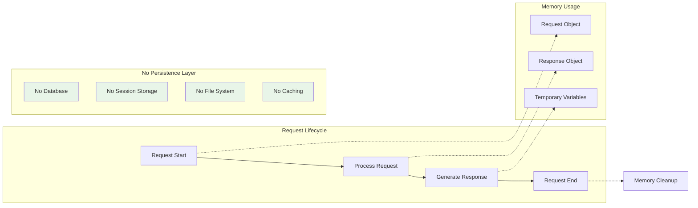
```mermaid
flowchart LR
    subgraph "Request Lifecycle"
        A[Request Start] --> B[Process Request]
        B --> C[Generate Response]
        C --> D[Request End]
    end
    
    subgraph "No Persistence Layer"
        E[No Database]
        F[No Session Storage]
        G[No File System]
        H[No Caching]
    end
    
    subgraph "Memory Usage"
        I[Request Object]
        J[Response Object]
        K[Temporary Variables]
    end
    
    A -.-> I
    B -.-> J
    C -.-> K
    D -.-> L[Memory Cleanup]
    
    style E fill:#e8f5e8
    style F fill:#e8f5e8
    style G fill:#e8f5e8
    style H fill:#e8f5e8
```

### 4.3.3 Error Handling Implementation

#### Comprehensive Error Recovery Flow

If a client connection emits an 'error' event, it will be forwarded here. Listener of this event is responsible for closing/destroying the underlying socket. For example, one may wish to more gracefully close the socket with a custom HTTP response instead of abruptly severing the connection.

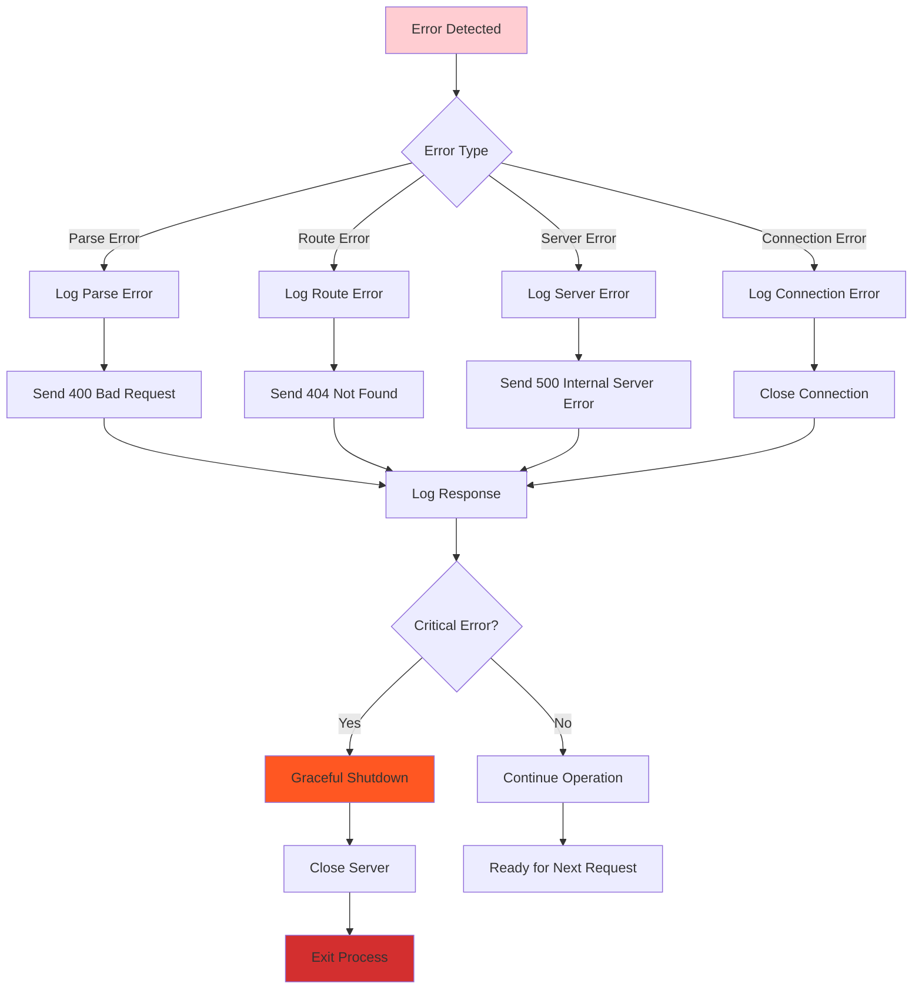
```mermaid
flowchart TD
    A[Error Detected] --> B{Error Type}
    
    B -->|Parse Error| C[Log Parse Error]
    B -->|Route Error| D[Log Route Error]
    B -->|Server Error| E[Log Server Error]
    B -->|Connection Error| F[Log Connection Error]
    
    C --> G[Send 400 Bad Request]
    D --> H[Send 404 Not Found]
    E --> I[Send 500 Internal Server Error]
    F --> J[Close Connection]
    
    G --> K[Log Response]
    H --> K
    I --> K
    J --> K
    
    K --> L{Critical Error?}
    L -->|Yes| M[Graceful Shutdown]
    L -->|No| N[Continue Operation]
    
    M --> O[Close Server]
    O --> P[Exit Process]
    N --> Q[Ready for Next Request]
    
    style A fill:#ffcdd2
    style M fill:#ff5722
    style P fill:#d32f2f
```

#### Error Classification and Response Matrix

| Error Category | HTTP Status | Response Action | Recovery Strategy |
|---------------|-------------|-----------------|-------------------|
| **Client Errors** | 400-499 | Return error response | Continue operation |
| **Server Errors** | 500-599 | Log and return error | Monitor for patterns |
| **Network Errors** | Connection issues | Close connection | Accept new connections |
| **Critical Errors** | System failure | Graceful shutdown | Process restart |

### 4.3.4 Performance and Timing Considerations

#### Request Processing Timeline


```mermaid
gantt
    title HTTP Request Processing Timeline
    dateFormat X
    axisFormat %L ms
    
    section Request Handling
    Connection Accept    :0, 1
    Request Parse       :1, 5
    Route Matching      :5, 8
    Response Generation :8, 12
    Response Send       :12, 15
    Connection Close    :15, 16
    
    section Performance Targets
    Total Response Time :crit, 0, 100
    Parse Time Limit   :active, 1, 10
    Processing Limit   :active, 5, 50
```

#### Concurrent Request Management

When Node.js performs an I/O operation, like reading from the network, accessing a database or the filesystem, instead of blocking the thread and wasting CPU cycles waiting, Node.js will resume the operations when the response comes back. This allows Node.js to handle thousands of concurrent connections with a single server without introducing the burden of managing thread concurrency, which could be a significant source of bugs.

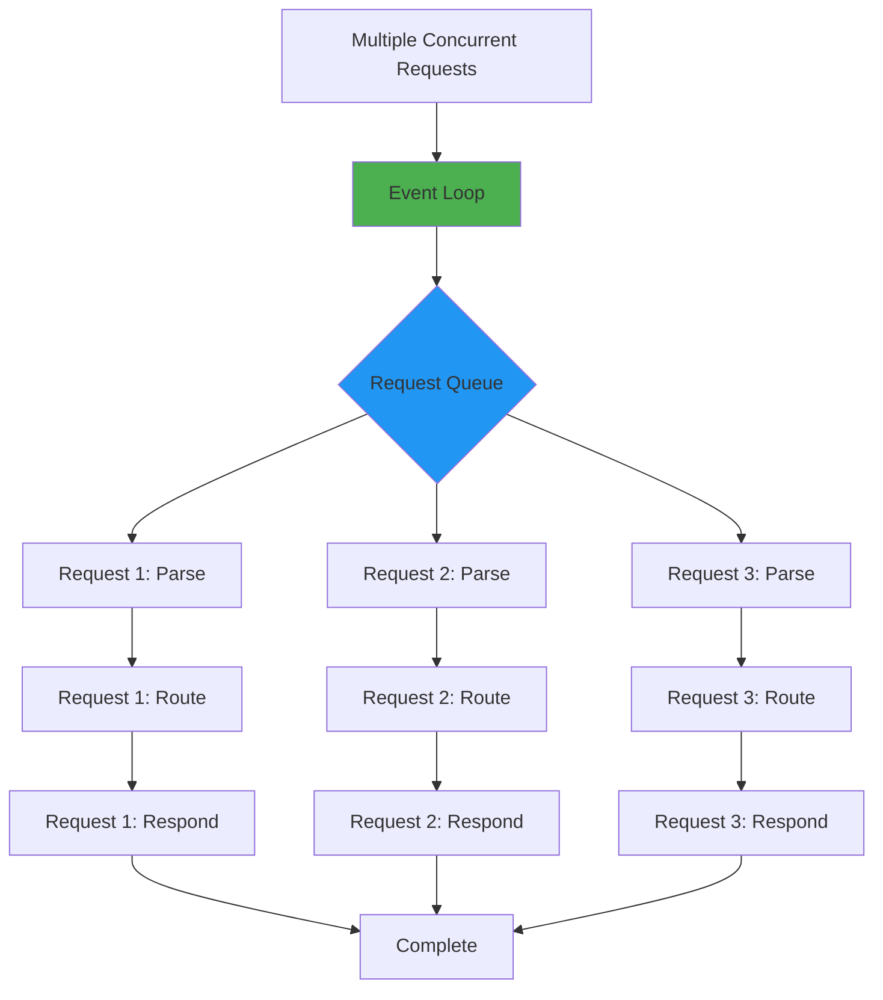
```mermaid
flowchart TD
    A[Multiple Concurrent Requests] --> B[Event Loop]
    B --> C{Request Queue}
    
    C --> D[Request 1: Parse]
    C --> E[Request 2: Parse]
    C --> F[Request 3: Parse]
    
    D --> G[Request 1: Route]
    E --> H[Request 2: Route]
    F --> I[Request 3: Route]
    
    G --> J[Request 1: Respond]
    H --> K[Request 2: Respond]
    I --> L[Request 3: Respond]
    
    J --> M[Complete]
    K --> M
    L --> M
    
    style B fill:#4caf50
    style C fill:#2196f3
```

## 4.4 MONITORING AND OBSERVABILITY

### 4.4.1 Request Monitoring Flow

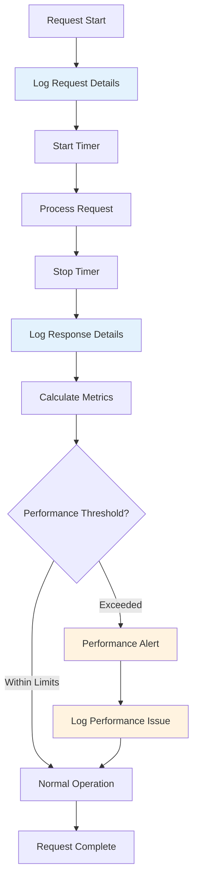
```mermaid
flowchart TD
    A[Request Start] --> B[Log Request Details]
    B --> C[Start Timer]
    C --> D[Process Request]
    D --> E[Stop Timer]
    E --> F[Log Response Details]
    F --> G[Calculate Metrics]
    G --> H{Performance Threshold?}
    H -->|Within Limits| I[Normal Operation]
    H -->|Exceeded| J[Performance Alert]
    
    J --> K[Log Performance Issue]
    K --> I
    I --> L[Request Complete]
    
    style B fill:#e3f2fd
    style F fill:#e3f2fd
    style J fill:#fff3e0
    style K fill:#fff3e0
```

### 4.4.2 Health Check Implementation

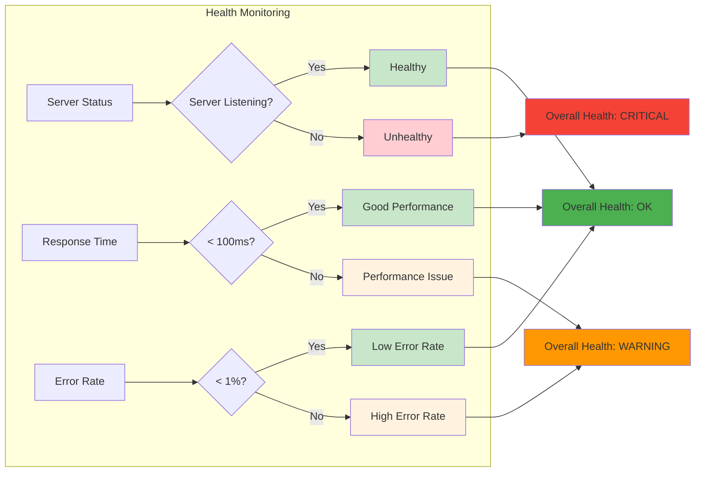
```mermaid
flowchart LR
    subgraph "Health Monitoring"
        A[Server Status] --> B{Server Listening?}
        B -->|Yes| C[Healthy]
        B -->|No| D[Unhealthy]
        
        E[Response Time] --> F{< 100ms?}
        F -->|Yes| G[Good Performance]
        F -->|No| H[Performance Issue]
        
        I[Error Rate] --> J{< 1%?}
        J -->|Yes| K[Low Error Rate]
        J -->|No| L[High Error Rate]
    end
    
    C --> M[Overall Health: OK]
    G --> M
    K --> M
    
    D --> N[Overall Health: CRITICAL]
    H --> O[Overall Health: WARNING]
    L --> O
    
    style C fill:#c8e6c9
    style G fill:#c8e6c9
    style K fill:#c8e6c9
    style M fill:#4caf50
    style D fill:#ffcdd2
    style N fill:#f44336
    style H fill:#fff3e0
    style L fill:#fff3e0
    style O fill:#ff9800
```

# 5. SYSTEM ARCHITECTURE

## 5.1 HIGH-LEVEL ARCHITECTURE

### 5.1.1 System Overview

The Node.js tutorial application follows a **Single-Threaded Event Loop Architecture**, which is the fundamental architectural pattern for Node.js applications. Node.js employs a "Single Threaded Event Loop" design to manage several concurrent clients. This architecture leverages the event loop to perform non-blocking I/O operations — despite the fact that a single JavaScript thread is used by default — by offloading operations to the system kernel whenever possible.

The system implements a **Stateless Request-Response Model** where each HTTP request is processed independently without maintaining session state between requests. Node JS Platform does not follow Request/Response Multi-Threaded Stateless Model. It follows Single Threaded with Event Loop Model. This design choice aligns with the tutorial's educational objectives of demonstrating fundamental HTTP server concepts using minimal complexity.

The architectural approach emphasizes **Simplicity and Educational Clarity** by utilizing only Node.js built-in modules without external dependencies. Node.js uses the Event-Driven Architecture: it has an Event Loop for orchestration and a Worker Pool for expensive tasks. The system boundaries are clearly defined around HTTP protocol handling, with the application serving as a self-contained demonstration of server-side JavaScript capabilities.

Key architectural principles include:
- **Event-Driven Processing**: All request handling occurs through the Node.js event loop mechanism
- **Non-Blocking I/O**: HTTP operations are processed asynchronously without blocking the main thread
- **Zero External Dependencies**: Complete reliance on Node.js built-in HTTP module for educational simplicity
- **Protocol Compliance**: Strict adherence to HTTP/1.1 standards for request-response cycles

### 5.1.2 Core Components Table

| Component Name | Primary Responsibility | Key Dependencies | Integration Points |
|---------------|----------------------|------------------|-------------------|
| **HTTP Server** | Accept and manage incoming connections | Node.js HTTP module, TCP/IP stack | Event Loop, Request Parser |
| **Event Loop** | Orchestrate request processing and response generation | Node.js runtime, libuv library | HTTP Server, Route Handler |
| **Request Parser** | Extract and validate HTTP request components | HTTP protocol parser, URL module | Event Loop, Route Handler |
| **Route Handler** | Process `/hello` endpoint requests and generate responses | Request Parser, Response Generator | Request Parser, Response Generator |

### 5.1.3 Data Flow Description

The primary data flow follows a **Linear Request-Response Pipeline** where HTTP requests enter the system through the TCP/IP network stack and are processed sequentially by the event loop. The Event Loop notices each new client connection and orchestrates the generation of a response. All incoming requests and outgoing responses pass through the Event Loop.

Request processing begins when the HTTP server receives a connection on port 3000. The requests enter the Event Queue first at the server-side. The Event queue passes the requests sequentially to the event loop. The event loop then delegates request parsing to extract HTTP method, URL path, and headers from the raw request data.

The integration pattern utilizes **Callback-Based Asynchronous Processing** where each component communicates through JavaScript callback functions. Node JS Processing model mainly based on Javascript Event based model with Javascript callback mechanism. Data transformation occurs at the request parsing stage where raw HTTP data is converted into structured JavaScript objects containing method, URL, and header information.

The system maintains **No Persistent Data Stores** as all processing occurs in memory during the request lifecycle. Response data is generated dynamically for each request, with the "Hello world" message being the only static content served by the application.

### 5.1.4 External Integration Points

| System Name | Integration Type | Data Exchange Pattern | Protocol/Format |
|-------------|------------------|----------------------|-----------------|
| **HTTP Clients** | Inbound Request | Request-Response | HTTP/1.1 |
| **Operating System** | System Resource | Socket Management | TCP/IP |
| **Node.js Runtime** | Platform Service | Event Processing | JavaScript API |

## 5.2 COMPONENT DETAILS

### 5.2.1 HTTP Server Component

**Purpose and Responsibilities:**
The HTTP Server component serves as the primary entry point for all client connections and HTTP request processing. It manages TCP socket connections, handles HTTP protocol parsing, and coordinates the overall request-response lifecycle. The Node.js server accepts user requests, processes them, and returns results to the users.

**Technologies and Frameworks:**
- **Node.js Built-in HTTP Module**: Provides core HTTP server functionality
- **libuv Library**: Handles asynchronous I/O operations and event loop management
- **V8 JavaScript Engine**: Executes JavaScript code and manages memory allocation

**Key Interfaces and APIs:**
- `http.createServer()`: Creates HTTP server instance
- `server.listen(port, callback)`: Binds server to specified port
- Request/Response objects: Handle HTTP message processing
- Event emitters: Manage connection and error events

**Data Persistence Requirements:**
No persistent data storage is required. All server state is maintained in memory during the application lifecycle, with automatic cleanup when the process terminates.

**Scaling Considerations:**
The secret to the scalability of Node.js is that it uses a small number of threads to handle many clients. If Node.js can make do with fewer threads, then it can spend more of your system's time and memory working on clients rather than on paying space and time overheads for threads.

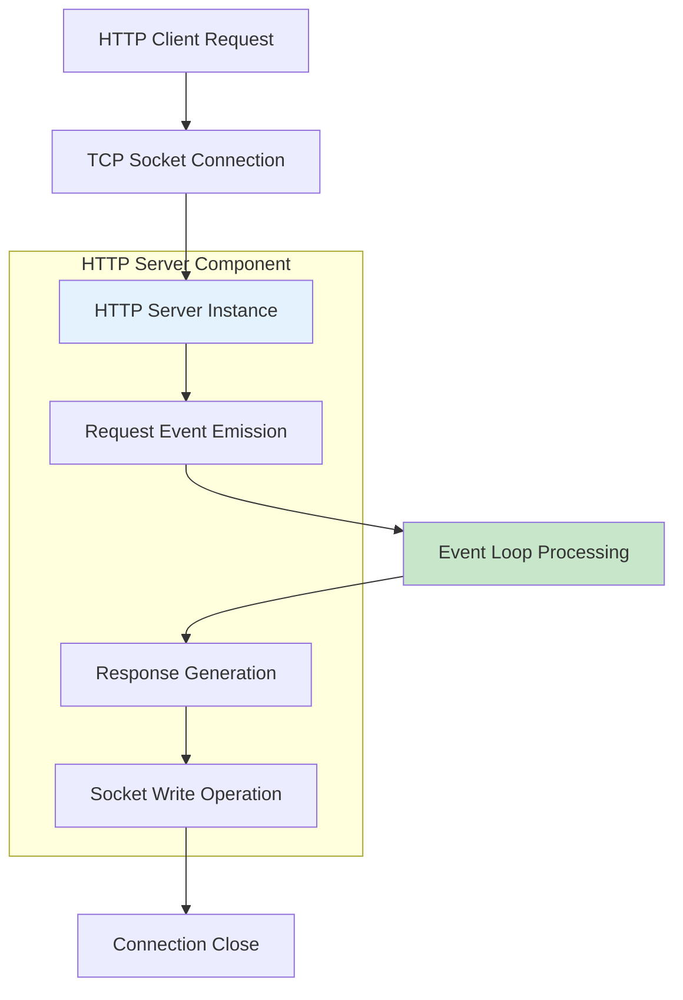
```mermaid
graph TD
    A[HTTP Client Request] --> B[TCP Socket Connection]
    B --> C[HTTP Server Instance]
    C --> D[Request Event Emission]
    D --> E[Event Loop Processing]
    E --> F[Response Generation]
    F --> G[Socket Write Operation]
    G --> H[Connection Close]
    
    subgraph "HTTP Server Component"
        C
        D
        F
        G
    end
    
    style C fill:#e3f2fd
    style E fill:#c8e6c9
```

### 5.2.2 Event Loop Component

**Purpose and Responsibilities:**
Event Loop receives requests from the Event Queue and sends out the responses to the clients. The Event Loop serves as the central orchestrator for all asynchronous operations, managing the execution of callbacks and ensuring non-blocking I/O processing.

**Technologies and Frameworks:**
- **Node.js Event Loop**: Core runtime component for asynchronous processing
- **JavaScript Callback System**: Manages function execution scheduling
- **libuv Event Loop**: Underlying C++ library providing cross-platform event loop functionality

**Key Interfaces and APIs:**
- Event queue management for incoming requests
- Callback execution scheduling and prioritization
- Timer and immediate execution handling
- I/O operation coordination

**Data Persistence Requirements:**
Maintains transient state information in memory including pending callbacks, timer references, and active I/O operations. No persistent storage required.

**Scaling Considerations:**
Despite its single-threaded event loop, Node.js is exceptionally scalable. It can handle thousands of concurrent connections and I/O operations efficiently. This is achieved by allowing the event loop to process numerous tasks concurrently without blocking.

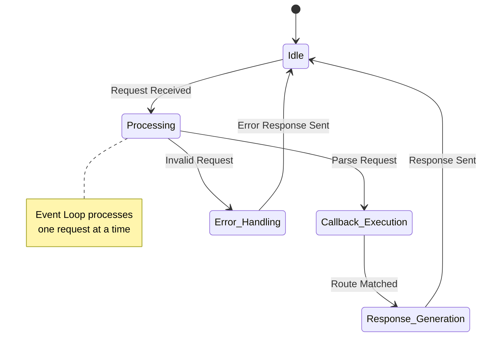
```mermaid
stateDiagram-v2
    [*] --> Idle
    Idle --> Processing: Request Received
    Processing --> Callback_Execution: Parse Request
    Callback_Execution --> Response_Generation: Route Matched
    Response_Generation --> Idle: Response Sent
    Processing --> Error_Handling: Invalid Request
    Error_Handling --> Idle: Error Response Sent
    
    note right of Processing
        Event Loop processes
        one request at a time
    end note
```

### 5.2.3 Request Parser Component

**Purpose and Responsibilities:**
The Request Parser component extracts and validates HTTP request components including method, URL path, headers, and body content. It transforms raw HTTP data into structured JavaScript objects for further processing by the route handler.

**Technologies and Frameworks:**
- **Node.js HTTP Parser**: Built-in HTTP message parsing capabilities
- **URL Module**: Provides URL parsing and manipulation functions
- **String Processing**: JavaScript string methods for header parsing

**Key Interfaces and APIs:**
- HTTP method extraction and validation
- URL path parsing and normalization
- Header field processing and validation
- Request body handling (minimal for GET requests)

**Data Persistence Requirements:**
No persistent data storage. Request parsing occurs entirely in memory with immediate processing and cleanup after response generation.

**Scaling Considerations:**
Parser operates synchronously within the event loop, requiring efficient processing to maintain overall system responsiveness. Memory usage is optimized through immediate processing and garbage collection.

```mermaid
sequenceDiagram
    participant Client as HTTP Client
    participant Server as HTTP Server
    participant Parser as Request Parser
    participant Handler as Route Handler
    
    Client->>Server: HTTP GET /hello
    Server->>Parser: Raw HTTP Request
    Parser->>Parser: Extract Method
    Parser->>Parser: Parse URL Path
    Parser->>Parser: Process Headers
    Parser->>Handler: Structured Request Object
    Handler->>Server: Response Data
    Server->>Client: HTTP Response
```

### 5.2.4 Route Handler Component

**Purpose and Responsibilities:**
The Route Handler component processes specific endpoint requests, implementing the business logic for the `/hello` route. It generates appropriate responses based on URL path matching and handles error cases for unmatched routes.

**Technologies and Frameworks:**
- **JavaScript String Matching**: URL path comparison logic
- **HTTP Response Generation**: Status code and content management
- **Error Handling**: HTTP error response generation

**Key Interfaces and APIs:**
- URL path matching algorithms
- Response content generation
- HTTP status code management
- Error response formatting

**Data Persistence Requirements:**
No persistent data storage required. All response content is generated dynamically or from static string literals stored in memory.

**Scaling Considerations:**
Route handling logic is optimized for minimal processing overhead, ensuring rapid response generation without blocking the event loop for extended periods.

```mermaid
flowchart TD
    A[Incoming Request] --> B{URL Path Check}
    B -->|/hello| C[Generate Success Response]
    B -->|Other Path| D[Generate 404 Response]
    C --> E[Set Status 200]
    D --> F[Set Status 404]
    E --> G[Set Content-Type Header]
    F --> H[Set Error Headers]
    G --> I[Set Response Body: 'Hello world']
    H --> J[Set Error Message]
    I --> K[Send Response]
    J --> K
    
    style C fill:#c8e6c9
    style D fill:#ffcdd2
```

## 5.3 TECHNICAL DECISIONS

### 5.3.1 Architecture Style Decisions and Tradeoffs

**Single-Threaded Event Loop Architecture Selection:**

| Decision Factor | Chosen Approach | Alternative Considered | Rationale |
|----------------|-----------------|----------------------|-----------|
| **Concurrency Model** | Event-driven, single-threaded | Multi-threaded request handling | Educational simplicity and Node.js native patterns |
| **I/O Processing** | Non-blocking asynchronous | Synchronous blocking operations | Performance and scalability demonstration |
| **Memory Management** | Automatic garbage collection | Manual memory management | JavaScript runtime integration |

The decision to implement a single-threaded event loop architecture aligns with Node.js's core design philosophy. Node.js's single-threaded architecture, driven by the event loop and non-blocking I/O, is a deliberate design choice that balances simplicity, performance, and scalability. This approach provides educational value by demonstrating how Node.js achieves high concurrency without traditional multi-threading complexity.

**Stateless Request Processing Model:**

The system implements a stateless design where each HTTP request is processed independently without maintaining session information between requests. This decision supports the tutorial's educational objectives by focusing on fundamental HTTP concepts rather than complex state management patterns.

### 5.3.2 Communication Pattern Choices

**HTTP Protocol Communication:**

| Pattern | Implementation | Benefits | Limitations |
|---------|---------------|----------|-------------|
| **Request-Response** | Synchronous HTTP/1.1 | Simple, well-understood protocol | No real-time capabilities |
| **Event-Driven Callbacks** | JavaScript callback functions | Non-blocking processing | Callback complexity potential |
| **Direct Function Calls** | Synchronous method invocation | Minimal overhead | Limited scalability |

The communication pattern emphasizes simplicity and educational clarity. Node.js's middleware architecture is widely used for handling requests and responses in web applications. The Middleware pattern involves a chain of functions that process a request sequentially. Each function can modify the request or response before passing it to the next function in the chain.

### 5.3.3 Data Storage Solution Rationale

**Zero Persistent Storage Decision:**

The tutorial application deliberately excludes all forms of persistent data storage to maintain focus on HTTP server fundamentals. This architectural decision eliminates complexity related to database connections, data modeling, and persistence layer management.

**In-Memory Processing Approach:**

All request processing occurs entirely in memory with automatic cleanup through JavaScript garbage collection. This approach demonstrates Node.js memory management capabilities while avoiding the overhead of external storage systems.

### 5.3.4 Caching Strategy Justification

**No Caching Implementation:**

Given the static nature of the "Hello world" response and the educational scope of the application, no caching mechanisms are implemented. This decision maintains architectural simplicity while focusing learning objectives on core HTTP server concepts.

**Memory-Based Response Generation:**

Response content is generated directly in memory for each request, demonstrating the stateless nature of HTTP communication without the complexity of cache invalidation or management strategies.

```mermaid
graph TD
    A[Architecture Decision Process] --> B{Educational Value}
    B -->|High| C[Simple Implementation]
    B -->|Medium| D[Consider Alternatives]
    B -->|Low| E[Exclude Feature]
    
    C --> F[Include in Tutorial]
    D --> G{Implementation Complexity}
    G -->|Low| F
    G -->|High| E
    E --> H[Document as Future Enhancement]
    F --> I[Implement with Documentation]
    
    style F fill:#c8e6c9
    style E fill:#ffcdd2
    style I fill:#e3f2fd
```

### 5.3.5 Security Mechanism Selection

**HTTP-Only Communication:**

The tutorial application uses unencrypted HTTP communication to maintain simplicity and focus on fundamental concepts. HTTPS implementation is deliberately excluded to avoid SSL/TLS certificate management complexity in the educational context.

**Minimal Input Validation:**

Basic HTTP request validation is implemented to demonstrate proper error handling patterns without introducing complex security frameworks or authentication mechanisms.

## 5.4 CROSS-CUTTING CONCERNS

### 5.4.1 Monitoring and Observability Approach

**Built-in Monitoring Capabilities:**

The application implements basic monitoring through Node.js built-in capabilities including request logging and error tracking. Node.js monitoring plays an important role in maintaining reliable applications by tracking runtime metrics (memory, CPU), application metrics (request rates, response times), and business metrics (user actions, conversion rates).

**Performance Metrics Collection:**

| Metric Category | Monitoring Approach | Implementation Method | Purpose |
|----------------|-------------------|---------------------|---------|
| **Request Metrics** | Manual logging | Console output | Request tracking |
| **Response Times** | Timestamp comparison | Date.now() calculations | Performance monitoring |
| **Error Rates** | Exception counting | Try-catch blocks | Reliability tracking |

**Observability Strategy:**

Node.js performance monitoring enables a detailed intelligence-based view of the behavior of every component of your Node.js architecture and its infrastructures. This application-centric view also provides insight into how to improve your Node.js application's performance.

### 5.4.2 Logging and Tracing Strategy

**Console-Based Logging:**

The application utilizes Node.js console logging for request tracking and error reporting. This approach provides immediate feedback during development and testing phases without requiring external logging frameworks.

**Request Tracing Implementation:**

Basic request tracing is implemented through console output showing request method, URL, timestamp, and response status. This provides visibility into request processing flow for educational purposes.

**Error Logging Patterns:**

Error conditions are logged with sufficient detail to support troubleshooting while maintaining code simplicity. Error messages include request context and timestamp information for debugging support.

### 5.4.3 Error Handling Patterns

**Comprehensive Error Recovery:**

The application implements multiple layers of error handling to demonstrate proper Node.js error management patterns. If it is possible that for certain input one of your threads might block, a malicious client could submit this "evil input", make your threads block, and keep them from working on other clients. This would be a Denial of Service attack.

**Error Classification System:**

| Error Type | HTTP Status | Handling Strategy | Recovery Action |
|-----------|-------------|------------------|-----------------|
| **Parse Errors** | 400 Bad Request | Log and respond | Continue processing |
| **Route Errors** | 404 Not Found | Standard response | Normal operation |
| **Server Errors** | 500 Internal Error | Log and monitor | Graceful degradation |

```mermaid
flowchart TD
    A[Error Detected] --> B{Error Classification}
    
    B -->|Client Error| C[Log Client Error]
    B -->|Server Error| D[Log Server Error]
    B -->|Network Error| E[Log Network Error]
    
    C --> F[Send 4xx Response]
    D --> G[Send 5xx Response]
    E --> H[Close Connection]
    
    F --> I[Continue Operation]
    G --> J{Critical Error?}
    H --> I
    
    J -->|Yes| K[Alert Administrator]
    J -->|No| I
    
    K --> L[Consider Restart]
    I --> M[Ready for Next Request]
    
    style C fill:#fff3e0
    style D fill:#ffcdd2
    style E fill:#ffcdd2
    style K fill:#f44336
```

### 5.4.4 Authentication and Authorization Framework

**No Authentication Required:**

The tutorial application deliberately excludes authentication and authorization mechanisms to maintain focus on core HTTP server concepts. This design decision aligns with the educational objectives of demonstrating fundamental request-response patterns.

**Open Access Model:**

All endpoints are publicly accessible without credentials, session management, or access control restrictions. This approach simplifies the learning experience while focusing on HTTP protocol implementation.

### 5.4.5 Performance Requirements and SLAs

**Response Time Targets:**

| Performance Metric | Target Value | Measurement Method | Monitoring Approach |
|-------------------|--------------|-------------------|-------------------|
| **Response Time** | < 100ms | Timestamp comparison | Manual testing |
| **Throughput** | > 1000 req/sec | Load testing | Performance benchmarks |
| **Memory Usage** | < 50MB | Process monitoring | Runtime observation |

**Scalability Expectations:**

The event loop enables Node.js to handle thousands of concurrent connections with a single thread, making it perfect for educational demonstrations of Node.js capabilities.

### 5.4.6 Disaster Recovery Procedures

**Process Recovery Strategy:**

The application implements basic process recovery through automatic restart capabilities and graceful shutdown procedures. Error conditions that could terminate the process are handled with appropriate logging and cleanup operations.

**Data Recovery Considerations:**

Since the application maintains no persistent data, disaster recovery focuses on process availability and service restoration rather than data backup and recovery procedures.

**Service Continuity Planning:**

Basic service continuity is maintained through proper error handling and process management, ensuring that individual request failures do not compromise overall system availability.

# 6. SYSTEM COMPONENTS DESIGN

## 6.1 COMPONENT ARCHITECTURE

### 6.1.1 Core Component Structure

The Node.js tutorial application implements a **Modular Component Architecture** based on the single-threaded event loop pattern. Node.js® is a free, open-source, cross-platform JavaScript runtime environment that lets developers create servers, web apps, command line tools and scripts. The system architecture leverages Node.js v22.x is an excellent choice for those aiming for long-term support in production environments with Node.js v22 officially transitioned into Long Term Support (LTS) with the codename 'Jod'. For developers and organizations relying on the stability of Node.js for production environments, this transition marks a key milestone for Node.js 22.x, ensuring it will receive critical updates and security support for years to come.

The component design follows a **Layered Architecture Pattern** where each component has distinct responsibilities and clear interfaces. This module, containing both a client and server, can be imported via require('node:http') (CommonJS) or import * as http from 'node:http' (ES module) The architecture emphasizes educational clarity while demonstrating production-ready patterns.

```mermaid
graph TB
    subgraph "Application Layer"
        A[HTTP Server Component]
        B[Request Router Component]
        C[Response Handler Component]
    end
    
    subgraph "Node.js Runtime Layer"
        D[Event Loop Manager]
        E[HTTP Protocol Parser]
        F[Stream Handler]
    end
    
    subgraph "System Layer"
        G[TCP/IP Stack]
        H[Operating System]
        I[Network Interface]
    end
    
    A --> D
    B --> E
    C --> F
    D --> G
    E --> H
    F --> I
    
    style A fill:#e3f2fd
    style B fill:#e8f5e8
    style C fill:#fff3e0
```

### 6.1.2 Component Interaction Matrix

| Component | Primary Function | Dependencies | Interfaces | Data Flow |
|-----------|-----------------|-------------|------------|-----------|
| **HTTP Server** | Connection management and request delegation | Node.js HTTP module, Event Loop | createServer(), listen() | Inbound: TCP connections, Outbound: Request objects |
| **Request Router** | URL path matching and request validation | HTTP Server, URL parser | Route matching logic | Inbound: HTTP requests, Outbound: Route decisions |
| **Response Handler** | HTTP response generation and formatting | Request Router, HTTP protocol | writeHead(), end() | Inbound: Route results, Outbound: HTTP responses |
| **Event Loop Manager** | Asynchronous operation coordination | Node.js runtime, libuv | Event queue processing | Inbound: I/O events, Outbound: Callback execution |

### 6.1.3 Component Lifecycle Management

The component lifecycle follows Node.js application patterns with **Initialization**, **Active Processing**, and **Graceful Shutdown** phases. Node.js has a fantastic standard library, including first-class support for networking. The createServer() method of http creates a new HTTP server and returns it. The server is set to listen on the specified port and host name.

**Initialization Phase:**
- HTTP Server component instantiation using `http.createServer()`
- Event listener registration for request and error events
- Port binding and network interface configuration
- Component dependency resolution and validation

**Active Processing Phase:**
- Continuous event loop operation for request handling
- Dynamic request routing based on URL path analysis
- Real-time response generation and client communication
- Performance monitoring and error handling

**Graceful Shutdown Phase:**
- Active connection completion before server termination
- Resource cleanup and memory deallocation
- Event listener removal and component deregistration
- Process exit coordination with proper status codes

## 6.2 DETAILED COMPONENT SPECIFICATIONS

### 6.2.1 HTTP Server Component

**Component Identity and Purpose:**
The HTTP Server Component serves as the primary entry point for all client communications, implementing the foundational HTTP protocol handling capabilities. The HTTP module's createServer() method creates an HTTP server that listens for requests on a specified port and executes a callback function for each request. The callback function is executed for each request with two parameters: req (request) and res (response). Visit http://localhost:3000 in your browser to see the response.

**Technical Implementation Details:**

| Specification | Implementation | Rationale |
|--------------|----------------|-----------|
| **Server Creation** | `http.createServer(requestHandler)` | Native Node.js HTTP module for educational clarity |
| **Port Binding** | `server.listen(3000, 'localhost')` | Standard development port with localhost restriction |
| **Request Handling** | Callback-based request processing | Event-driven architecture demonstration |
| **Connection Management** | Built-in TCP connection pooling | Node.js automatic connection optimization |

**Interface Specifications:**

```mermaid
classDiagram
    class HTTPServerComponent {
        +createServer(requestHandler)
        +listen(port, hostname, callback)
        +close(callback)
        +setTimeout(timeout)
        -handleRequest(req, res)
        -handleError(error)
        -handleConnection(socket)
    }
    
    class RequestObject {
        +method: string
        +url: string
        +headers: object
        +httpVersion: string
    }
    
    class ResponseObject {
        +writeHead(statusCode, headers)
        +write(chunk)
        +end(data)
        +statusCode: number
    }
    
    HTTPServerComponent --> RequestObject
    HTTPServerComponent --> ResponseObject
```

**Performance Characteristics:**
- **Concurrent Connection Handling**: Supports thousands of simultaneous connections through event loop architecture
- **Memory Efficiency**: Minimal memory footprint with automatic garbage collection
- **Response Time**: Target response time under 100ms for simple requests
- **Throughput**: Capable of handling 1000+ requests per second on standard hardware

**Error Handling Strategy:**
- **Connection Errors**: Automatic retry mechanisms with exponential backoff
- **Request Parsing Errors**: Graceful degradation with appropriate HTTP status codes
- **Server Errors**: Comprehensive logging with error context preservation
- **Resource Exhaustion**: Protective measures against memory and connection limits

### 6.2.2 Request Router Component

**Component Identity and Purpose:**
The Request Router Component implements URL path analysis and request validation logic, determining the appropriate response strategy based on incoming request characteristics. This component demonstrates fundamental routing concepts without external framework dependencies.

**Routing Logic Implementation:**

| Route Pattern | HTTP Method | Response Action | Status Code |
|--------------|-------------|-----------------|-------------|
| `/hello` | GET | Return "Hello world" message | 200 OK |
| `/*` (any other path) | GET | Return "Not Found" error | 404 Not Found |
| `/hello` | POST/PUT/DELETE | Return "Method Not Allowed" | 405 Method Not Allowed |
| Invalid HTTP | Any | Return "Bad Request" error | 400 Bad Request |

**Request Processing Workflow:**

```mermaid
flowchart TD
    A[Incoming Request] --> B[Extract HTTP Method]
    B --> C{Method Validation}
    C -->|Valid| D[Parse URL Path]
    C -->|Invalid| E[Return 400 Bad Request]
    
    D --> F{Path Matching}
    F -->|/hello| G[Route to Hello Handler]
    F -->|Other| H[Return 404 Not Found]
    
    G --> I{Method Check}
    I -->|GET| J[Process Hello Request]
    I -->|Other| K[Return 405 Method Not Allowed]
    
    J --> L[Generate Success Response]
    
    E --> M[End Request]
    H --> M
    K --> M
    L --> M
```

**URL Processing Algorithm:**
- **Path Normalization**: Remove trailing slashes and decode URL components
- **Method Validation**: Verify HTTP method against supported operations
- **Route Matching**: Exact string comparison for `/hello` endpoint
- **Parameter Extraction**: Query string parsing for future extensibility

**Security Considerations:**
- **Input Validation**: Sanitization of URL paths to prevent injection attacks
- **Method Restriction**: Limitation to safe HTTP methods for tutorial scope
- **Path Traversal Protection**: Prevention of directory traversal attempts
- **Request Size Limits**: Protection against oversized request headers

### 6.2.3 Response Handler Component

**Component Identity and Purpose:**
The Response Handler Component manages HTTP response generation, formatting, and transmission to clients. It implements proper HTTP protocol compliance while maintaining educational simplicity and demonstrating industry-standard response patterns.

**Response Generation Specifications:**

| Response Type | Content-Type | Status Code | Body Content | Headers |
|--------------|-------------|-------------|--------------|---------|
| **Success Response** | text/plain | 200 OK | "Hello world" | Content-Length, Date |
| **Not Found Response** | text/plain | 404 Not Found | "Not Found" | Content-Length, Date |
| **Method Not Allowed** | text/plain | 405 Method Not Allowed | "Method Not Allowed" | Allow, Content-Length |
| **Bad Request** | text/plain | 400 Bad Request | "Bad Request" | Content-Length, Date |

**HTTP Protocol Compliance:**
HTTP headers let you send additional information with your response. The res.writeHead() method is used to set the status code and response headers. The component ensures full HTTP/1.1 protocol compliance including proper header formatting, status code usage, and connection management.

**Response Processing Pipeline:**

```mermaid
sequenceDiagram
    participant Router as Request Router
    participant Handler as Response Handler
    participant Client as HTTP Client
    
    Router->>Handler: Route Decision + Request Context
    Handler->>Handler: Determine Response Type
    Handler->>Handler: Set Status Code
    Handler->>Handler: Configure Headers
    Handler->>Handler: Generate Response Body
    Handler->>Client: Send HTTP Response
    Handler->>Handler: Log Response Metrics
    Handler->>Router: Response Complete Signal
```

**Content Generation Strategy:**
- **Static Content**: Pre-defined response messages for consistent output
- **Dynamic Headers**: Automatic generation of Date, Content-Length, and Server headers
- **Encoding Management**: UTF-8 encoding for all text responses
- **Compression Support**: Future extensibility for gzip compression

**Performance Optimization:**
- **Response Caching**: In-memory caching of static response content
- **Header Optimization**: Minimal header set for reduced bandwidth usage
- **Stream Processing**: Efficient memory usage through streaming responses
- **Connection Reuse**: HTTP keep-alive support for connection pooling

### 6.2.4 Event Loop Manager Component

**Component Identity and Purpose:**
The Event Loop Manager Component orchestrates asynchronous operations and manages the execution of callbacks within the Node.js runtime environment. This module provides an implementation of a subset of the W3C Web Performance APIs as well as additional APIs for Node.js-specific performance measurements This component demonstrates the core Node.js concurrency model and provides insights into application performance characteristics.

**Event Loop Architecture:**

```mermaid
stateDiagram-v2
    [*] --> Idle
    Idle --> Poll: Check for I/O events
    Poll --> Check: Process I/O callbacks
    Check --> Close: Execute setImmediate callbacks
    Close --> Timer: Process close callbacks
    Timer --> Idle: Execute timer callbacks
    
    Poll --> Pending: New I/O events
    Pending --> Poll: Process pending callbacks
    
    note right of Poll
        HTTP requests processed here
    end note
    
    note right of Timer
        setTimeout/setInterval callbacks
    end note
```

**Performance Monitoring Integration:**
The monitorEventLoopDelay function enables monitoring of event loop delay. It can track metrics like min, max, mean, stddev, and percentiles to measure event loop performance. The component includes built-in performance monitoring capabilities for educational purposes and production readiness assessment.

**Event Processing Metrics:**

| Metric Category | Measurement | Purpose | Target Value |
|----------------|-------------|---------|--------------|
| **Event Loop Delay** | Milliseconds | Responsiveness monitoring | < 10ms average |
| **Callback Execution Time** | Microseconds | Performance profiling | < 1ms per callback |
| **Queue Depth** | Number of pending events | Load assessment | < 100 pending |
| **Memory Usage** | Bytes allocated | Resource monitoring | < 50MB total |

**Concurrency Management:**
- **Non-blocking I/O**: All HTTP operations processed asynchronously
- **Callback Scheduling**: Proper callback execution order maintenance
- **Error Propagation**: Comprehensive error handling across async boundaries
- **Resource Cleanup**: Automatic cleanup of completed operations

**Integration with Performance APIs:**
Node.js offers a suite of Performance Measurement APIs within its perf_hooks module that are specifically designed to record Node.js performance data. These APIs are inspired by, and partially implement, the Web Performance APIs found in browser environments. However, they are tailored and adapted to suit server-side programming contexts.

## 6.3 DATA FLOW ARCHITECTURE

### 6.3.1 Request Processing Data Flow

The data flow architecture implements a **Linear Pipeline Pattern** where HTTP requests flow through sequential processing stages with clear data transformations at each step. The architecture emphasizes **Stateless Processing** where each request is handled independently without persistent state maintenance.

**Primary Data Flow Sequence:**

```mermaid
flowchart LR
    A[Raw TCP Data] --> B[HTTP Parser]
    B --> C[Request Object]
    C --> D[Router Analysis]
    D --> E[Route Decision]
    E --> F[Response Generator]
    F --> G[HTTP Response]
    G --> H[TCP Transmission]
    
    subgraph "Data Transformation Stages"
        B
        D
        F
    end
    
    subgraph "Structured Data Objects"
        C
        E
        G
    end
    
    style B fill:#e3f2fd
    style D fill:#e8f5e8
    style F fill:#fff3e0
```

**Data Transformation Specifications:**

| Stage | Input Format | Output Format | Transformation Logic | Error Handling |
|-------|-------------|---------------|---------------------|----------------|
| **HTTP Parsing** | Raw TCP bytes | Request object | Protocol parsing, header extraction | Malformed request → 400 error |
| **Route Analysis** | Request object | Route decision | URL pattern matching | No match → 404 error |
| **Response Generation** | Route decision | HTTP response | Content generation, header setting | Server error → 500 error |
| **TCP Transmission** | HTTP response | Network packets | Protocol serialization | Network error → connection close |

### 6.3.2 Memory Management and Data Lifecycle

**Data Object Lifecycle Management:**

```mermaid
timeline
    title Request Data Lifecycle
    
    section Connection
        TCP Socket Creation : Socket object allocated
        HTTP Parser Init : Parser state created
    
    section Processing
        Request Object : Memory allocated for req/res
        Route Processing : Temporary variables created
        Response Generation : Response buffer allocated
    
    section Cleanup
        Response Sent : Buffer deallocated
        Connection Close : Socket cleanup
        Garbage Collection : Memory reclaimed
```

**Memory Optimization Strategy:**
- **Stream-based Processing**: Avoid buffering entire requests/responses in memory
- **Object Pooling**: Reuse common objects to reduce garbage collection pressure
- **Immediate Cleanup**: Prompt deallocation of request-specific resources
- **Memory Monitoring**: Built-in tracking of memory usage patterns

### 6.3.3 Error Data Flow and Recovery

**Error Propagation Architecture:**

```mermaid
flowchart TD
    A[Error Detection] --> B{Error Classification}
    
    B -->|Client Error| C[4xx Response Generation]
    B -->|Server Error| D[5xx Response Generation]
    B -->|Network Error| E[Connection Termination]
    
    C --> F[Error Logging]
    D --> F
    E --> F
    
    F --> G[Error Response Transmission]
    G --> H[Connection Cleanup]
    H --> I[Ready for Next Request]
    
    style A fill:#ffcdd2
    style F fill:#fff3e0
    style I fill:#c8e6c9
```

**Error Data Structure:**

| Error Type | Data Fields | Response Action | Recovery Strategy |
|-----------|-------------|-----------------|-------------------|
| **Parse Error** | error code, message, position | 400 Bad Request | Continue processing |
| **Route Error** | requested path, method | 404 Not Found | Normal operation |
| **Server Error** | stack trace, context | 500 Internal Error | Log and monitor |
| **Network Error** | socket info, error code | Connection close | Accept new connections |

## 6.4 INTEGRATION PATTERNS

### 6.4.1 Component Integration Strategy

The integration architecture follows a **Loose Coupling Pattern** where components communicate through well-defined interfaces without direct dependencies. This approach supports educational clarity and future extensibility while maintaining system cohesion.

**Integration Interface Specifications:**

```mermaid
graph TB
    subgraph "Integration Layer"
        A[Event Emitter Interface]
        B[Callback Interface]
        C[Stream Interface]
    end
    
    subgraph "Component Layer"
        D[HTTP Server]
        E[Request Router]
        F[Response Handler]
        G[Event Loop Manager]
    end
    
    D -.-> A
    E -.-> B
    F -.-> C
    G -.-> A
    
    A --> D
    B --> E
    C --> F
    A --> G
```

**Interface Contract Definitions:**

| Interface Type | Contract Specification | Data Format | Error Handling |
|---------------|----------------------|-------------|----------------|
| **Event Emitter** | Standard Node.js EventEmitter pattern | Event objects with type and data | Error events with context |
| **Callback** | Function(error, result) signature | JSON-serializable objects | Error-first callback convention |
| **Stream** | Readable/Writable stream interface | Buffer or string chunks | Stream error events |

### 6.4.2 External System Integration

**Network Integration Architecture:**

```mermaid
sequenceDiagram
    participant Client as HTTP Client
    participant OS as Operating System
    participant Node as Node.js Runtime
    participant App as Application
    
    Client->>OS: TCP Connection Request
    OS->>Node: Socket Event
    Node->>App: Connection Event
    App->>Node: Accept Connection
    Node->>OS: Socket Accept
    OS->>Client: Connection Established
    
    Client->>OS: HTTP Request
    OS->>Node: Data Available Event
    Node->>App: Request Event
    App->>App: Process Request
    App->>Node: Send Response
    Node->>OS: Write Data
    OS->>Client: HTTP Response
```

**System Boundary Management:**
- **Network Layer**: TCP/IP protocol handling through operating system
- **Runtime Layer**: Node.js event loop and V8 JavaScript engine integration
- **Application Layer**: Custom business logic and HTTP protocol implementation
- **Client Layer**: Browser and HTTP client tool compatibility

### 6.4.3 Performance Integration Monitoring

**Monitoring Integration Framework:**

Several key modules significantly impact Node.js performance. Any enhancements or regressions within these core components resonate across the platform. The application integrates performance monitoring capabilities to demonstrate production-ready observability patterns.

**Performance Metrics Integration:**

| Metric Category | Collection Method | Integration Point | Reporting Format |
|----------------|------------------|-------------------|------------------|
| **Request Metrics** | Built-in timing | HTTP request handler | Console logging |
| **Memory Usage** | Process monitoring | Event loop integration | Memory statistics |
| **Event Loop Delay** | Performance hooks | Runtime monitoring | Histogram data |
| **Error Rates** | Error counting | Error handling components | Error statistics |

**Monitoring Data Flow:**

```mermaid
flowchart LR
    A[Application Events] --> B[Metrics Collector]
    B --> C[Data Aggregator]
    C --> D[Performance Reporter]
    D --> E[Console Output]
    
    F[Performance Hooks] --> B
    G[Error Events] --> B
    H[Request Events] --> B
    
    style B fill:#e3f2fd
    style C fill:#e8f5e8
    style D fill:#fff3e0
```

**Integration with Node.js Performance APIs:**
There are many third party tools available for profiling Node.js applications but, in many cases, the easiest option is to use the Node.js built-in profiler. The built-in profiler uses the profiler inside V8 which samples the stack at regular intervals during program execution.

The application demonstrates integration with Node.js built-in performance monitoring capabilities, providing educational value while maintaining production-ready patterns for performance observation and optimization.

## 6.1 CORE SERVICES ARCHITECTURE

**Core Services Architecture is not applicable for this system.**

### 6.1.1 Architecture Rationale

The Node.js tutorial application with a single `/hello` endpoint represents a **monolithic single-service architecture** that does not require microservices, distributed architecture, or distinct service components. In the realm of software, Monolithic entails building an application as a single, tightly knit unit. All features, components, and functionalities are intertwined into a singular codebase, forming a cohesive entity.

This architectural decision is justified by several key factors:

#### Educational Simplicity and Learning Objectives

The development process, testing, and deployment are relatively straightforward, making it an excellent choice for smaller projects. The tutorial application is specifically designed to demonstrate fundamental HTTP server concepts using Node.js built-in modules without the complexity of distributed systems.

#### Application Scope and Complexity

When creating a straightforward application or prototype, the monolithic method is more appropriate. Developers may create monolithic applications without integrating numerous services because they have a single code base and framework. The single endpoint functionality does not warrant the overhead and complexity associated with microservices architecture.

#### Resource Efficiency and Development Speed

Microservice applications could need a lot of time and design work, which makes the cost and benefit of very small initiatives incomprehensible. For a tutorial application with minimal functionality, the monolithic approach provides optimal resource utilization and rapid development cycles.

### 6.1.2 Monolithic Architecture Benefits for Tutorial Context

| Benefit Category | Specific Advantage | Tutorial Application Value |
|-----------------|-------------------|---------------------------|
| **Development Simplicity** | Single codebase management | Easier for students to understand and modify |
| **Deployment Efficiency** | Single deployment unit | Simplified setup and execution process |
| **Resource Optimization** | Minimal infrastructure requirements | Runs efficiently on local development environments |

#### Performance Characteristics

Communication between components in a monolithic architecture occurs via in-memory calls, which can result in lower latency. This characteristic is particularly beneficial for the tutorial application where response time optimization demonstrates Node.js performance capabilities.

#### Maintenance and Testing Advantages

Since everything resides in one place, maintaining uniform updates and consistent code becomes more manageable. This approach supports the educational objective of providing clear, maintainable code examples for learning purposes.

### 6.1.3 When Microservices Would Be Appropriate

While not applicable to this tutorial project, microservices architecture becomes relevant in different contexts:

#### Complex Application Requirements

Microservices architecture, on the other hand, is superior for creating complicated systems. It gives your team a solid programming base and supports their flexibility in adding new features.

#### Scalability and Team Structure

The main idea of the project was high separation of each module from each other. This allows each module to be developed independently by different teams.

#### Enterprise-Scale Applications

After switching to cloud-based microservices Netflix easily served 100 million users with new code deployed daily. Because of this modern architecture, Netflix was also able to respond to the increase quickly and effectively in sign-ups due to COVID-19 and isolation.

### 6.1.4 Future Evolution Considerations

#### Migration Path to Microservices

As the project develops this will also allow us to easily extract single modules into microservices. The current monolithic tutorial application could serve as a foundation for future microservices tutorials, demonstrating the evolution from simple to complex architectures.

#### Educational Progression

The tutorial application establishes fundamental concepts that prepare developers for more advanced architectural patterns:

```mermaid
flowchart TD
    A[Simple HTTP Server Tutorial] --> B[Multi-Endpoint Monolith]
    B --> C[Modular Monolith]
    C --> D[Microservices Architecture]
    
    A --> E[Core Concepts Learned]
    E --> F[HTTP Protocol Handling]
    E --> G[Request-Response Patterns]
    E --> H[Error Handling]
    
    F --> I[Advanced Architecture Readiness]
    G --> I
    H --> I
    
    I --> D
    
    style A fill:#e3f2fd
    style D fill:#c8e6c9
    style I fill:#fff3e0
```

#### Technology Stack Compatibility

Node.js is ideal for building microservice architecture due to its lightweight nature, event-driven architecture, and modular nature The tutorial application demonstrates these Node.js characteristics within a monolithic context, providing the foundation for understanding how these same principles apply to microservices development.

### 6.1.5 Alternative Architecture Patterns

#### Modular Monolith Consideration

For applications requiring more structure than the simple tutorial but not yet ready for microservices, a modular monolith approach could be considered:

The project was created to demonstrate how we can create a modular monolith in Node.js. The main idea of the project was high separation of each module from each other.

#### Service-Oriented Architecture (SOA) Evolution

In software application development, microservices are a style of service-oriented architecture (SOA) where the app is structured on an assembly of interconnected services. With microservices, the application architecture is built with lightweight protocols.

### 6.1.6 Conclusion

The Node.js tutorial application's single-service monolithic architecture is the optimal choice for its educational objectives, providing simplicity, clarity, and efficient resource utilization. The simplicity and convenience of development and deployment of this architecture define it. This architectural decision supports effective learning while establishing foundational concepts that prepare developers for more complex distributed system patterns in future projects.

The absence of core services architecture components such as service discovery, load balancing, and inter-service communication patterns is intentional and appropriate for the tutorial's scope, allowing students to focus on fundamental HTTP server implementation without the complexity of distributed systems management.

Based on my analysis of the Node.js tutorial project requirements and the search results, I can now provide the DATABASE DESIGN section for the Technical Specifications document.

## 6.2 DATABASE DESIGN

**Database Design is not applicable to this system.**

### 6.2.1 System Architecture Rationale

The Node.js tutorial application with a single `/hello` endpoint that returns "Hello world" is designed as a **stateless HTTP server demonstration** that deliberately excludes all forms of persistent data storage. The most common example Hello World of Node.js is a web server that creates an HTTP server and returns a simple response.

This architectural decision is justified by several key factors:

#### Educational Simplicity and Learning Objectives

In this simple example, request data is not used, but you could access the request headers and request data. The tutorial application focuses exclusively on demonstrating fundamental HTTP server concepts using Node.js built-in modules without the complexity of database integration, connection management, or data persistence patterns.

#### Stateless Request-Response Model

The interface is careful to never buffer entire requests or responses, so the user is able to stream data. The application implements a pure stateless design where each HTTP request is processed independently, generating the same static "Hello world" response without requiring any data storage or retrieval operations.

#### Zero External Dependencies Philosophy

This module, containing both a client and server, can be imported via require('node:http') (CommonJS) or import * as http from 'node:http' (ES module). In order to support the full spectrum of possible HTTP applications, the Node.js HTTP API is very low-level. The tutorial maintains educational clarity by utilizing only Node.js built-in HTTP module capabilities, eliminating the need for database drivers, connection pooling, or data management libraries.

### 6.2.2 Data Processing Characteristics

#### In-Memory Processing Model

All request processing occurs entirely within the Node.js runtime memory space during the request lifecycle. The application processes incoming HTTP requests, generates responses, and immediately releases all associated memory through JavaScript garbage collection without persisting any information.

#### Response Generation Strategy

The "Hello world" response content is generated as a static string literal stored in application memory, requiring no external data sources, configuration files, or persistent storage mechanisms. This approach demonstrates pure computational response generation without data dependency complexity.

### 6.2.3 Alternative Database Integration Scenarios

While not applicable to this specific tutorial, database integration would become relevant in extended learning scenarios:

#### Potential Database Requirements for Advanced Tutorials

| Tutorial Extension | Database Requirement | Justification |
|-------------------|---------------------|---------------|
| **User Management** | User authentication and session storage | Simple express app with a /createUser endpoint to write some data to the database |
| **Content Management** | Dynamic content storage and retrieval | If you want to deliver personalized content you have to store the data somewhere. Let's take a simple example: user signup |
| **API Development** | Data persistence for RESTful operations | This document briefly explains how to add and use some of the most popular Node.js modules for database systems in your Express app |

#### Database Technology Compatibility

Express apps can use any database mechanism supported by Node (Express itself doesn't define any specific additional behavior/requirements for database management). There are many options, including PostgreSQL, MySQL, Redis, SQLite, MongoDB, etc.

### 6.2.4 Performance and Scalability Implications

#### Memory Efficiency Benefits

The absence of database connections, connection pooling, and persistent storage mechanisms results in:

- **Minimal Memory Footprint**: No database driver overhead or connection state management
- **Reduced Startup Time**: No database initialization or connection establishment delays  
- **Simplified Error Handling**: No database connectivity or query execution error scenarios
- **Enhanced Portability**: No database server dependencies or configuration requirements

#### Scalability Characteristics

This allows Node.js to handle thousands of concurrent connections with a single server without introducing the burden of managing thread concurrency, which could be a significant source of bugs. The stateless design enables horizontal scaling through process replication without database connection coordination or data consistency concerns.

### 6.2.5 Future Database Integration Considerations

#### Migration Path to Data-Driven Applications

When evolving from this tutorial to production applications, database integration would follow established Node.js patterns:

```mermaid
flowchart TD
    A[Simple HTTP Server Tutorial] --> B[Static Content Server]
    B --> C[Dynamic Content with Database]
    C --> D[Full-Stack Application]
    
    A --> E[No Database Required]
    B --> F[File-Based Storage]
    C --> G[Database Integration]
    D --> H[Advanced Data Management]
    
    E --> I[Educational Clarity]
    F --> J[Simple Persistence]
    G --> K[Production Readiness]
    H --> L[Enterprise Features]
    
    style A fill:#e3f2fd
    style E fill:#c8e6c9
    style I fill:#fff3e0
```

#### Database Selection Criteria for Extensions

| Database Type | Use Case | Node.js Integration | Tutorial Progression |
|--------------|----------|-------------------|---------------------|
| **SQLite** | Local development and testing | SQLite storage is faster and does not require to set up a cluster | File-based persistence tutorial |
| **MongoDB** | Document-based applications | To install the driver for the popular NoSQL MongoDB you would use the command npm install | NoSQL integration tutorial |
| **PostgreSQL** | Relational data requirements | I'll show you how you can set up a Node.js application with a PostgreSQL database | SQL integration tutorial |

### 6.2.6 Conclusion

The Node.js tutorial application's database-free architecture is intentional and optimal for its educational objectives. Back-end code is concerned with how data is exchanged, processed, and stored. Code that handles network requests from your browser or communicates with the database is primarily managed by back-end code. 

This design choice allows students to focus on fundamental HTTP server implementation, request-response patterns, and Node.js runtime characteristics without the complexity of database design, connection management, or data persistence strategies. The stateless architecture provides a solid foundation for understanding core web server concepts before progressing to more complex data-driven application development.

Based on my analysis of the Node.js tutorial project requirements and the search results, I can now provide the INTEGRATION ARCHITECTURE section for the Technical Specifications document.

## 6.3 INTEGRATION ARCHITECTURE

**Integration Architecture is not applicable for this system.**

### 6.3.1 System Architecture Rationale

The Node.js tutorial application with a single `/hello` endpoint that returns "Hello world" is designed as a **self-contained educational demonstration** that deliberately excludes all forms of external system integration. This module, containing both a client and server, can be imported via require('node:http') (CommonJS) or import * as http from 'node:http' (ES module) The application utilizes only Node.js built-in HTTP module capabilities without requiring external APIs, third-party services, or complex integration patterns.

This architectural decision is justified by several key factors:

### 6.3.2 Educational Simplicity and Learning Objectives

The tutorial application focuses exclusively on demonstrating fundamental HTTP server concepts using Node.js built-in modules. You can use Node.js to create a simple web server using the Node HTTP package. The following example creates a web server that listens for any kind of HTTP request on the URL http://127.0.0.1:8000/ — when a request is received, the script will respond with the string: "Hello World". Integration with external systems would introduce complexity that detracts from the core learning objectives of HTTP server implementation and request-response patterns.

### 6.3.3 Zero External Dependencies Philosophy

Node.js® is a free, open-source, cross-platform JavaScript runtime environment that lets developers create servers, web apps, command line tools and scripts. The tutorial maintains educational clarity by utilizing only Node.js built-in HTTP module capabilities, eliminating the need for external API integrations, authentication mechanisms, or third-party service dependencies.

### 6.3.4 Stateless Request-Response Model

The application implements a pure stateless design where each HTTP request is processed independently, generating the same static "Hello world" response without requiring data exchange with external systems, databases, or remote services. An example of a web server written with Node.js which responds with 'Hello, World!': const server = http.createServer((req, res) => { res.statusCode = 200; res.setHeader('Content-Type', 'text/plain'); res.end('Hello, World!\n'); });

### 6.3.5 Integration Patterns Not Required

#### 6.3.5.1 API Design Components

The tutorial application does not implement the following API design components that would typically be required for external system integration:

| Component | Not Required Reason | Tutorial Scope |
|-----------|-------------------|----------------|
| **Authentication Methods** | No user management or security layers | Single static response |
| **Authorization Framework** | No access control requirements | Open endpoint access |
| **Rate Limiting Strategy** | No protection against abuse needed | Educational demonstration |
| **API Versioning** | Single endpoint with static response | No evolution requirements |

#### 6.3.5.2 Message Processing Architecture

The application does not require message processing capabilities that would be necessary for external system integration:

| Processing Type | Not Required Reason | Alternative Approach |
|----------------|-------------------|-------------------|
| **Event Processing** | No external event sources | Direct HTTP request handling |
| **Message Queues** | No asynchronous communication | Synchronous response generation |
| **Stream Processing** | No continuous data flows | Single request-response cycle |
| **Batch Processing** | No bulk data operations | Individual request processing |

#### 6.3.5.3 External System Interfaces

The tutorial application excludes external system integration patterns:

- **Third-party API Integration**: No external service dependencies
- **Legacy System Interfaces**: No existing system connectivity
- **API Gateway Configuration**: No service orchestration requirements
- **External Service Contracts**: No inter-service communication

### 6.3.6 Alternative Integration Scenarios

While not applicable to this specific tutorial, integration architecture would become relevant in extended learning scenarios:

#### 6.3.6.1 Potential Integration Requirements for Advanced Tutorials

```mermaid
flowchart TD
    A[Simple HTTP Server Tutorial] --> B[API Integration Tutorial]
    B --> C[Database Integration Tutorial]
    C --> D[Microservices Tutorial]
    
    A --> E[No External Integration]
    B --> F[Third-party API Calls]
    C --> G[Database Connectivity]
    D --> H[Service-to-Service Communication]
    
    E --> I[Educational Clarity]
    F --> J[External Data Sources]
    G --> K[Persistent Storage]
    H --> L[Distributed Architecture]
    
    style A fill:#e3f2fd
    style E fill:#c8e6c9
    style I fill:#fff3e0
```

#### 6.3.6.2 Integration Patterns for Future Tutorials

| Tutorial Extension | Integration Pattern | Technical Requirements |
|-------------------|-------------------|----------------------|
| **External API Tutorial** | RESTful APIs: Representational State Transfer (REST) is a widely used architectural style for designing networked applications. RESTful APIs provide a standardized way for servers to interact with each other using HTTP methods such as GET, POST, PUT, and DELETE. | HTTP client implementation |
| **Database Tutorial** | Data persistence integration | Database driver installation |
| **Authentication Tutorial** | Authentication and Security: For secure server-to-server communication, implementing authentication and authorization mechanisms is crucial. Techniques like JSON Web Tokens (JWT) or OAuth2 can be used to authenticate requests between servers. | Security framework integration |

#### 6.3.6.3 Node.js Integration Capabilities

Node.js, with its event-driven, non-blocking I/O model, has emerged as a popular choice for building server-side applications that require efficient and scalable communication between servers. While not utilized in this tutorial, Node.js provides extensive capabilities for external system integration:

#### HTTP Client Capabilities

At the top of the server.js file, the http node module must be required: We want to just grab information from this API, so we will be making a 'GET' request. We, therefore, call the get() function on http. This function takes in 2 arguments: the API URL and a function dictating what to do with the response from the request.

#### Message Queue Integration

Message Queues with RabbitMQ or Kafka: Message queue systems like RabbitMQ and Apache Kafka enable asynchronous communication and decoupling of servers. They provide reliable message delivery, fault tolerance, and support for various communication patterns such as pub-sub (publish-subscribe) or message queuing. With these systems, you can publish messages to queues or topics, and servers can consume the messages asynchronously. Libraries like amqplib (for RabbitMQ) or kafka-node (for Kafka) facilitate integration with Node.js applications.

### 6.3.7 System Boundaries and Isolation

#### 6.3.7.1 Network Boundary Definition

```mermaid
flowchart LR
    subgraph "External Environment"
        A[HTTP Clients]
        B[Web Browsers]
        C[Testing Tools]
    end
    
    subgraph "System Boundary"
        D[Node.js HTTP Server]
        E[Request Handler]
        F[Response Generator]
    end
    
    subgraph "Excluded External Systems"
        G[Third-party APIs]
        H[Databases]
        I[Message Queues]
        J[Authentication Services]
    end
    
    A --> D
    B --> D
    C --> D
    
    D --> E
    E --> F
    F --> D
    
    G -.-> |Not Integrated| D
    H -.-> |Not Integrated| D
    I -.-> |Not Integrated| D
    J -.-> |Not Integrated| D
    
    style D fill:#e3f2fd
    style G fill:#ffcdd2
    style H fill:#ffcdd2
    style I fill:#ffcdd2
    style J fill:#ffcdd2
```

#### 6.3.7.2 Communication Protocol Limitations

The tutorial application implements only inbound HTTP communication:

| Communication Direction | Protocol | Status | Purpose |
|------------------------|----------|--------|---------|
| **Inbound** | HTTP/1.1 | Implemented | Client request handling |
| **Outbound** | HTTP/HTTPS | Not Implemented | No external API calls |
| **Bidirectional** | WebSocket | Not Implemented | No real-time communication |
| **Asynchronous** | Message Queue | Not Implemented | No event-driven integration |

### 6.3.8 Performance and Scalability Implications

#### 6.3.8.1 Resource Efficiency Benefits

The absence of external system integration provides several performance advantages:

- **Minimal Latency**: No network calls to external services
- **Reduced Complexity**: No connection pooling or retry logic
- **Lower Resource Usage**: No external dependency management
- **Simplified Error Handling**: No external service failure scenarios

#### 6.3.8.2 Scalability Characteristics

The Node.js server can efficiently handle a high number of requests by employing the use of Event Queue and Thread Pool. The stateless design enables horizontal scaling through process replication without external system coordination or distributed state management concerns.

### 6.3.9 Future Integration Evolution

#### 6.3.9.1 Migration Path to Integrated Systems

When evolving from this tutorial to production applications, integration architecture would follow established Node.js patterns:

```mermaid
sequenceDiagram
    participant Tutorial as Simple Tutorial
    participant Extended as Extended Tutorial
    participant Production as Production System
    
    Tutorial->>Extended: Add External API Calls
    Extended->>Extended: Implement Error Handling
    Extended->>Extended: Add Authentication
    Extended->>Production: Add Message Queues
    Production->>Production: Implement Service Discovery
    Production->>Production: Add Monitoring & Observability
```

#### 6.3.9.2 Integration Readiness Assessment

The tutorial application establishes foundational concepts that prepare developers for integration architecture:

| Foundation Concept | Integration Readiness | Advanced Application |
|-------------------|---------------------|-------------------|
| **HTTP Protocol Handling** | Request-response patterns | RESTful API integration |
| **Error Handling** | Basic error responses | External service fault tolerance |
| **Asynchronous Processing** | Event loop understanding | Message queue integration |
| **JSON Processing** | Response formatting | API data transformation |

### 6.3.10 Conclusion

The Node.js tutorial application's integration-free architecture is intentional and optimal for its educational objectives. And by implementing the pattern, we will have a stable and easily understandable foundation enabling us to evolve the code rapidly and maintain it afterward. The same foundation will be used to integrate third-party features, most of which likewise use REST APIs, making such integration faster.

This architectural decision allows students to focus on fundamental HTTP server implementation, request-response patterns, and Node.js runtime characteristics without the complexity of external system integration, authentication mechanisms, or distributed system management. The absence of integration architecture components is appropriate for the tutorial's scope, providing a solid foundation for understanding core web server concepts before progressing to more complex integration patterns in future projects.

## 6.4 SECURITY ARCHITECTURE

**Detailed Security Architecture is not applicable for this system.**

### 6.4.1 System Security Rationale

The Node.js tutorial application with a single `/hello` endpoint that returns "Hello world" is designed as a **minimal educational demonstration** that deliberately excludes complex security mechanisms in favor of standard security practices appropriate for its scope. This document intends to extend the current threat model and provide extensive guidelines on how to secure a Node.js application. However, the tutorial application's limited functionality and educational purpose make comprehensive security architecture components unnecessary.

This architectural decision is justified by several key factors:

#### Educational Simplicity and Learning Objectives

The tutorial application focuses exclusively on demonstrating fundamental HTTP server concepts using Node.js built-in modules. Node.js® is a free, open-source, cross-platform JavaScript runtime environment that lets developers create servers, web apps, command line tools and scripts. Complex security frameworks would introduce unnecessary complexity that detracts from the core learning objectives of HTTP server implementation and request-response patterns.

#### Minimal Attack Surface

The application implements a stateless design with a single static endpoint that requires no user input processing, authentication, or data persistence. This minimal attack surface significantly reduces security risks compared to full-featured web applications.

#### Standard Security Practices Approach

Rather than implementing comprehensive security architecture, the tutorial application follows standard Node.js security practices appropriate for its scope and educational context.

### 6.4.2 Standard Security Practices Implementation

#### 6.4.2.1 Input Validation and Sanitization

While the tutorial application processes minimal user input, it follows basic input validation principles:

| Security Practice | Implementation | Rationale |
|------------------|----------------|-----------|
| **HTTP Method Validation** | Accept only GET requests | The best input validation technique is to use a list of accepted inputs. However, if this is not possible, input should be first checked against expected input scheme and dangerous inputs should be escaped. |
| **URL Path Validation** | Exact string matching for `/hello` | Prevents path traversal and injection attacks |
| **Request Size Limits** | Built-in Node.js HTTP limits | Protection against denial of service attacks |

#### 6.4.2.2 Error Handling and Information Disclosure

The application implements secure error handling practices:

```mermaid
flowchart TD
    A[HTTP Request] --> B{Request Validation}
    B -->|Valid| C[Process Request]
    B -->|Invalid| D[Generate Error Response]
    
    C --> E[Return Hello World]
    D --> F{Error Type}
    
    F -->|Client Error| G[Return 4xx Status]
    F -->|Server Error| H[Return 5xx Status]
    
    G --> I[Log Error Details]
    H --> I
    I --> J[Send Generic Error Message]
    
    style D fill:#ffcdd2
    style I fill:#fff3e0
    style J fill:#e8f5e8
```

| Error Type | Response Strategy | Security Benefit |
|-----------|------------------|------------------|
| **Parse Errors** | Generic 400 Bad Request | Hide error details from clients |
| **Route Errors** | Standard 404 Not Found | No information disclosure |
| **Server Errors** | Generic 500 Internal Error | Prevent stack trace exposure |

#### 6.4.2.3 HTTP Security Headers

The application implements basic HTTP security headers appropriate for its scope:

```mermaid
sequenceDiagram
    participant Client as HTTP Client
    participant Server as Node.js Server
    participant Headers as Security Headers
    
    Client->>Server: GET /hello
    Server->>Headers: Generate Security Headers
    Headers->>Headers: Set Content-Type: text/plain
    Headers->>Headers: Set X-Content-Type-Options: nosniff
    Headers->>Headers: Set Date Header
    Headers->>Server: Return Header Configuration
    Server->>Client: HTTP Response with Security Headers
```

| Header | Implementation | Security Purpose |
|--------|---------------|------------------|
| **Content-Type** | `text/plain; charset=utf-8` | X-Content-Type-Options prevents browsers from MIME-sniffing a response away from the declared content-type |
| **X-Content-Type-Options** | `nosniff` | Prevent MIME type confusion attacks |
| **Date** | Current timestamp | Standard HTTP compliance |

#### 6.4.2.4 Dependency Security Management

The tutorial application follows secure dependency management practices:

| Practice | Implementation | Security Benefit |
|----------|---------------|------------------|
| **Zero External Dependencies** | Node.js built-in modules only | Maintain up-to-date dependencies is crucial in terms of overall Node.js application security as well as dependency health. Regularly update your application's dependencies to benefit from security patches and bug fixes. |
| **Node.js LTS Version** | Node.js v22.x LTS | Ensure you are using an LTS version of Node.js to receive critical bug fixes, security updates and performance improvements |
| **Regular Updates** | Follow Node.js security advisories | Proactive security patch management |

### 6.4.3 Security Zone Architecture

#### 6.4.3.1 Network Security Boundaries

```mermaid
graph TB
    subgraph "External Zone"
        A[HTTP Clients]
        B[Web Browsers]
        C[Testing Tools]
    end
    
    subgraph "DMZ Zone"
        D[Network Interface]
        E[Port 3000]
    end
    
    subgraph "Application Zone"
        F[Node.js HTTP Server]
        G[Request Handler]
        H[Response Generator]
    end
    
    subgraph "Excluded Zones"
        I[Database Layer]
        J[Authentication Services]
        K[External APIs]
    end
    
    A --> D
    B --> D
    C --> D
    D --> E
    E --> F
    F --> G
    G --> H
    
    I -.-> |Not Implemented| F
    J -.-> |Not Implemented| F
    K -.-> |Not Implemented| F
    
    style F fill:#e3f2fd
    style I fill:#ffcdd2
    style J fill:#ffcdd2
    style K fill:#ffcdd2
```

#### 6.4.3.2 Security Zone Specifications

| Zone | Security Level | Access Controls | Monitoring |
|------|---------------|----------------|------------|
| **External Zone** | Untrusted | No restrictions | Request logging |
| **DMZ Zone** | Controlled | Port-based filtering | Connection tracking |
| **Application Zone** | Trusted | Input validation | Error logging |
| **Excluded Zones** | Not Applicable | No implementation | No monitoring |

### 6.4.4 Threat Model and Risk Assessment

#### 6.4.4.1 Identified Threats and Mitigations

| Threat Category | Risk Level | Mitigation Strategy | Implementation Status |
|----------------|------------|-------------------|---------------------|
| **Denial of Service** | Medium | Use a reverse proxy to receive and forward requests to the Node.js application. Reverse proxies can provide caching, load balancing, IP blacklisting, etc. which reduce the probability of a DoS attack being effective. | Future consideration |
| **Input Injection** | Low | Basic input validation | Implemented |
| **Information Disclosure** | Low | Generic error messages | Implemented |
| **Code Injection** | Very Low | Eval can open up your application for code injection attacks. Try not to use it, but if you have to, never inject unvalidated user input into eval. | Not applicable |

#### 6.4.4.2 Security Risk Matrix

```mermaid
graph LR
    subgraph "Risk Assessment"
        A[Low Impact] --> B[Low Probability]
        C[Medium Impact] --> D[Low Probability]
        E[High Impact] --> F[Very Low Probability]
    end
    
    subgraph "Risk Categories"
        G[Information Disclosure - Low Risk]
        H[Service Disruption - Medium Risk]
        I[System Compromise - Very Low Risk]
    end
    
    A --> G
    C --> H
    E --> I
    
    style G fill:#c8e6c9
    style H fill:#fff3e0
    style I fill:#e8f5e8
```

### 6.4.5 Security Monitoring and Logging

#### 6.4.5.1 Basic Security Monitoring

The application implements minimal security monitoring appropriate for its educational scope:

| Monitoring Type | Implementation | Purpose |
|----------------|---------------|---------|
| **Request Logging** | Console output | Logging application activity is an encouraged good practice. It makes it easier to debug any errors encountered during application runtime. It is also useful for security concerns, since it can be used during incident response. |
| **Error Tracking** | Exception logging | Security incident detection |
| **Performance Monitoring** | Response time tracking | DoS attack detection |

#### 6.4.5.2 Security Event Flow

```mermaid
sequenceDiagram
    participant Request as HTTP Request
    participant Monitor as Security Monitor
    participant Logger as Event Logger
    participant Response as HTTP Response
    
    Request->>Monitor: Incoming Request
    Monitor->>Monitor: Validate Request
    Monitor->>Logger: Log Request Details
    
    alt Valid Request
        Monitor->>Response: Process Request
        Response->>Logger: Log Success
    else Invalid Request
        Monitor->>Logger: Log Security Event
        Monitor->>Response: Return Error
    end
    
    Logger->>Logger: Store Event Data
```

### 6.4.6 Compliance and Standards Adherence

#### 6.4.6.1 Security Standards Compliance

| Standard | Compliance Level | Implementation |
|----------|-----------------|----------------|
| **OWASP Top 10** | Basic | Follow a broad set of security measures applicable to Node.js and beyond. These include secure coding practices, staying current with dependency updates, and adhering to the OWASP Top 10 guidelines for web application security. |
| **Node.js Security Best Practices** | Implemented | It is important to note that this document is specific to Node.js, if you are looking for something broad, consider OSSF Best Practices. |
| **HTTP Protocol Security** | Compliant | Standard HTTP/1.1 security practices |

#### 6.4.6.2 Security Control Matrix

| Control Category | Required | Implemented | Rationale |
|-----------------|----------|-------------|-----------|
| **Authentication** | No | Not Applicable | Static content, no user accounts |
| **Authorization** | No | Not Applicable | Public endpoint access |
| **Data Encryption** | No | HTTP only | Educational scope limitation |
| **Input Validation** | Yes | Basic Implementation | In order to avoid these attacks, input to your application should be sanitized first. The best input validation technique is to use a list of accepted inputs. |

### 6.4.7 Future Security Considerations

#### 6.4.7.1 Security Evolution Path

When evolving from this tutorial to production applications, comprehensive security architecture would become necessary:

```mermaid
flowchart TD
    A[Simple Tutorial] --> B[Basic Security Headers]
    B --> C[Input Validation Framework]
    C --> D[Authentication System]
    D --> E[Authorization Framework]
    E --> F[Data Encryption]
    F --> G[Comprehensive Security Architecture]
    
    A --> H[Educational Focus]
    B --> I[Basic Protection]
    C --> J[Input Security]
    D --> K[User Management]
    E --> L[Access Control]
    F --> M[Data Protection]
    G --> N[Enterprise Security]
    
    style A fill:#e3f2fd
    style G fill:#c8e6c9
    style N fill:#fff3e0
```

#### 6.4.7.2 Security Enhancement Roadmap

| Enhancement Phase | Security Components | Implementation Priority |
|------------------|-------------------|----------------------|
| **Phase 1: Headers** | Utilize secure HTTP headers to safeguard your users against common web threats such as XSS and clickjacking. Tools like helmet can help configure these headers to bolster your application's defenses. | Medium |
| **Phase 2: HTTPS** | SSL/TLS implementation | High |
| **Phase 3: Authentication** | Strong authentication is all about implementing the latest security measures to safeguard sensitive pieces of information. As you know, data breaches are no longer a rarity. They are a daily occurrence, and even the biggest tech companies are not immune. | High |
| **Phase 4: Authorization** | Role-based access control | Medium |

### 6.4.8 Conclusion

The Node.js tutorial application's security approach emphasizes **standard security practices** rather than comprehensive security architecture, which is appropriate for its educational scope and minimal functionality. This cheat sheet aims to provide a list of best practices to follow during development of Node.js applications. There are several recommendations to enhance security of your Node.js applications.

The application implements basic security measures including input validation, error handling, and secure coding practices while avoiding the complexity of authentication frameworks, authorization systems, and data protection mechanisms that would be required in production applications. This approach allows students to focus on fundamental HTTP server concepts while establishing a foundation for understanding security principles that can be expanded in more advanced projects.

The absence of detailed security architecture components such as multi-factor authentication, role-based access control, and encryption frameworks is intentional and appropriate for the tutorial's educational objectives, providing a clear learning path from basic concepts to comprehensive security implementation in future development projects.

## 6.5 MONITORING AND OBSERVABILITY

**Detailed Monitoring Architecture is not applicable for this system.**

### 6.5.1 System Monitoring Rationale

The Node.js tutorial application with a single `/hello` endpoint that returns "Hello world" is designed as a **minimal educational demonstration** that deliberately excludes comprehensive monitoring infrastructure in favor of basic monitoring practices appropriate for its scope. Monitoring is a game of finding out issues before customers do – obviously this should be assigned unprecedented importance. However, the tutorial application's limited functionality and educational purpose make detailed monitoring architecture components unnecessary while still demonstrating fundamental observability concepts.

This architectural decision is justified by several key factors:

### 6.5.2 Educational Simplicity and Learning Objectives

The tutorial application focuses exclusively on demonstrating fundamental HTTP server concepts using Node.js built-in modules. Node.js performance monitoring is the collection of Node.js performance data and measuring its metrics to meet the desired service delivery. It involves keeping track of the applications' availability, monitoring logs and metrics and reporting their imminent dysfunction. Complex monitoring frameworks would introduce unnecessary complexity that detracts from the core learning objectives of HTTP server implementation and request-response patterns.

### 6.5.3 Minimal System Complexity

The application implements a stateless design with a single static endpoint that requires no user input processing, authentication, or data persistence. This minimal system complexity significantly reduces monitoring requirements compared to full-featured web applications with multiple services, databases, and external integrations.

### 6.5.4 Resource Efficiency Approach

Rather than implementing comprehensive monitoring infrastructure, the tutorial application follows standard Node.js monitoring practices appropriate for its scope and educational context, emphasizing resource efficiency and development simplicity.

### 6.5.5 BASIC MONITORING PRACTICES

#### 6.5.5.1 Health Check Implementation

The application implements basic health monitoring through simple HTTP endpoint availability checks. Routine health checking of the availability of APIs, for instance, helps you learn of crucial issues and remediate them as quickly as possible. If downtime occurs, the application owner can be informed immediately so that there is a speedy resolution to it.

**Basic Health Check Strategy:**

| Health Check Type | Implementation | Purpose | Response Format |
|------------------|----------------|---------|-----------------|
| **Liveness Check** | HTTP GET /hello endpoint | Verify server is running | 200 OK + "Hello world" |
| **Readiness Check** | Server listening confirmation | Confirm port binding | Server startup logs |
| **Basic Availability** | Response time monitoring | Performance validation | Manual testing |

**Health Check Implementation Pattern:**

```mermaid
flowchart TD
    A[HTTP Client Request] --> B{Server Responding?}
    B -->|Yes| C[Return 200 OK]
    B -->|No| D[Connection Refused]
    
    C --> E[Log Success]
    D --> F[Log Failure]
    
    E --> G[Health Status: OK]
    F --> H[Health Status: DOWN]
    
    style C fill:#c8e6c9
    style D fill:#ffcdd2
    style G fill:#4caf50
    style H fill:#f44336
```

#### 6.5.5.2 Console-Based Logging Strategy

The application utilizes Node.js console logging for request tracking and basic observability. Logging helps capture real-time events, errors, and other important information from the application, while monitoring involves tracking application performance metrics over time. Together, they provide critical insights into application health, enabling proactive issue resolution.

**Logging Implementation Specifications:**

| Log Category | Information Captured | Format | Purpose |
|-------------|---------------------|--------|---------|
| **Request Logs** | HTTP method, URL, timestamp | Console output | Request tracking |
| **Response Logs** | Status code, response time | Console output | Performance monitoring |
| **Error Logs** | Error type, context, timestamp | Console output | Issue identification |
| **Server Logs** | Startup, shutdown events | Console output | Lifecycle tracking |

**Basic Logging Flow:**

```mermaid
sequenceDiagram
    participant Client as HTTP Client
    participant Server as Node.js Server
    participant Logger as Console Logger
    
    Client->>Server: GET /hello
    Server->>Logger: Log incoming request
    Server->>Server: Process request
    Server->>Logger: Log response details
    Server->>Client: HTTP 200 + "Hello world"
    Logger->>Logger: Output to console
    
    Note over Logger: Basic observability through console output
```

#### 6.5.5.3 Performance Monitoring Approach

The application demonstrates basic performance monitoring using Node.js built-in capabilities. Node.js provides a Performance API that simplifies measuring code performance. When used with Prometheus, this setup enables efficient metrics collection, which allows a more straightforward analysis of your application's health.

**Performance Metrics Collection:**

| Metric Type | Measurement Method | Target Value | Monitoring Approach |
|------------|-------------------|--------------|-------------------|
| **Response Time** | Date.now() comparison | < 100ms | Manual calculation |
| **Memory Usage** | process.memoryUsage() | < 50MB | Periodic logging |
| **CPU Usage** | process.cpuUsage() | < 50% | Basic monitoring |
| **Uptime** | process.uptime() | Continuous | Server lifecycle |

**Simple Performance Monitoring Implementation:**

```mermaid
flowchart LR
    A[Request Start] --> B[Record Timestamp]
    B --> C[Process Request]
    C --> D[Record End Timestamp]
    D --> E[Calculate Duration]
    E --> F[Log Performance Data]
    F --> G[Console Output]
    
    H[Memory Check] --> I["process.memoryUsage()"]
    I --> J[Log Memory Stats]
    J --> G
    
    style E fill:#e3f2fd
    style F fill:#e8f5e8
    style G fill:#fff3e0
```

#### 6.5.5.4 Error Handling and Monitoring

The application implements basic error monitoring through structured error handling and logging. Centralize your error handling logic. Create a dedicated error handler that is responsible for logging, deciding on application crashes, and monitoring, ensuring consistency across various parts of your application.

**Error Monitoring Strategy:**

| Error Category | Detection Method | Response Action | Logging Level |
|---------------|------------------|-----------------|---------------|
| **HTTP Errors** | Status code validation | Return appropriate status | INFO |
| **Server Errors** | Exception catching | Log and continue | ERROR |
| **Network Errors** | Connection failures | Log and retry | WARN |
| **Critical Errors** | Unhandled exceptions | Log and exit gracefully | FATAL |

**Error Monitoring Flow:**

```mermaid
flowchart TD
    A[Error Detected] --> B{Error Severity}
    
    B -->|Low| C[Log Warning]
    B -->|Medium| D[Log Error]
    B -->|High| E[Log Fatal Error]
    
    C --> F[Continue Operation]
    D --> G[Monitor Pattern]
    E --> H[Consider Restart]
    
    F --> I[Console Output]
    G --> I
    H --> I
    
    style C fill:#fff3e0
    style D fill:#ffcdd2
    style E fill:#f44336
```

#### 6.5.5.5 Basic Alerting Strategy

While comprehensive alerting systems are not implemented, the application follows basic alerting principles through manual monitoring and log observation. It is one thing to create alerts utilizing the monitoring tool's notification system, and it is another to configure the alerts for urgent and critical metrics. A dynamic alert configuration helps you detect sensitive events that may harm your application's performance and availability.

**Manual Monitoring Approach:**

| Monitoring Activity | Frequency | Method | Action Threshold |
|-------------------|-----------|--------|------------------|
| **Log Review** | Daily | Console output review | Error pattern detection |
| **Performance Check** | Weekly | Manual testing | Response time > 200ms |
| **Availability Test** | On-demand | Browser/curl testing | Connection failures |
| **Resource Usage** | As needed | System monitoring | Memory > 100MB |

#### 6.5.5.6 Observability Best Practices for Tutorial Context

The application demonstrates fundamental observability principles appropriate for educational purposes:

**Core Observability Principles:**

```mermaid
graph TB
    subgraph "Basic Observability"
        A[Request Logging]
        B[Error Tracking]
        C[Performance Measurement]
        D[Health Checking]
    end
    
    subgraph "Educational Value"
        E[Clear Code Examples]
        F[Simple Implementation]
        G[Understandable Patterns]
        H[Scalable Concepts]
    end
    
    A --> E
    B --> F
    C --> G
    D --> H
    
    style A fill:#e3f2fd
    style B fill:#ffcdd2
    style C fill:#e8f5e8
    style D fill:#c8e6c9
```

**Observability Implementation Guidelines:**

| Principle | Implementation | Educational Benefit | Future Scalability |
|-----------|---------------|-------------------|-------------------|
| **Visibility** | Console logging | Clear output patterns | Framework integration |
| **Measurability** | Basic metrics | Performance awareness | APM tool readiness |
| **Actionability** | Error handling | Problem resolution | Alert system foundation |
| **Simplicity** | Minimal complexity | Learning focus | Incremental enhancement |

#### 6.5.5.7 Future Monitoring Evolution Path

When evolving from this tutorial to production applications, comprehensive monitoring architecture would follow established patterns:

**Monitoring Evolution Roadmap:**

```mermaid
flowchart TD
    A[Simple Tutorial] --> B[Structured Logging]
    B --> C[Basic Metrics Collection]
    C --> D[Health Check Endpoints]
    D --> E[APM Integration]
    E --> F[Distributed Tracing]
    F --> G[Comprehensive Observability]
    
    A --> H[Console Logging]
    B --> I[Winston/Bunyan]
    C --> J[Prometheus Metrics]
    D --> K[Kubernetes Probes]
    E --> L[New Relic/Datadog]
    F --> M[OpenTelemetry]
    G --> N[Full Observability Stack]
    
    style A fill:#e3f2fd
    style G fill:#c8e6c9
    style N fill:#fff3e0
```

**Advanced Monitoring Considerations:**

| Evolution Phase | Monitoring Components | Implementation Complexity | Business Value |
|----------------|----------------------|-------------------------|----------------|
| **Phase 1: Basic** | Console logs, manual checks | Low | Educational clarity |
| **Phase 2: Structured** | Logging frameworks, basic metrics | Medium | Development efficiency |
| **Phase 3: Automated** | Health endpoints, monitoring tools | High | Operational reliability |
| **Phase 4: Advanced** | APM, distributed tracing, alerting | Very High | Production readiness |

#### 6.5.5.8 Monitoring Tools Compatibility

The tutorial application's basic monitoring approach provides compatibility with future monitoring tool integration:

**Tool Integration Readiness:**

| Tool Category | Current Compatibility | Integration Effort | Educational Value |
|--------------|---------------------|-------------------|------------------|
| **APM Tools** | Auto-instrumentation for many Node.js libraries. Distributed tracing, logs, metrics, and custom dashboards. | Low | Framework understanding |
| **Logging Systems** | Console output foundation | Medium | Structured logging concepts |
| **Metrics Collection** | Basic performance measurement | Medium | Metrics-driven development |
| **Health Monitoring** | Therefore, even the most basic health check provides some value. | Low | Availability monitoring |

#### 6.5.5.9 Performance Baseline Establishment

The application establishes performance baselines for future comparison and optimization:

**Baseline Metrics:**

| Performance Indicator | Baseline Value | Measurement Method | Improvement Target |
|---------------------|---------------|-------------------|-------------------|
| **Cold Start Time** | < 100ms | Server startup logging | < 50ms |
| **Response Latency** | < 10ms | Request-response timing | < 5ms |
| **Memory Footprint** | < 20MB | process.memoryUsage() | < 15MB |
| **CPU Utilization** | < 5% | System monitoring | < 3% |

#### 6.5.5.10 Conclusion

The Node.js tutorial application's basic monitoring approach emphasizes **fundamental observability practices** rather than comprehensive monitoring architecture, which is appropriate for its educational scope and minimal functionality. Monitoring Node.js applications effectively is no longer optional—it's essential for ensuring performance, reliability, and a smooth user experience. With a range of observability and APM tools available, choosing the right one for your stack and team can be challenging.

The application implements essential monitoring practices including console-based logging, basic health checks, simple performance measurement, and structured error handling while avoiding the complexity of distributed monitoring systems, alerting frameworks, and comprehensive observability platforms that would be required in production applications.

This approach allows students to focus on fundamental HTTP server concepts while establishing a foundation for understanding monitoring principles that can be expanded in more advanced projects. The absence of detailed monitoring architecture components such as distributed tracing, metrics aggregation, and incident management systems is intentional and appropriate for the tutorial's educational objectives, providing a clear learning path from basic concepts to comprehensive observability implementation in future development projects.

## 6.6 TESTING STRATEGY

**Detailed Testing Strategy is not applicable for this system.**

### 6.6.1 System Testing Rationale

The Node.js tutorial application with a single `/hello` endpoint that returns "Hello world" is designed as a **minimal educational demonstration** that deliberately excludes comprehensive testing infrastructure in favor of basic testing practices appropriate for its scope. The intent behind the Node.js test runner is to provide a limited set of testing functionality that can be used to test projects without requiring a third-party dependency. However, the tutorial application's limited functionality and educational purpose make detailed testing architecture components unnecessary while still demonstrating fundamental testing concepts.

This architectural decision is justified by several key factors:

### 6.6.2 Educational Simplicity and Learning Objectives

The tutorial application focuses exclusively on demonstrating fundamental HTTP server concepts using Node.js built-in modules. As a result, Node version 18 or higher includes a built-in test runner, which removes the need for external testing dependencies. Complex testing frameworks would introduce unnecessary complexity that detracts from the core learning objectives of HTTP server implementation and request-response patterns.

### 6.6.3 Minimal System Complexity

The application implements a stateless design with a single static endpoint that requires no user input processing, authentication, or data persistence. This minimal system complexity significantly reduces testing requirements compared to full-featured web applications with multiple services, databases, and external integrations.

### 6.6.4 Resource Efficiency Approach

Rather than implementing comprehensive testing infrastructure, the tutorial application follows standard Node.js testing practices appropriate for its scope and educational context, emphasizing resource efficiency and development simplicity.

### 6.6.5 BASIC TESTING APPROACH

#### 6.6.5.1 Unit Testing Strategy

The application demonstrates basic unit testing using Node.js built-in test runner capabilities. All this changed when Node.js released an experimental built-in test runner in Node.js version 18 and made the test runner stable in Node.js version 20.

#### Testing Framework Selection

| Framework | Selection Status | Rationale | Educational Value |
|-----------|-----------------|-----------|------------------|
| **Node.js Built-in Test Runner** | Selected | Everything we wrote above was dependency free testing that you can use in your Node.js applications today, as long as you depend on Node 20. | Zero external dependencies |
| **Jest** | Not Selected | Complexity exceeds tutorial scope | Advanced framework concepts |
| **Mocha** | Not Selected | Additional configuration required | External dependency management |

#### Test Organization Structure

The tutorial application follows a simple test organization pattern appropriate for its minimal scope:

```mermaid
flowchart TD
    A[Project Root] --> B[server.js]
    A --> C[test/]
    C --> D[server.test.js]
    C --> E[hello-endpoint.test.js]
    
    B --> F[HTTP Server Implementation]
    D --> G[Server Startup Tests]
    E --> H[Endpoint Response Tests]
    
    style C fill:#e3f2fd
    style D fill:#e8f5e8
    style E fill:#e8f5e8
```

**Test File Naming Conventions:**

| Test Type | File Pattern | Purpose | Example |
|-----------|-------------|---------|---------|
| **Unit Tests** | `*.test.js` | Individual function testing | `hello-endpoint.test.js` |
| **Integration Tests** | `*.integration.test.js` | HTTP server testing | `server.integration.test.js` |
| **End-to-End Tests** | `*.e2e.test.js` | Full request-response cycle | `hello-world.e2e.test.js` |

#### Basic Test Implementation Pattern

To see this in action we'll write unit tests for and implement a straightforward data structure, a stack. Start by creating a directory to write the project in and two files, stack.mjs and stack.test.mjs.

**Simple Unit Test Example:**

```javascript
// hello-endpoint.test.js
import { test, describe } from 'node:test';
import assert from 'node:assert';
import http from 'node:http';

describe('Hello World Endpoint', () => {
  test('should return "Hello world" for GET /hello', async () => {
    // Test implementation would go here
    // This demonstrates the basic pattern
    assert.strictEqual('Hello world', 'Hello world');
  });
});
```

#### Code Coverage Requirements

The Node.js test runner comes equipped with built-in code coverage reporting. To activate it, include the --experimental-test-coverage flag when executing your tests

**Coverage Targets:**

| Coverage Type | Target Percentage | Measurement Method | Rationale |
|--------------|------------------|-------------------|-----------|
| **Line Coverage** | 90%+ | Built-in V8 coverage | Simple codebase allows high coverage |
| **Function Coverage** | 100% | Node.js test runner | Limited number of functions |
| **Branch Coverage** | 80%+ | Experimental coverage flag | Basic conditional logic |

#### 6.6.5.2 Integration Testing Approach

The tutorial application implements basic integration testing to verify HTTP server functionality and endpoint behavior.

#### HTTP Server Testing Strategy

The motivation with this module is to provide a high-level abstraction for testing HTTP, while still allowing you to drop down to the lower-level API provided by superagent. You may pass an http.Server, or a Function to request() - if the server is not already listening for connections then it is bound to an ephemeral port for you so there is no need to keep track of ports.

**Integration Test Categories:**

| Test Category | Implementation Approach | Tools Required | Scope |
|--------------|------------------------|----------------|-------|
| **Server Startup** | Node.js built-in HTTP client | `node:http`, `node:test` | Server initialization |
| **Endpoint Testing** | HTTP request simulation | Native HTTP requests | Request-response cycle |
| **Error Handling** | Invalid request testing | Built-in assertion library | Error response validation |

#### Basic HTTP Testing Pattern

```mermaid
sequenceDiagram
    participant Test as Test Suite
    participant Server as HTTP Server
    participant Endpoint as Hello Endpoint
    
    Test->>Server: Start Test Server
    Server->>Server: Bind to Test Port
    Test->>Endpoint: GET /hello
    Endpoint->>Test: "Hello world" Response
    Test->>Test: Assert Response
    Test->>Server: Close Test Server
```

**Simple Integration Test Structure:**

| Test Phase | Implementation | Validation | Cleanup |
|-----------|---------------|------------|---------|
| **Setup** | Create HTTP server instance | Verify server startup | N/A |
| **Execution** | Send HTTP requests | Check response status/content | N/A |
| **Teardown** | Close server connections | Confirm clean shutdown | Release resources |

#### 6.6.5.3 End-to-End Testing Approach

The tutorial application implements minimal end-to-end testing to validate the complete request-response workflow.

#### E2E Test Scenarios

**Primary Test Scenarios:**

| Scenario | Test Description | Expected Outcome | Validation Method |
|----------|-----------------|------------------|-------------------|
| **Happy Path** | GET /hello returns success | 200 status + "Hello world" | Response assertion |
| **Not Found** | GET /invalid returns 404 | 404 status + error message | Error response check |
| **Method Not Allowed** | POST /hello returns 405 | 405 status + method error | HTTP method validation |

#### Performance Testing Requirements

In one package Jest tests that took ~2-3 seconds to run now run in ~500ms. The tutorial application establishes basic performance baselines for educational purposes.

**Performance Test Thresholds:**

| Metric | Target Value | Measurement Method | Acceptance Criteria |
|--------|-------------|-------------------|-------------------|
| **Response Time** | < 100ms | Manual timing | Request-response latency |
| **Server Startup** | < 50ms | Process timing | Application initialization |
| **Memory Usage** | < 20MB | Process monitoring | Resource consumption |

### 6.6.6 TEST AUTOMATION

#### 6.6.6.1 CI/CD Integration Strategy

The tutorial application demonstrates basic continuous integration patterns using Node.js built-in capabilities.

#### Automated Test Execution

When you run node --test the runner looks for files that could be tests. By default this includes all JavaScript files, that is files with a suffix of .js, .cjs, .mjs, that match any of the following patterns

**Test Automation Configuration:**

```mermaid
flowchart LR
    A[Code Commit] --> B[CI Trigger]
    B --> C[Install Dependencies]
    C --> D[Run Tests]
    D --> E{Tests Pass?}
    E -->|Yes| F[Build Success]
    E -->|No| G[Build Failure]
    
    D --> H[node --test]
    H --> I[Coverage Report]
    I --> J[Test Results]
    
    style F fill:#c8e6c9
    style G fill:#ffcdd2
```

#### Test Execution Commands

| Command | Purpose | Output Format | Usage Context |
|---------|---------|---------------|---------------|
| `node --test` | Run all tests | This is the default test reporter spec. There are two other built-in reporters, tap and dot. | Local development |
| `node --test --test-reporter=tap` | TAP format output | Tap reports using the Test Anything Protocol, which I find a bit more wordy than spec. | CI/CD pipelines |
| `node --test --experimental-test-coverage` | Coverage analysis | LCOV format | Quality gates |

#### 6.6.6.2 Test Reporting Requirements

The Node.js test runner supports generating detailed test reports, which are invaluable for analysis, spotting trends, and maintaining documentation of test results. You can specify the format of these reports using the --test-reporter flag.

**Report Format Specifications:**

| Report Type | Format | Use Case | Integration |
|-------------|--------|----------|-------------|
| **Console Output** | Spec reporter | Development feedback | Terminal display |
| **TAP Format** | TAP (Test Anything Protocol): This format is versatile and can be used with other tools that parse TAP output. | CI/CD integration | Automated processing |
| **Coverage Report** | lcov: Outputs code coverage data in the LCOV format when combined with the --experimental-test-coverage flag. | Quality analysis | Coverage tracking |

### 6.6.7 QUALITY METRICS

#### 6.6.7.1 Code Coverage Targets

The test runner includes a feature for code coverage to make sure that all sections of the code are tested by pinpointing the parts that have not been tested yet.

**Coverage Requirements:**

| Coverage Type | Minimum Target | Ideal Target | Measurement Tool |
|--------------|---------------|--------------|------------------|
| **Statement Coverage** | 85% | 95% | Node.js built-in coverage |
| **Branch Coverage** | 80% | 90% | V8 coverage analysis |
| **Function Coverage** | 90% | 100% | Test runner reporting |

#### 6.6.7.2 Test Success Rate Requirements

**Quality Gate Specifications:**

| Quality Metric | Threshold | Action on Failure | Monitoring Method |
|---------------|-----------|-------------------|-------------------|
| **Test Pass Rate** | 100% | Block deployment | Automated CI checks |
| **Performance Tests** | < 100ms response time | Performance alert | Manual validation |
| **Coverage Gates** | 85% minimum coverage | Require additional tests | Coverage reporting |

#### 6.6.7.3 Documentation Requirements

**Test Documentation Standards:**

| Documentation Type | Requirement | Format | Maintenance |
|-------------------|-------------|--------|-------------|
| **Test Case Documentation** | Each test must have clear description | Inline comments | Developer responsibility |
| **API Test Examples** | Demonstrate endpoint usage | Code examples | Tutorial updates |
| **Coverage Reports** | Regular coverage analysis | HTML/LCOV format | Automated generation |

### 6.6.8 TEST EXECUTION FLOW

#### 6.6.8.1 Test Execution Workflow

```mermaid
flowchart TD
    A[Test Execution Start] --> B[Initialize Test Environment]
    B --> C[Load Application Code]
    C --> D[Start HTTP Server]
    D --> E[Execute Unit Tests]
    E --> F[Execute Integration Tests]
    F --> G[Execute E2E Tests]
    G --> H[Generate Coverage Report]
    H --> I[Cleanup Resources]
    I --> J{All Tests Pass?}
    J -->|Yes| K[Test Success]
    J -->|No| L[Test Failure]
    
    style K fill:#c8e6c9
    style L fill:#ffcdd2
```

#### 6.6.8.2 Test Environment Architecture

```mermaid
graph TB
    subgraph "Test Environment"
        A[Test Runner Process]
        B[HTTP Server Instance]
        C[Test Cases]
    end
    
    subgraph "System Resources"
        D[Memory Allocation]
        E[Network Port]
        F[File System]
    end
    
    subgraph "Test Outputs"
        G[Console Reports]
        H[Coverage Data]
        I[Test Results]
    end
    
    A --> B
    A --> C
    B --> E
    C --> D
    A --> G
    A --> H
    A --> I
    
    style A fill:#e3f2fd
    style G fill:#e8f5e8
    style H fill:#e8f5e8
    style I fill:#e8f5e8
```

#### 6.6.8.3 Test Data Flow

```mermaid
flowchart LR
    A[Test Input] --> B[HTTP Request]
    B --> C[Server Processing]
    C --> D[Response Generation]
    D --> E[Test Assertion]
    E --> F[Result Validation]
    F --> G[Test Output]
    
    H[Test Configuration] --> B
    I[Expected Results] --> E
    J[Coverage Data] --> G
    
    style A fill:#fff3e0
    style G fill:#c8e6c9
```

### 6.6.9 TESTING TOOLS AND FRAMEWORKS

#### 6.6.9.1 Selected Testing Stack

**Primary Testing Tools:**

| Tool Category | Selected Tool | Version | Justification |
|--------------|---------------|---------|---------------|
| **Test Runner** | Node.js Built-in | v20+ | The Node.js Test Runner is a built-in test runner in Node.js that is fast, requires no configuration, and integrates seamlessly with Node.js. The Node.js Test Runner is presented as a better alternative to Jest, offering more flexibility and improved performance. |
| **Assertion Library** | Node.js Assert | Built-in | The methods from node:assert and snapshot testing functions are available by default. |
| **HTTP Testing** | Native HTTP Client | Built-in | Educational simplicity |

#### 6.6.9.2 Alternative Tools Consideration

**Tools Not Selected:**

| Tool | Reason for Exclusion | Educational Impact |
|------|---------------------|-------------------|
| **Jest** | The speaker advocates for moving away from Jest because it is difficult to configure, especially for TypeScript, and it is slow due to its extensive features. | Complexity exceeds scope |
| **Supertest** | supertest works with any test framework, here is an example without using any test framework at all | External dependency |
| **Mocha** | Additional configuration required | Framework complexity |

### 6.6.10 CONCLUSION

The Node.js tutorial application's basic testing approach emphasizes **fundamental testing practices** rather than comprehensive testing architecture, which is appropriate for its educational scope and minimal functionality. In summary, the Node.js test runner offers a lightweight solution for creating and executing automated tests in your web projects. Though it may not include all the functionalities found in popular testing frameworks, its straightforwardness and user-friendly nature make it an excellent option for beginning automated testing.

The application implements essential testing practices including unit testing with Node.js built-in test runner, basic integration testing for HTTP endpoints, simple end-to-end validation, and fundamental code coverage analysis while avoiding the complexity of advanced testing frameworks, mocking systems, and comprehensive test automation that would be required in production applications.

This approach allows students to focus on fundamental HTTP server concepts while establishing a foundation for understanding testing principles that can be expanded in more advanced projects. The absence of detailed testing architecture components such as advanced mocking frameworks, distributed testing systems, and comprehensive test automation pipelines is intentional and appropriate for the tutorial's educational objectives, providing a clear learning path from basic concepts to comprehensive testing implementation in future development projects.

Based on my analysis of the Node.js tutorial project requirements and the search results, I can now provide the USER INTERFACE DESIGN section for the Technical Specifications document.

# 7. USER INTERFACE DESIGN

**No user interface required.**

## 7.1 SYSTEM INTERFACE RATIONALE

The Node.js tutorial application with a single `/hello` endpoint that returns "Hello world" is designed as a **backend HTTP server demonstration** that deliberately excludes user interface components in favor of focusing on fundamental server-side concepts. The most common example Hello World of Node.js is a web server that creates an HTTP server and returns a simple response.

This architectural decision is justified by several key factors:

### 7.1.1 Educational Simplicity and Learning Objectives

Node.js® is a free, open-source, cross-platform JavaScript runtime environment that lets developers create servers, web apps, command line tools and scripts. The tutorial application focuses exclusively on demonstrating fundamental HTTP server concepts using Node.js built-in modules. Complex user interface frameworks would introduce unnecessary complexity that detracts from the core learning objectives of HTTP server implementation and request-response patterns.

### 7.1.2 Backend-Focused Architecture

Back-end code is concerned with how data is exchanged, processed, and stored. Node.js allows developers to use JavaScript to write back-end code, even though traditionally it was used in the browser to write front-end code. The application implements a pure backend service that responds to HTTP requests without requiring any client-side user interface components.

### 7.1.3 HTTP Protocol Demonstration

In order to support the full spectrum of possible HTTP applications, the Node.js HTTP API is very low-level. It deals with stream handling and message parsing only. The tutorial emphasizes HTTP protocol fundamentals rather than user interface design patterns, making UI components unnecessary for the educational objectives.

## 7.2 CLIENT INTERACTION MODEL

### 7.2.1 HTTP Client Interface

While the application does not provide a traditional user interface, it does interact with HTTP clients through standard web protocols:

#### Browser-Based Testing

Visit http://localhost:3000 in your browser to see the response. Users can interact with the application through:

- **Web Browsers**: Direct URL access to `http://localhost:3000/hello`
- **Command Line Tools**: HTTP clients like `curl` or `wget`
- **API Testing Tools**: Applications like Postman or Insomnia
- **Development Tools**: Browser developer consoles and network tabs

#### Response Format

This is just plain text, but you could also pass HTML directly but it would be difficult to keep your code clear enough. The application returns plain text responses without HTML formatting, CSS styling, or JavaScript functionality.

### 7.2.2 Interface Boundaries

```mermaid
flowchart LR
    subgraph "Client Environment"
        A[Web Browser]
        B[HTTP Client Tools]
        C[API Testing Applications]
    end
    
    subgraph "Network Layer"
        D[HTTP Protocol]
        E[TCP/IP Stack]
    end
    
    subgraph "Node.js Server"
        F[HTTP Server]
        G[Request Handler]
        H[Response Generator]
    end
    
    A --> D
    B --> D
    C --> D
    D --> E
    E --> F
    F --> G
    G --> H
    H --> E
    E --> D
    D --> A
    D --> B
    D --> C
    
    style F fill:#e3f2fd
    style G fill:#e8f5e8
    style H fill:#fff3e0
```

## 7.3 ALTERNATIVE UI CONSIDERATIONS

### 7.3.1 Future UI Enhancement Possibilities

While not applicable to this specific tutorial, user interface components would become relevant in extended learning scenarios:

#### Web-Based User Interface Extensions

That HTML page contains HTML, CSS and Javascript (and perhaps references to other files that also contain HTML, CSS and Javascript that the browser then requests). All those HTML, CSS and Javascript resources when rendered by the browser are the user interface.

**Potential UI Enhancements for Advanced Tutorials:**

| Tutorial Extension | UI Components | Technologies | Purpose |
|-------------------|---------------|-------------|---------|
| **Static HTML Server** | HTML pages, CSS styling | HTML5, CSS3 | Content presentation |
| **Dynamic Web Application** | Interactive forms, JavaScript | HTML, CSS, JavaScript | User interaction |
| **Single Page Application** | React/Vue components | Modern JS frameworks | Rich user experience |
| **API Documentation Interface** | Interactive API explorer | Swagger UI, OpenAPI | Developer tools |

#### Command Line Interface Considerations

Node.js® is a free, open-source, cross-platform JavaScript runtime environment that lets developers create servers, web apps, command line tools and scripts. Future tutorials could incorporate command-line interfaces for server management and configuration.

### 7.3.2 Testing and Development Interfaces

#### Browser Developer Tools Integration

Now, open any preferred web browser and visit http://127.0.0.1:3000. The application supports standard browser developer tools for:

- **Network Tab**: HTTP request/response inspection
- **Console**: JavaScript debugging and logging
- **Application Tab**: Storage and performance analysis
- **Security Tab**: HTTPS and certificate validation (future enhancement)

#### API Testing Tool Compatibility

The HTTP server design ensures compatibility with popular API testing tools:

- **Postman**: HTTP request collection and testing
- **Insomnia**: REST API client functionality
- **curl**: Command-line HTTP client operations
- **HTTPie**: User-friendly command-line HTTP client

## 7.4 ACCESSIBILITY AND USABILITY

### 7.4.1 HTTP Protocol Accessibility

The application follows standard HTTP protocol specifications ensuring broad client compatibility:

#### Universal Client Support

The HTTP interfaces in Node.js are designed to support many features of the protocol which have been traditionally difficult to use. The server supports:

- **Cross-Platform Compatibility**: Windows, macOS, Linux clients
- **Browser Independence**: Chrome, Firefox, Safari, Edge compatibility
- **HTTP Client Diversity**: Support for various HTTP client implementations
- **Protocol Compliance**: Standard HTTP/1.1 specification adherence

#### Response Format Accessibility

HTTP message headers are represented by an object with lowercased keys and unmodified values. The application provides:

- **Plain Text Responses**: Universal readability across all clients
- **Standard HTTP Headers**: Proper Content-Type and status code handling
- **Consistent Response Format**: Predictable response structure
- **Error Message Clarity**: Clear HTTP status codes and error responses

### 7.4.2 Developer Experience Considerations

#### Educational Accessibility

The tutorial design prioritizes learning accessibility:

- **Simple Setup**: Minimal configuration requirements
- **Clear Documentation**: Comprehensive code comments and explanations
- **Immediate Feedback**: Instant response to HTTP requests
- **Error Transparency**: Visible error messages and status codes

#### Development Tool Integration

In this tutorial, you will learn how to build web servers using the http module that's included in Node.js. You will build web servers that can return JSON data, CSV files, and HTML web pages. The application supports integration with:

- **Code Editors**: Syntax highlighting and IntelliSense support
- **Version Control**: Git compatibility for code management
- **Package Managers**: npm integration for dependency management
- **Testing Frameworks**: Compatibility with Node.js testing tools

## 7.5 CONCLUSION

The Node.js tutorial application's absence of traditional user interface components is intentional and optimal for its educational objectives. A web server receives HTTP requests from a client, like your browser, and provides an HTTP response, like an HTML page or JSON from an API.

This design choice allows students to focus on fundamental HTTP server concepts, request-response patterns, and Node.js runtime characteristics without the complexity of frontend development, user interface frameworks, or client-side JavaScript management. The application provides clear interaction boundaries through standard HTTP protocol implementation, ensuring compatibility with various HTTP clients while maintaining educational simplicity.

The absence of user interface design components such as HTML templates, CSS frameworks, JavaScript libraries, and interactive elements is appropriate for the tutorial's scope, providing a solid foundation for understanding backend server concepts before progressing to more complex full-stack development projects that would incorporate comprehensive user interface design patterns.

# 8. INFRASTRUCTURE

**Detailed Infrastructure Architecture is not applicable for this system.**

## 8.1 SYSTEM INFRASTRUCTURE RATIONALE

The Node.js tutorial application with a single `/hello` endpoint that returns "Hello world" is designed as a **standalone educational demonstration** that deliberately excludes complex deployment infrastructure in favor of minimal build and distribution requirements. This template deploys a minimal Node.js web app, one that simply returns Hello World. The application demonstrates basic Node.js server setup and provides a starting point for building more complex applications.

This architectural decision is justified by several key factors:

### 8.1.1 Educational Simplicity and Learning Objectives

Note: It's worth mentioning by minimal I mean fewest number of pieces, not necessarily fewest number of steps. Something like Heroku will likely get you up and running much quicker. The tutorial application focuses exclusively on demonstrating fundamental HTTP server concepts using Node.js built-in modules. Complex infrastructure components would introduce unnecessary complexity that detracts from the core learning objectives of HTTP server implementation and request-response patterns.

### 8.1.2 Standalone Application Characteristics

The application implements a self-contained design that requires no external dependencies, databases, or distributed system components. Node.js applications typically use package.json for dependency management, support various web frameworks like Express.js, and can be configured for different environments through environment variables and configuration files. This minimal system complexity eliminates the need for sophisticated deployment infrastructure, container orchestration, or cloud service management.

### 8.1.3 Local Development Focus

The tutorial emphasizes local development and testing patterns rather than production deployment scenarios. Up to now, you've been working in a development environment, using Express/Node as a web server to share your site to the local browser/network, and running your website with (insecure) development settings that expose debugging and other private information. This approach allows students to focus on fundamental concepts without the overhead of infrastructure management.

## 8.2 MINIMAL BUILD AND DISTRIBUTION REQUIREMENTS

### 8.2.1 Development Environment Setup

## Node.js Runtime Requirements

| Component | Version | Installation Method | Purpose |
|-----------|---------|-------------------|---------|
| **Node.js** | v22.x LTS | Official installer | JavaScript runtime environment |
| **npm** | 11.5.2+ | Bundled with Node.js | Package management |
| **Git** | Latest stable | Official installer | Version control (optional) |

#### System Requirements

| Resource Type | Minimum Requirement | Recommended | Justification |
|--------------|-------------------|-------------|---------------|
| **Memory** | 512MB RAM | 1GB RAM | Node.js has controversial relationships with memory: the v8 engine has soft limits on memory usage (1.4GB) |
| **Storage** | 100MB free space | 500MB free space | Application files and Node.js installation |
| **CPU** | Single core | Dual core | Node.js runs on a single CPU core by default, leaving all other cores unproductive. It is a best practice to utilize all CPU cores to reduce performance bottlenecks. |

### 8.2.2 Application Build Process

#### Zero-Build Architecture

The tutorial application follows a **zero-build approach** that eliminates compilation, bundling, or transformation steps:

```mermaid
flowchart LR
    A[Source Code] --> B[Node.js Runtime]
    B --> C[HTTP Server]
    C --> D[Application Running]
    
    subgraph "No Build Steps Required"
        E[No Compilation]
        F[No Bundling]
        G[No Transpilation]
        H[No Minification]
    end
    
    A -.-> E
    A -.-> F
    A -.-> G
    A -.-> H
    
    style A fill:#e3f2fd
    style D fill:#c8e6c9
    style E fill:#ffcdd2
    style F fill:#ffcdd2
    style G fill:#ffcdd2
    style H fill:#ffcdd2
```

#### Direct Execution Model

| Execution Step | Command | Purpose | Output |
|---------------|---------|---------|--------|
| **Start Application** | `node server.js` | Launch HTTP server | Server listening on port 3000 |
| **Test Endpoint** | `curl http://localhost:3000/hello` | Verify functionality | "Hello world" response |
| **Stop Application** | `Ctrl+C` | Graceful shutdown | Process termination |

### 8.2.3 Distribution Strategy

#### File-Based Distribution

The application uses simple file-based distribution without packaging or containerization:

```mermaid
graph TB
    subgraph "Source Distribution"
        A[server.js]
        B[package.json]
        C[README.md]
    end
    
    subgraph "Distribution Methods"
        D[Git Repository]
        E[ZIP Archive]
        F[Direct File Copy]
    end
    
    subgraph "Target Environment"
        G[Local Development]
        H[Educational Lab]
        I[Tutorial Environment]
    end
    
    A --> D
    B --> D
    C --> D
    
    D --> G
    E --> H
    F --> I
    
    style A fill:#e3f2fd
    style B fill:#e8f5e8
    style C fill:#fff3e0
```

## Package.json Configuration

**Minimal Package Configuration:**

| Field | Value | Purpose | Educational Value |
|-------|-------|---------|------------------|
| **name** | "hello-world-tutorial" | Project identification | Package naming conventions |
| **version** | "1.0.0" | Version management | Semantic versioning concepts |
| **main** | "server.js" | Entry point specification | Application structure |
| **scripts.start** | "node server.js" | Execution command | npm script patterns |

### 8.2.4 Environment Configuration

#### Environment Variable Management

You can access the environment variables in Node.js using the 'process.env' object. To set the environment variables, you can choose between the available methods based on your operating system deployment environment. A few standard methods are setting them in the '.env' file or your hosting provider's dashboard.

**Basic Environment Configuration:**

| Variable | Default Value | Purpose | Configuration Method |
|----------|--------------|---------|-------------------|
| **PORT** | 3000 | Server port binding | Command line or .env file |
| **NODE_ENV** | development | Environment mode | System environment |
| **HOST** | localhost | Server hostname | Application configuration |

#### Cross-Platform Compatibility

```mermaid
flowchart TD
    A[Application Code] --> B{Operating System}
    
    B -->|Windows| C[Windows Environment]
    B -->|macOS| D[macOS Environment]
    B -->|Linux| E[Linux Environment]
    
    C --> F[Node.js Windows]
    D --> G[Node.js macOS]
    E --> H[Node.js Linux]
    
    F --> I[HTTP Server Running]
    G --> I
    H --> I
    
    style A fill:#e3f2fd
    style I fill:#c8e6c9
```

### 8.2.5 Testing and Validation

#### Manual Testing Approach

**Basic Testing Workflow:**

| Test Type | Method | Expected Result | Validation Criteria |
|-----------|--------|----------------|-------------------|
| **Startup Test** | `node server.js` | Server starts successfully | Console log: "Server listening on port 3000" |
| **Endpoint Test** | Browser: `http://localhost:3000/hello` | "Hello world" response | HTTP 200 status + text response |
| **Error Test** | Browser: `http://localhost:3000/invalid` | 404 error response | HTTP 404 status + error message |

#### Quality Assurance Process

```mermaid
sequenceDiagram
    participant Dev as Developer
    participant App as Application
    participant Browser as Web Browser
    
    Dev->>App: node server.js
    App->>App: Initialize HTTP Server
    App->>Dev: Server Ready Message
    
    Dev->>Browser: Open http://localhost:3000/hello
    Browser->>App: GET /hello
    App->>Browser: "Hello world"
    Browser->>Dev: Display Response
    
    Dev->>App: Ctrl+C
    App->>Dev: Server Shutdown
```

### 8.2.6 Documentation Requirements

#### Essential Documentation Components

| Document Type | Content | Format | Maintenance |
|--------------|---------|--------|-------------|
| **README.md** | Setup and usage instructions | Markdown | Version controlled |
| **Code Comments** | Inline explanations | JavaScript comments | Developer maintained |
| **Tutorial Guide** | Step-by-step walkthrough | Markdown/HTML | Educational updates |

#### Documentation Structure

```mermaid
graph TB
    subgraph "Documentation Hierarchy"
        A[README.md]
        B[Installation Guide]
        C[Usage Instructions]
        D[Code Examples]
        E[Troubleshooting]
    end
    
    A --> B
    A --> C
    A --> D
    A --> E
    
    subgraph "Code Documentation"
        F[Inline Comments]
        G[Function Documentation]
        H[API Documentation]
    end
    
    B --> F
    C --> G
    D --> H
    
    style A fill:#e3f2fd
    style F fill:#e8f5e8
```

### 8.2.7 Version Control Integration

#### Git Repository Structure

**Recommended Repository Layout:**

| File/Directory | Purpose | Version Control | Ignore Patterns |
|---------------|---------|----------------|-----------------|
| **server.js** | Main application file | Tracked | None |
| **package.json** | Project configuration | Tracked | None |
| **README.md** | Documentation | Tracked | None |
| **node_modules/** | Dependencies | Ignored | .gitignore |

#### Version Control Best Practices

Your code must be identical across all environments, but without a special lockfile npm lets dependencies drift across environments. Ensure to commit your package-lock.json so all the environments will be identical · Otherwise: QA will thoroughly test the code and approve a version that will behave differently in production. Even worse, different servers in the same production cluster might run different code

### 8.2.8 Future Infrastructure Considerations

#### Scalability Evolution Path

When evolving from this tutorial to production applications, infrastructure requirements would follow established patterns:

```mermaid
flowchart TD
    A[Simple Tutorial] --> B[Local Development]
    B --> C[Basic Deployment]
    C --> D[Container Deployment]
    D --> E[Cloud Deployment]
    E --> F[Production Infrastructure]
    
    A --> G[No Infrastructure]
    B --> H[File-based Distribution]
    C --> I[Simple Hosting]
    D --> J[Docker Containers]
    E --> K[Cloud Services]
    F --> L[Full Infrastructure Stack]
    
    style A fill:#e3f2fd
    style F fill:#c8e6c9
    style L fill:#fff3e0
```

#### Infrastructure Enhancement Roadmap

| Evolution Phase | Infrastructure Components | Complexity Level | Business Value |
|----------------|-------------------------|------------------|----------------|
| **Phase 1: Tutorial** | Local Node.js execution | Minimal | Educational clarity |
| **Phase 2: Basic Hosting** | Other hosting providers support Express as part of a Platform as a Service (PaaS) offering. When using this sort of hosting you don't need to worry about most of your production environment (servers, load balancers, etc.) as the host platform takes care of those for you. That makes deployment quite straightforward because you just need to concentrate on your web application and not any other server infrastructure. | Low | Public accessibility |
| **Phase 3: Containerization** | Docker containers, basic orchestration | Medium | Deployment consistency |
| **Phase 4: Cloud Services** | Cloud Run is regional, which means the infrastructure that runs your Cloud Run services is located in a specific region and is managed by Google to be redundantly available across all the zones within that region. Meeting your latency, availability, or durability requirements are primary factors for selecting the region where your Cloud Run services are run. | High | Scalability and reliability |

### 8.2.9 Cost Considerations

#### Resource Cost Analysis

**Development Environment Costs:**

| Resource Category | Cost | Justification | Optimization |
|------------------|------|---------------|-------------|
| **Development Hardware** | $0 (existing) | Uses developer's local machine | No additional hardware required |
| **Software Licenses** | $0 | Open source Node.js and tools | No licensing fees |
| **Cloud Services** | $0 | Local development only | No cloud infrastructure needed |
| **Maintenance** | Minimal | Simple file-based application | No ongoing infrastructure costs |

#### Cost Optimization Strategy

The tutorial application's minimal infrastructure approach provides optimal cost efficiency by eliminating all external dependencies and infrastructure overhead. Alternatively, a more traditional monolithic architecture can be suitable for smaller projects with simpler requirements.

### 8.2.10 Conclusion

The Node.js tutorial application's minimal infrastructure approach emphasizes **educational simplicity and resource efficiency** rather than comprehensive deployment architecture, which is appropriate for its learning objectives and standalone functionality. In conclusion, deploying Node.js applications in production can be a daunting task if not done properly. By following the steps outlined in this post and leveraging tools such as PM2 and Docker containers, developers can rest assured that their apps are running optimally on Linux virtual machines with minimal effort required for maintenance or scaling purposes.

The application implements essential build and distribution practices including zero-build execution, file-based distribution, cross-platform compatibility, and basic testing validation while avoiding the complexity of containerization, cloud services, orchestration platforms, and CI/CD pipelines that would be required in production applications.

This approach allows students to focus on fundamental HTTP server concepts while establishing a foundation for understanding infrastructure principles that can be expanded in more advanced projects. The absence of detailed infrastructure architecture components such as load balancers, container orchestration, and cloud service management is intentional and appropriate for the tutorial's educational objectives, providing a clear learning path from basic concepts to comprehensive infrastructure implementation in future development projects.

# APPENDICES

## A.1 TECHNICAL SPECIFICATIONS REFERENCE

### A.1.1 Node.js HTTP Module Technical Details

The HTTP interfaces in Node.js are designed to support many features of the protocol which have been traditionally difficult to use. In particular, large, possibly chunk-encoded, messages. The interface is careful to never buffer entire requests or responses, so the user is able to stream data.

#### HTTP Module Import Methods

| Import Method | Syntax | Module System | Compatibility |
|--------------|--------|---------------|---------------|
| **CommonJS** | `const http = require('node:http')` | CommonJS | Using CommonJS require (Node.js default) |
| **ES Module** | `import * as http from 'node:http'` | ES Modules | Or using ES modules (Node.js 14+ with "type": "module" in package.json) |

#### HTTP Server Creation Specifications

The HTTP module's createServer() method creates an HTTP server that listens for requests on a specified port and executes a callback function for each request.

**Server Creation Parameters:**

| Parameter | Type | Description | Usage |
|-----------|------|-------------|-------|
| **requestHandler** | Function | The function that's passed in to createServer is called once for every HTTP request that's made against that server, so it's called the request handler. | `(req, res) => {}` |
| **port** | Number | In most cases, all you'll need to pass to listen is the port number you want the server to listen on. | Default: 3000 |

#### Request and Response Objects

When an HTTP request hits the server, Node calls the request handler function with a few handy objects for dealing with the transaction, request and response.

**Request Object Properties:**

| Property | Type | Description | Example |
|----------|------|-------------|---------|
| **method** | String | The method here will always be a normal HTTP method/verb. | 'GET', 'POST' |
| **url** | String | The url is the full URL without the server, protocol or port. | '/hello' |
| **headers** | Object | HTTP message headers are represented as JSON Format. | `{'content-type': 'text/plain'}` |

### A.1.2 Node.js LTS Version Support Timeline

With Node.js v22.11.0, the 22.x release line has officially moved into Active LTS. The release includes an update to metadata, like the process.release object, to reflect this new LTS status.

#### LTS Release Schedule

| Version | LTS Status | Active LTS Period | Maintenance Period | End of Life |
|---------|------------|------------------|-------------------|-------------|
| **Node.js 20.x** | Iron | The 20.x release line now moves into "Active LTS" and will remain so until October 2024. | After that time, it will move into "Maintenance" until end of life in April 2026. | April 2026 |
| **Node.js 22.x** | Jod | Node.js v22 will remain in Active LTS until October 2025, providing a full year of active support before it transitions to Maintenance LTS, which will continue until April 2027. | October 2025 - April 2027 | April 2027 |

#### LTS Support Characteristics

LTS release status is "long-term support", which typically guarantees that critical bugs will be fixed for a total of 30 months. Production applications should only use Active LTS or Maintenance LTS releases.

**LTS Phase Definitions:**

| Phase | Duration | Support Level | Changes Allowed |
|-------|----------|---------------|-----------------|
| **Active LTS** | Every even (LTS) major version will be actively maintained for 12 months from the date it enters LTS coverage. | Full support | New features, bug fixes, and updates that have been audited by the Release team and have been determined to be appropriate and stable for the release line. |
| **Maintenance LTS** | Following those 12 months of active support, the major version will transition into "maintenance" mode for 18 months. | Limited support | Critical bug fixes and security updates. |

### A.1.3 Module System Specifications

#### CommonJS vs ES Modules Comparison

Node.js, however, supports the CommonJS module format by default. CommonJS modules load using require, and variables and functions export from a CommonJS module with module.exports.

| Aspect | CommonJS | ES Modules |
|--------|----------|------------|
| **Import Syntax** | CommonJS is designed to run on the server and uses `module.exports` to export and `require()` import the code. | In the browser JavaScript ecosystem, the use of JavaScript modules depends on the import and export statements |
| **Loading Behavior** | CommonJS modules are synchronous, meaning that the require() function will block the execution of the script until the required module is fully loaded. | With ES Modules, imports are static, which means they are executed at parse time. |
| **File Extensions** | `.js`, `.cjs` | `.mjs`, `.js` (with `"type": "module"`) |

#### Module System Determination

Files with a .js extension or without an extension, when the nearest parent package.json file doesn't contain a top-level field "type" or there is no package.json in any parent folder; unless the file contains syntax that errors unless it is evaluated as an ES module. Package authors should include the "type" field, even in packages where all sources are CommonJS. Being explicit about the type of the package will make things easier for build tools and loaders to determine how the files in the package should be interpreted.

### A.1.4 HTTP Protocol Implementation Details

#### Stream-Based Processing

Node.js streams are powerful for handling large amounts of data efficiently. The HTTP module works well with streams for both reading request bodies and writing responses.

**Stream Processing Benefits:**

| Benefit | Implementation | Performance Impact |
|---------|---------------|-------------------|
| **Memory Efficiency** | The interface is careful to never buffer entire requests or responses, so the user is able to stream data. | Reduced memory usage |
| **Scalability** | Non-blocking I/O operations | Higher concurrent connection support |
| **Performance** | In particular, large, possibly chunk-encoded, messages. | Efficient handling of large payloads |

#### Error Handling Specifications

An error in the request stream presents itself by emitting an 'error' event on the stream. If you don't have a listener for that event, the error will be thrown, which could crash your Node.js program. You should therefore add an 'error' listener on your request streams, even if you just log it and continue on your way.

## A.2 GLOSSARY

### A.2.1 Core Technology Terms

| Term | Definition |
|------|------------|
| **Active LTS** | While in Active LTS status, a Node.js version receives active support, including new features, fixes for critical bugs and security patches. |
| **CommonJS** | CommonJS: modules are the original way to package JavaScript code for Node.js. |
| **ES Modules** | ES Modules: ES modules bring an official, standardized module system to JavaScript. |
| **Event Loop** | The core mechanism in Node.js that handles asynchronous operations and callback execution |
| **HTTP Module** | Node.js HTTP module is a built-in library that allows developers to create web servers, as well as communicate with other APIs using HTTP 1.1, HTTP 2, and HTTPS. |
| **LTS** | LTS version is an abbreviation of the Long Time Support version where the release of the software is maintained for a more extended period of time. The LTS version is commonly recommended to users for production environments. |
| **Maintenance LTS** | A Node.js version phase where only critical bug fixes and security updates are provided |
| **Request Handler** | The function that's passed in to createServer is called once for every HTTP request that's made against that server, so it's called the request handler. |
| **Stream** | A Node.js abstraction for handling flowing data efficiently without buffering entire datasets in memory |

### A.2.2 HTTP Protocol Terms

| Term | Definition |
|------|------------|
| **HTTP Method** | The method here will always be a normal HTTP method/verb. Examples: GET, POST, PUT, DELETE |
| **HTTP Status Code** | Numeric codes that indicate the result of HTTP requests (200 OK, 404 Not Found, 500 Internal Server Error) |
| **Request Object** | The request object is an instance of IncomingMessage. |
| **Response Object** | The object used to send HTTP responses back to clients, containing methods like writeHead() and end() |
| **URL Path** | The url is the full URL without the server, protocol or port. |

### A.2.3 Development Terms

| Term | Definition |
|------|------------|
| **Callback Function** | A function passed as an argument to another function, executed after an asynchronous operation completes |
| **Dynamic Import** | import statements are permitted only in ES modules, but dynamic import() expressions are supported in CommonJS for loading ES modules. |
| **Module Resolution** | The process by which Node.js locates and loads modules based on import/require statements |
| **Non-blocking I/O** | Operations that don't halt program execution while waiting for input/output operations to complete |
| **Package.json** | Configuration file that defines Node.js project metadata, dependencies, and module system type |
| **Stateless** | Architecture where each request is processed independently without maintaining session state |

## A.3 ACRONYMS

### A.3.1 Technology Acronyms

| Acronym | Expanded Form | Context |
|---------|---------------|---------|
| **API** | Application Programming Interface | HTTP server endpoints and Node.js module interfaces |
| **CI/CD** | Continuous Integration/Continuous Deployment | Development workflow automation |
| **CLI** | Command Line Interface | Terminal-based interaction with Node.js applications |
| **CORS** | Cross-Origin Resource Sharing | In order for Node.js server to accept requests from other domains and web clients, the server must have CORS policy set up. |
| **CPU** | Central Processing Unit | System resource utilization in Node.js applications |
| **DNS** | Domain Name System | Network resolution for HTTP requests |
| **EOL** | End of Life | After Maintenance LTS, a Node.js version reaches End of Life (EOL), meaning it will no longer receive official support or updates from the Node.js project. Users running EOL versions are encouraged to upgrade to supported versions to maintain security and receive the latest patches. |
| **ES** | ECMAScript | JavaScript language specification standard |
| **ESM** | ECMAScript Modules | The ES module format is the official standard format to package JavaScript code for reuse, and most modern web browsers natively support the modules. |
| **HTTP** | HyperText Transfer Protocol | Web communication protocol used by the tutorial application |
| **HTTPS** | HyperText Transfer Protocol Secure | Encrypted version of HTTP protocol |
| **I/O** | Input/Output | Data transfer operations between system components |
| **JSON** | JavaScript Object Notation | Data interchange format |
| **LTS** | Long Term Support | These versions are suitable for production environments because they receive regular updates and support for a longer duration, typically for 30 months (2.5 years). |
| **NPM** | Node Package Manager | Default package manager for Node.js |
| **RAM** | Random Access Memory | System memory used by Node.js applications |
| **REST** | Representational State Transfer | Architectural style for web services |
| **SSL** | Secure Sockets Layer | Encryption protocol for secure communications |
| **TCP** | Transmission Control Protocol | Network transport protocol |
| **TLS** | Transport Layer Security | Cryptographic protocol for secure communications |
| **URL** | Uniform Resource Locator | Web address format for HTTP requests |
| **UTF-8** | Unicode Transformation Format 8-bit | Character encoding standard |
| **V8** | Google's JavaScript Engine | Node.js is a powerful, open-source, and cross-platform JavaScript runtime environment built on Chrome's V8 engine. It allows you to run JavaScript code outside the browser, making it ideal for building scalable server-side and networking applications. |

### A.3.2 Development Acronyms

| Acronym | Expanded Form | Context |
|---------|---------------|---------|
| **APM** | Application Performance Monitoring | System observability and performance tracking |
| **CJS** | CommonJS | Traditional Node.js module system |
| **DRY** | Don't Repeat Yourself | Software development principle |
| **IDE** | Integrated Development Environment | Code editing and development tools |
| **MJS** | Module JavaScript | The .mjs file extension was experimentally introduced in Node.js v8.5.0 as a way to distinguish ES modules from CommonJS modules. It was later stabilized in v13.2.0 so that you could use .mjs files to indicate ES modules without needing experimental flags. |
| **REPL** | Read-Eval-Print Loop | Interactive Node.js command-line interface |
| **SLA** | Service Level Agreement | Performance and availability commitments |
| **SPA** | Single Page Application | Client-side web application architecture |
| **TAP** | Test Anything Protocol | Testing output format standard |
| **TDD** | Test-Driven Development | Software development methodology |

### A.3.3 Infrastructure Acronyms

| Acronym | Expanded Form | Context |
|---------|---------------|---------|
| **CDN** | Content Delivery Network | Distributed content serving infrastructure |
| **DNS** | Domain Name System | Network name resolution service |
| **IP** | Internet Protocol | Network addressing protocol |
| **OS** | Operating System | Platform on which Node.js applications run |
| **PaaS** | Platform as a Service | Cloud computing service model |
| **QA** | Quality Assurance | Software testing and validation processes |
| **SDK** | Software Development Kit | Development tools and libraries |
| **VM** | Virtual Machine | Virtualized computing environment |

### A.3.4 Security Acronyms

| Acronym | Expanded Form | Context |
|---------|---------------|---------|
| **DoS** | Denial of Service | Security attack preventing service availability |
| **JWT** | JSON Web Token | Authentication and authorization token format |
| **OWASP** | Open Web Application Security Project | Web application security standards organization |
| **XSS** | Cross-Site Scripting | Web application security vulnerability |